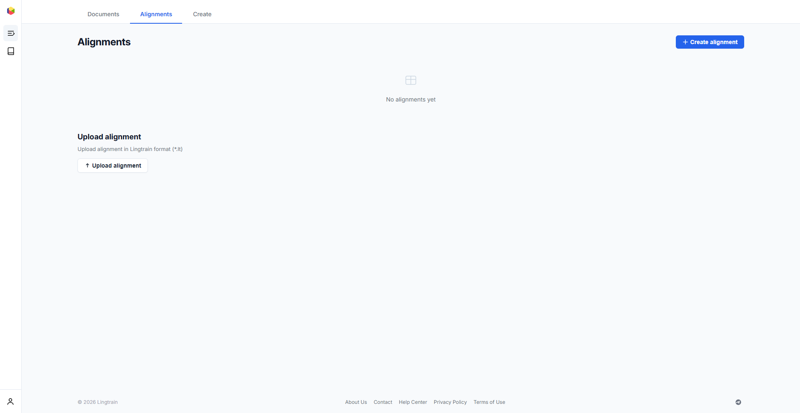
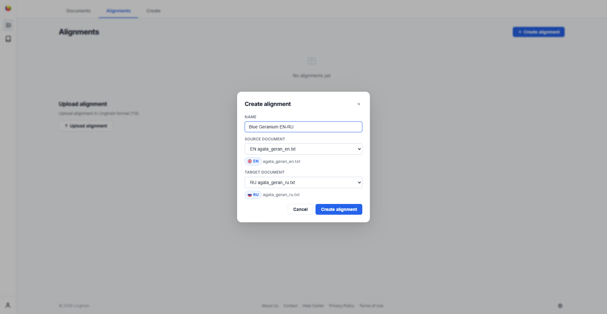
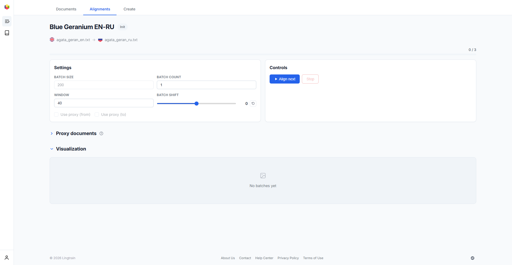
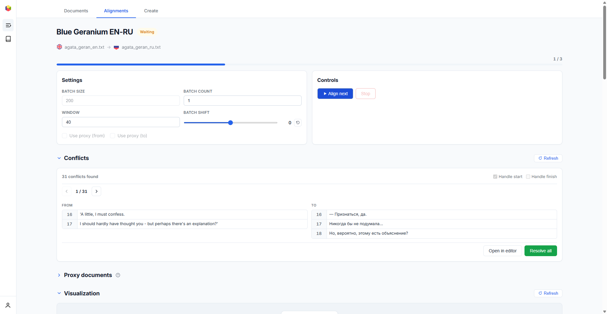
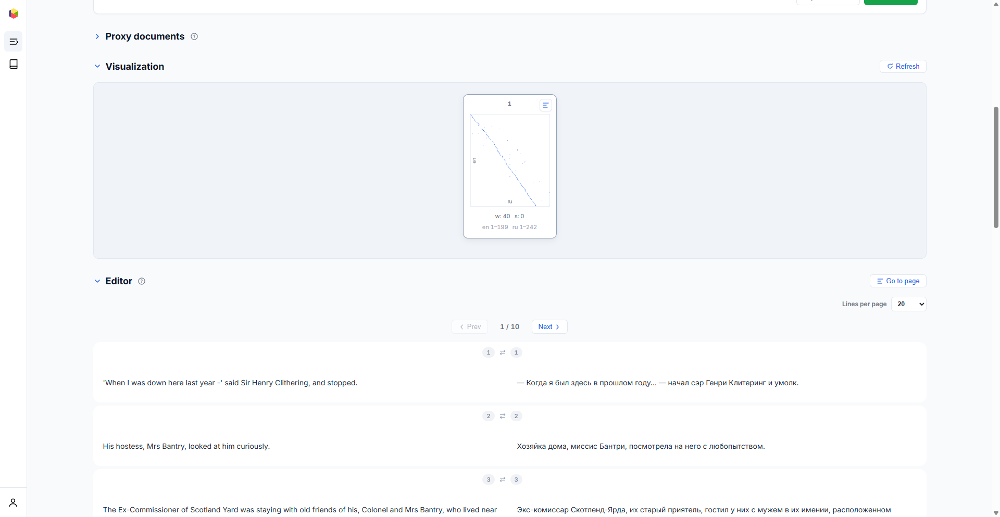
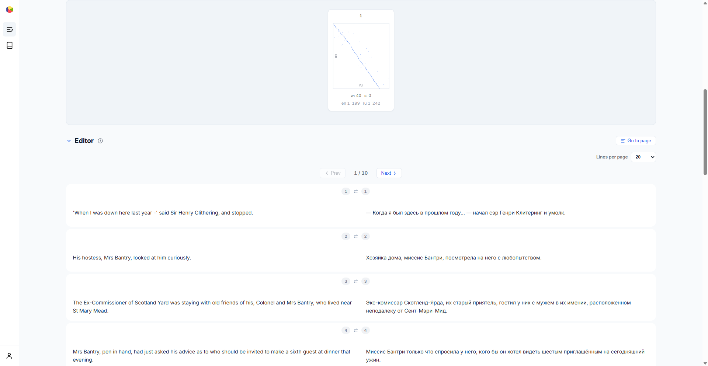

# Alignment process {#alignment}

The **Alignments** tab is where you create, run, and manage text alignment projects. Alignment is the core process that matches sentences between two texts using ML-powered semantic similarity.

## Creating from uploaded documents {#creating}

Click **"+ Create"** in the top-right corner of the Alignments tab. The first step lets you choose **Monolingual book** or **Alignment**.

### Monolingual book {#creating-monobook}

Choose **Monolingual book** to create a private, immediately readable book from one uploaded document. Enter the book name, select the source document, and click **Create book**. The newest document is selected automatically; its title mark is used as the name when available, otherwise the filename is used.

Creation uses the current edited **Sentence preview**, not the original upload. Deleted sentences stay deleted, edited text and structural marks are preserved, and retained paragraph markers determine paragraph grouping. Blank gaps removed from verse during document preparation are no longer present, so creation treats each consecutive surviving verse run as one stanza and cannot restore the removed gaps.

The new book appears in the alignment list and is available to its owner in the web and Theseus readers. It remains private until it is explicitly shared or published.

Selecting a monolingual book in the alignment list opens its LTM editor with one language column. The same book remains available in the single-pane web reader.

### Alignment {#creating-alignment}

Choose **Alignment**. In the second step:

1. **Name** — give your alignment a descriptive name (e.g., "Blue Geranium EN-RU").
2. **Source document** — select the "from" text from your uploaded documents.
3. **Target document** — select the "to" text.

Click **"Create alignment"** to initialize the project. The system will split your texts into batches and prepare the alignment database.

You can also **upload a previously created alignment** in Lingtrain format (`.lt`) using the "Upload alignment" section at the bottom of the list page.

## Alignment detail page {#detail}

After creating an alignment, click on it in the list to open the detail page. Here you control the entire alignment workflow.

The page header shows the alignment name, current status badge, source and target filenames, and progress indicator (e.g., "0 / 3" means 0 out of 3 batches processed).

### Alignment states {#states}

| State | Meaning |
|---|---|
| **Init** | Alignment created, no batches processed yet |
| **In progress** | A batch is currently being aligned |
| **Queued** | Waiting in the processing queue |
| **Waiting** | Some batches processed, waiting for user action |
| **Done** | All batches aligned and conflicts resolved |
| **Error** | An error occurred during processing |

## Settings {#settings}

The **Settings** panel controls how alignment runs:

- **Batch size** — number of sentences from the source text per batch (default: 200). The target text portion is proportionally calculated. This value is fixed after alignment creation.
- **Batch count** — how many batches to process in the next "Align next" action.
- **Window** — extra sentences added on each side of the proportional target window (default: 40). A larger window increases the chance of finding correct matches but also increases computation time and risk of false matches.
- **Batch shift** — manual offset to adjust the target window position. Use this when sentence counts differ greatly and the alignment flow drifts away from the diagonal. Positive values shift the target window forward; negative values shift it backward.
- **Use interlinear (from) / Use interlinear (to)** — enable alignment through interlinear translations. These checkboxes become active once interlinear documents are uploaded (see [Interlinear translation](proxy.en.md)).

## Running the alignment {#running}

Click **"Align next"** to start processing. The system will:

1. Compute sentence embeddings using the configured ML model
2. Build a cosine similarity matrix between source and target sentences
3. Select the best match for each source sentence
4. Save results and generate a visualization

During processing, the status changes to **"In progress"** and the "Stop" button becomes active. You can stop a running alignment at any time — progress is preserved.

After each batch completes, the status changes to **"Waiting"** and you can inspect the results before continuing with the next batch.

## Visualization {#visualization}

The **Visualization** section shows a scatter plot for each processed batch. Each dot represents an aligned sentence pair, with source sentence position on one axis and target position on the other.

A good alignment shows dots forming a **diagonal line** from bottom-left to top-right. Deviations from the diagonal indicate areas where the sentence flow drifted — possibly due to different paragraph structures or missing sections in one text.

Each visualization card shows:

- **Batch number**
- **Window (w)** and **shift (s)** parameters used
- **Source and target line ranges** (e.g., "en 1–199, ru 1–242")
- **Open in editor** button to jump to that batch in the editor

If the diagonal looks broken in some batches, you can adjust the **shift** parameter and re-align those specific batches.

## Conflicts {#conflicts}

After initial alignment, the **Conflicts** section appears showing mismatches that need resolution.

A conflict occurs when the model cannot establish a clean one-to-one mapping between source and target sentences. This typically happens because:

- A translator split one sentence into several (e.g., 2 source → 3 target)
- A translator merged multiple sentences into one
- Short or repetitive sentences confuse the similarity model

The conflict viewer shows:

- **Total conflict count** (e.g., "31 conflicts found")
- **Navigation** between conflicts (Previous / Next, with counter)
- **From** and **To** panels showing the conflicting sentence groups with their line numbers
- **Handle start / Handle finish** checkboxes — include conflicts at the very beginning or end of the aligned text
- **Open in editor** — jump to this conflict in the editor for manual resolution
- **Resolve all** — automatically resolve all conflicts using the built-in resolution algorithm

Click **"Resolve all"** to run automatic conflict resolution. The system iteratively resolves conflicts from smallest to largest, picking the best grouping based on semantic similarity scores. After resolution, the conflict count should drop significantly.

## Editor {#editor}

The **Editor** section shows the aligned sentence pairs in a side-by-side view with full editing capabilities.

Each row displays:

- **Row number** (#1, #2, ...)
- **Source line IDs** — original line numbers from both texts (these are preserved through all edits, maintaining the binding to source documents)
- **Source text** (left) and **target text** (right)
- **Paragraph number** for the first source line in each cell (the same one-based number used by the marks editor)

### Editor actions {#editor-actions}

Hover over any cell to reveal action buttons:

| Action | Description |
|---|---|
| **Edit** | Modify the text content of a cell |
| **Candidates** | Browse alternative sentence matches from the source text |
| **Previous / Next** | Navigate between candidate options |
| **Delete** | Remove a sentence from the cell |
| **Add empty row above / below** | Insert an empty row for manual adjustments |

Use these tools to:

- **Merge sentences** that were incorrectly split
- **Split sentences** that were incorrectly merged
- **Replace mismatched sentences** with the correct ones from the candidate list
- **Delete** sentences that don't belong (e.g., translator's notes)
- **Manually resolve** conflicts that the automatic resolver couldn't handle

The editor supports pagination (configurable: 10, 20, or 50 lines per page) and a "Go to page" feature for quick navigation.

The candidate browser also accepts an exact line ID or a case-insensitive text substring. A successful search centers the normal candidate window on the closest matching source line; an unsuccessful search leaves the current window unchanged.

### Validation and modification {#validation-modification}

The section below the editor lists pairs whose left or right cell has no source line ID. It shows both texts, identifies the affected side, and can assign a new ID without creating a duplicate editor row. Use **Open in editor** to jump to and focus the exact pair.

**Structure modification** reports blockers such as empty mappings, malformed or missing IDs, duplicate references, unreferenced source rows, and processing/index mismatches. **Renumber** becomes available only when every source row on both sides is referenced exactly once. It assigns each side independent IDs `1..N` in the current alignment order and cannot be undone.

Renumbering updates artifact-local sentence features. Historical reader or SRS events stored outside the artifact can still contain old line IDs and cannot be rewritten reliably.

## Workflow summary {#workflow}

A typical alignment workflow:

1. **Create** the alignment from uploaded documents
2. **Align** the first batch — click "Align next"
3. **Check visualization** — verify the diagonal is clean
4. **Continue aligning** remaining batches (adjust shift if needed)
5. **Resolve conflicts** — click "Resolve all" for automatic resolution
6. **Review in editor** — fix any remaining issues manually
7. **Export** — go to the [Create tab](uploading.en.md) to generate books and corpora

For details on exporting, see the [Create tab documentation](uploading.en.md). For understanding the algorithm behind alignment, see [Alignment algorithm](algorithm.en.md).
