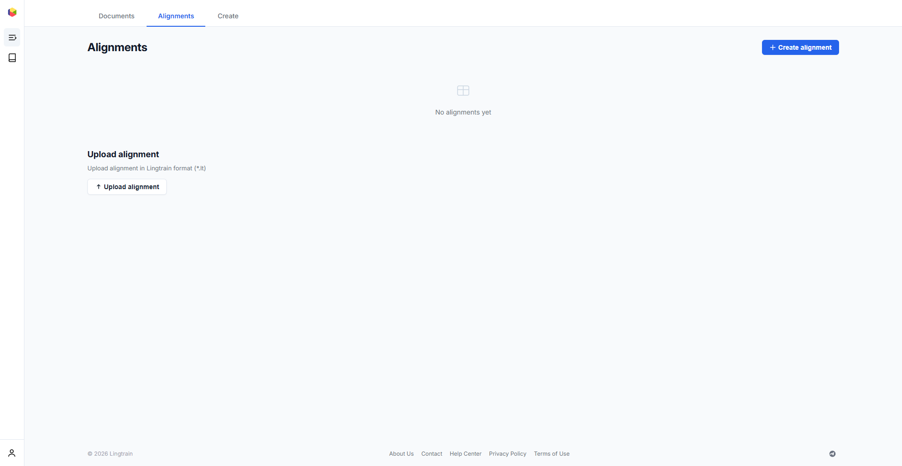
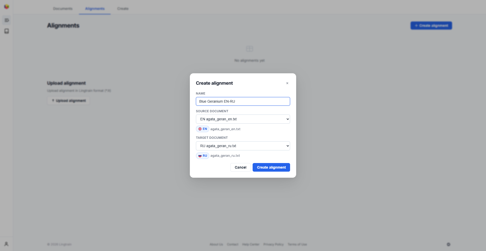
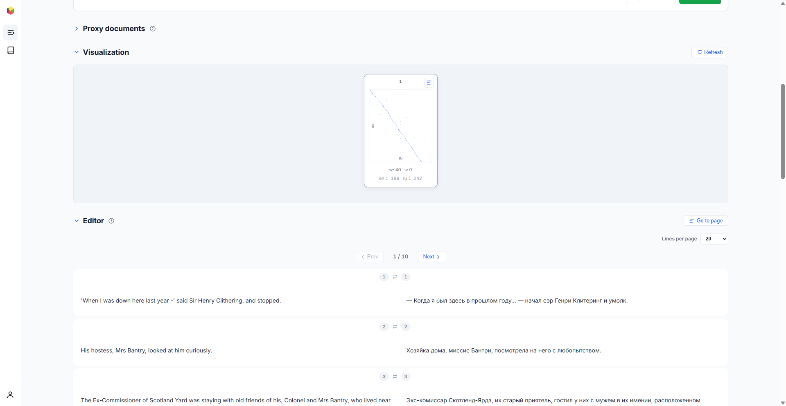

# Процесс выравнивания {#alignment}

Вкладка **Выравнивания** предназначена для создания, запуска и управления проектами выравнивания текстов. Выравнивание — это ключевой процесс сопоставления предложений двух текстов с помощью семантического сходства на основе ML-моделей.

## Создание выравнивания {#creating}

Чтобы начать выравнивание, нажмите **«+ Создать выравнивание»** в правом верхнем углу вкладки «Выравнивания».

В диалоге:

1. **Название** — задайте описательное название (например, «Синяя герань EN-RU»).
2. **Исходный документ** — выберите текст «откуда» из загруженных документов.
3. **Целевой документ** — выберите текст «куда».

Нажмите **«Создать выравнивание»** для инициализации проекта. Система разобьёт ваши тексты на батчи и подготовит базу данных выравнивания.

Вы также можете **загрузить ранее созданное выравнивание** в формате Lingtrain (`.lt`) через раздел «Загрузить выравнивание» внизу страницы списка.

## Страница деталей выравнивания {#detail}

После создания выравнивания нажмите на него в списке, чтобы открыть страницу деталей. Здесь вы управляете всем процессом выравнивания.

В заголовке страницы отображается название выравнивания, текущий статус, имена исходного и целевого файлов, а также индикатор прогресса (например, «0 / 3» означает 0 из 3 обработанных батчей).

### Состояния выравнивания {#states}

| Состояние | Значение |
|---|---|
| **Init** | Выравнивание создано, ни один батч не обработан |
| **In progress** | Идёт обработка батча |
| **Queued** | Ожидание в очереди обработки |
| **Waiting** | Часть батчей обработана, ожидает действий пользователя |
| **Done** | Все батчи выровнены и конфликты разрешены |
| **Error** | Произошла ошибка при обработке |

## Настройки {#settings}

Панель **Настройки** управляет параметрами выравнивания:

- **Размер батча** — количество предложений из исходного текста на один батч (по умолчанию: 200). Соответствующая часть целевого текста рассчитывается пропорционально. Это значение фиксируется после создания выравнивания.
- **Количество батчей** — сколько батчей обработать при следующем нажатии «Выровнять следующий».
- **Окно** — дополнительные предложения, добавляемые с каждой стороны пропорционального целевого окна (по умолчанию: 40). Большее окно увеличивает шанс нахождения правильных соответствий, но также увеличивает время вычислений и риск ложных совпадений.
- **Сдвиг батча** — ручное смещение для корректировки положения целевого окна. Используйте, когда количество предложений сильно различается и поток выравнивания отклоняется от диагонали. Положительные значения сдвигают целевое окно вперёд, отрицательные — назад.
- **Использовать прокси (из) / Использовать прокси (в)** — включить выравнивание через прокси-переводы. Эти флажки становятся активными после загрузки прокси-документов (см. [Подстрочник](proxy.ru.md)).

## Запуск выравнивания {#running}

Нажмите **«Выровнять следующий»** для начала обработки. Система выполнит следующие шаги:

1. Вычислит эмбеддинги предложений с помощью настроенной ML-модели
2. Построит матрицу косинусного сходства между предложениями исходного и целевого текстов
3. Выберет лучшее соответствие для каждого исходного предложения
4. Сохранит результаты и построит визуализацию

Во время обработки статус меняется на **«In progress»**, и кнопка «Стоп» становится активной. Вы можете остановить запущенное выравнивание в любой момент — прогресс сохраняется.

После завершения каждого батча статус меняется на **«Waiting»**, и вы можете проверить результаты перед продолжением обработки следующего батча.

## Визуализация {#visualization}

Раздел **Визуализация** показывает точечную диаграмму для каждого обработанного батча. Каждая точка представляет выровненную пару предложений: позиция исходного предложения на одной оси и позиция целевого — на другой.

Хорошее выравнивание показывает точки, образующие **диагональную линию** из нижнего левого угла в верхний правый. Отклонения от диагонали указывают на области, где поток предложений сместился — возможно, из-за различной структуры абзацев или отсутствующих фрагментов в одном из текстов.

Каждая карточка визуализации показывает:

- **Номер батча**
- **Окно (w)** и **сдвиг (s)** — использованные параметры
- **Диапазоны строк** исходного и целевого текстов (например, «en 1–199, ru 1–242»)
- **Кнопку «Открыть в редакторе»** для перехода к этому батчу в редакторе

Если диагональ выглядит ломаной в некоторых батчах, можно скорректировать параметр **сдвиг** и перевыровнять эти конкретные батчи.

## Конфликты {#conflicts}

После начального выравнивания появляется раздел **Конфликты**, показывающий несоответствия, требующие разрешения.

Конфликт возникает, когда модель не может установить чёткое соответствие «один к одному» между исходными и целевыми предложениями. Это обычно происходит, когда:

- Переводчик разбил одно предложение на несколько (например, 2 исходных → 3 целевых)
- Переводчик объединил несколько предложений в одно
- Короткие или повторяющиеся предложения вводят модель сходства в заблуждение

Просмотрщик конфликтов показывает:

- **Общее количество конфликтов** (например, «31 конфликт найден»)
- **Навигацию** между конфликтами (Предыдущий / Следующий, со счётчиком)
- **Панели «Из» и «В»**, показывающие конфликтующие группы предложений с номерами строк
- **Флажки «Обработать начало / Обработать конец»** — включить конфликты в самом начале или конце выровненного текста
- **«Открыть в редакторе»** — перейти к этому конфликту в редакторе для ручного разрешения
- **«Разрешить все»** — автоматически разрешить все конфликты с помощью встроенного алгоритма

Нажмите **«Разрешить все»** для запуска автоматического разрешения конфликтов. Система итеративно разрешает конфликты от наименьших к наибольшим, выбирая лучшую группировку на основе оценок семантического сходства. После разрешения количество конфликтов должно значительно уменьшиться.

## Редактор {#editor}

Раздел **Редактор** показывает выровненные пары предложений в виде параллельного текста с полными возможностями редактирования.

Каждая строка отображает:

- **Номер строки** (#1, #2, ...)
- **Идентификаторы исходных строк** — оригинальные номера строк из обоих текстов (они сохраняются при всех редактированиях, поддерживая связь с исходными документами)
- **Исходный текст** (слева) и **целевой текст** (справа)

### Действия в редакторе {#editor-actions}

Наведите на любую ячейку, чтобы увидеть кнопки действий:

| Действие | Описание |
|---|---|
| **Редактировать** | Изменить текстовое содержимое ячейки |
| **Кандидаты** | Просмотреть альтернативные варианты сопоставления из исходного текста |
| **Предыдущий / Следующий** | Перемещение между вариантами кандидатов |
| **Удалить** | Удалить предложение из ячейки |
| **Добавить пустую строку выше / ниже** | Вставить пустую строку для ручной корректировки |

С помощью этих инструментов можно:

- **Объединять предложения**, которые были неверно разделены
- **Разделять предложения**, которые были неверно объединены
- **Заменять неправильно сопоставленные предложения** правильными из списка кандидатов
- **Удалять** предложения, которые не должны присутствовать (например, примечания переводчика)
- **Вручную разрешать** конфликты, с которыми автоматический алгоритм не справился

Редактор поддерживает пагинацию (настраиваемую: 10, 20 или 50 строк на страницу) и функцию «Перейти на страницу» для быстрой навигации.

## Обзор рабочего процесса {#workflow}

Типичный рабочий процесс выравнивания:

1. **Создайте** выравнивание из загруженных документов
2. **Выровняйте** первый батч — нажмите «Выровнять следующий»
3. **Проверьте визуализацию** — убедитесь, что диагональ чистая
4. **Продолжите выравнивание** оставшихся батчей (при необходимости скорректируйте сдвиг)
5. **Разрешите конфликты** — нажмите «Разрешить все» для автоматического разрешения
6. **Проверьте в редакторе** — исправьте оставшиеся проблемы вручную
7. **Экспортируйте** — перейдите на вкладку [Создание](uploading.ru.md) для генерации книг и корпусов

Подробнее об экспорте см. в [документации вкладки «Создание»](uploading.ru.md). Для понимания алгоритма выравнивания см. [Алгоритм выравнивания](algorithm.ru.md).
