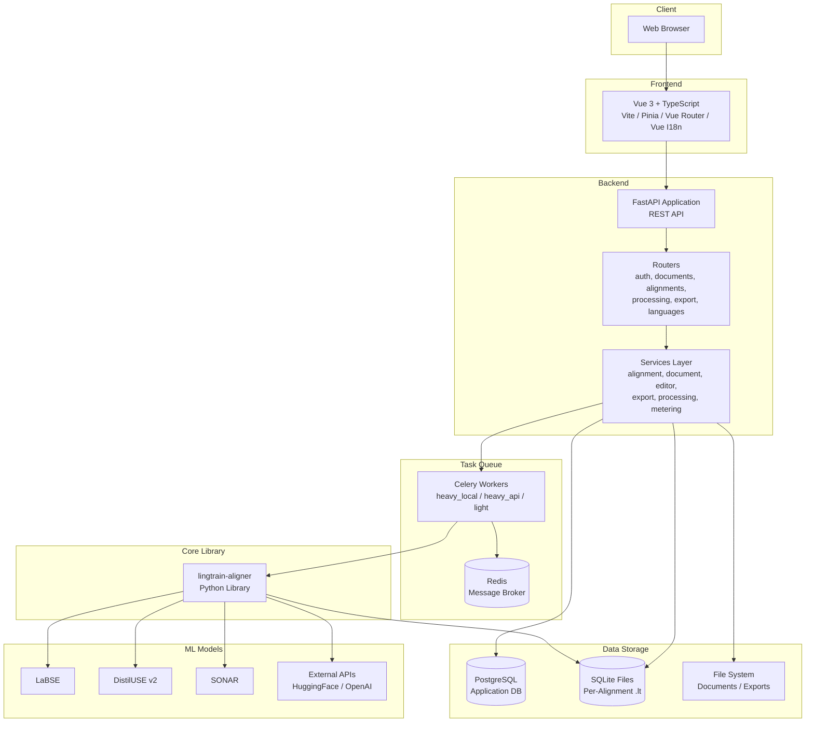

# Architecture Overview {#architecture-overview}

This page describes the high-level technical architecture of Lingtrain Aligner for technically curious users, contributors, and administrators considering self-hosted deployment.

## System Architecture Diagram {#diagram}



## Component Overview {#components}

### Frontend (Vue 3) {#frontend}

The frontend is a single-page application (SPA) built with:

- **Vue 3** — reactive UI framework with Composition API
- **TypeScript** — type-safe JavaScript
- **Vite** — fast build tool and development server
- **Pinia** — state management (stores for authentication, alignment state, UI preferences)
- **Vue Router** — client-side routing between pages
- **Vue I18n** — internationalization (English and Russian locales)

**Key directories:**

| Directory | Purpose |
|-----------|---------|
| `fe/src/pages/` | Page components (home, aligner workspace) |
| `fe/src/pages/aligner/` | Aligner sub-pages (documents, alignments, create) |
| `fe/src/components/` | Shared/reusable UI components |
| `fe/src/api/` | API client functions (Axios-based) |
| `fe/src/stores/` | Pinia state stores |
| `fe/src/i18n/` | Localization messages |
| `fe/src/assets/` | Global styles, CSS variables (design tokens) |

The frontend communicates with the backend exclusively through REST API calls. There is no WebSocket or server-sent events — progress polling is done via periodic HTTP requests.

### Backend (FastAPI) {#backend}

The backend is a Python application built with:

- **FastAPI** — modern async web framework with automatic OpenAPI documentation
- **SQLAlchemy** — ORM for PostgreSQL (application database)
- **Pydantic** — request/response schema validation
- **Celery** — distributed task queue for background processing
- **JWT** — stateless authentication

**Architecture pattern:** The backend follows a layered architecture:

1. **Routers** (`be/app/routers/`) — thin HTTP handlers that validate input, call services, and return responses
2. **Services** (`be/app/services/`) — business logic layer (alignment, document, editor, export, metering)
3. **Models** (`be/app/models/`) — SQLAlchemy ORM models for PostgreSQL tables
4. **Schemas** (`be/app/schemas/`) — Pydantic models for request/response validation

**Key routers:**

| Router | Prefix | Purpose |
|--------|--------|---------|
| `auth` | `/api/auth` | Registration, login, email verification, password reset |
| `oauth` | `/api/auth/oauth` | OAuth flows (Google, Yandex, VK) |
| `documents` | `/api/aligner/documents` | Document upload, listing, splitting, marks |
| `alignments` | `/api/aligner/alignments` | Alignment CRUD, control (align/stop/erase), conflicts, proxy |
| `processing` | `/api/aligner/processing` | Editor operations (page, edit, split, candidates) |
| `export` | `/api/aligner/export` | Download results, book preview |
| `languages` | `/api/languages` | Language listing and configuration |

### Task Queue (Celery + Redis) {#task-queue}

Heavy computational tasks (embedding computation, similarity matrix construction, conflict resolution) run asynchronously via Celery workers:

**Queue architecture:**

| Queue | Purpose | Default Concurrency |
|-------|---------|-------------------|
| `heavy_local` | Alignment tasks using local ML models | 1 (GPU-bound) |
| `heavy_api` | Alignment tasks using external APIs | 1 |
| `light` | Lightweight tasks (line counting, cleanup) | 4 |

**Task lifecycle:**

1. User submits a task (align, align_next, resolve) via the API
2. A `TaskRecord` is created in PostgreSQL with status `QUEUED`
3. The task is dispatched to Celery with a pre-assigned task ID
4. A Celery worker picks up the task and changes status to `RUNNING`
5. The worker calls `lingtrain-aligner` functions to process the data
6. On completion, the status is updated to `SUCCESS` or `FAILED`
7. Metering settlement is performed (actual lines processed vs. pre-charged)

**Concurrency control:** Each user has a concurrent task limit (configurable per subscription plan). The system performs both a fast pre-check (cached count) and an atomic re-check within the transaction to prevent race conditions.

### Alignment Engine (lingtrain-aligner) {#alignment-engine}

The core alignment logic lives in the `lingtrain-aligner` Python library (git submodule at `lingtrain-aligner/`). It provides:

- **Sentence splitting** — language-specific text segmentation
- **Embedding computation** — converting sentences to vectors using ML models
- **Similarity matrix** — cosine similarity with window masking
- **Best-match selection** — optimal sentence pair assignment
- **Conflict detection** — identifying breaks in the alignment chain
- **Conflict resolution** — exhaustive grouping search with aggregation
- **Data persistence** — reading/writing SQLite alignment databases

The library operates on SQLite `.lt` files, which serve as the storage format for all per-alignment data.

### Database Architecture {#database}

Lingtrain uses a **dual-database** approach:

**PostgreSQL (application database):**
- User accounts and authentication
- Alignment metadata (name, languages, state, progress)
- Document metadata (name, language, line count)
- Task records (status, timing, error info)
- Subscription and billing data
- Embedding model configuration
- Language configuration

**SQLite (per-alignment files):**
- Split sentences (source and target)
- Document index (alignment mapping)
- Batch metadata
- Markup tags
- Proxy text sentences
- Cached embeddings (optional)
- Alignment metadata (language codes, model info)

This separation provides:
- **Isolation** — each alignment is self-contained in its own file
- **Portability** — `.lt` files can be exported, backed up, and re-imported
- **Scalability** — alignment data scales independently of the application database
- **Concurrency safety** — only one worker accesses a given `.lt` file at a time

### Embedding Models {#embedding-models}

Lingtrain supports multiple embedding models with different characteristics:

**Local models** (loaded into GPU/CPU memory on the worker):
- LaBSE — 109 languages, 471M parameters
- distiluse-base-multilingual-cased-v2 — 50+ languages, 135M parameters
- XLM-R-100langs — 100 languages
- rubert-tiny2 — Russian-focused, fast
- SONAR — 200+ languages (Meta)

**API-based models** (external inference):
- Hugging Face Inference API — any hosted SentenceTransformers model
- OpenAI Embeddings API — text-embedding models

Model selection is handled by the `embeddings_config` service, which resolves model keys to inference parameters and routes tasks to the appropriate Celery queue (`heavy_local` for local, `heavy_api` for API).

### File Storage {#file-storage}

Server-side file organization:

```
data/
  {user_id}/
    documents/
      {lang}/
        original/          # Raw uploaded .txt files
        splitted/           # Sentence-split text files
    alignments/
      {lang_from}_{lang_to}/
        {alignment_guid}.db  # SQLite alignment database
    exports/
      {alignment_guid}_*.html  # Generated exports
      {alignment_guid}_*.tmx
      ...
    vis/
      {alignment_guid}_*.png   # Batch visualization images
```

### Authentication Flow {#auth-flow}

1. **Email/password:** Register, verify email with code, login to receive JWT
2. **OAuth:** Redirect to provider (Google/Yandex/VK), receive authorization code, exchange for user info, create or link account, return JWT
3. **API calls:** JWT included in `Authorization: Bearer` header, validated by `get_current_user` dependency

### Metering and Billing {#metering}

The metering system tracks usage and enforces quotas:

1. **Pre-charge:** Before a task starts, the estimated number of lines is calculated and reserved from the user's quota
2. **Settlement:** After the task completes (or is cancelled), the actual number of processed lines is compared with the pre-charge, and the difference is refunded or charged
3. **Quota enforcement:** Tasks are rejected if the user's quota is insufficient

This two-phase approach prevents users from exceeding their quotas while ensuring fair billing for partially completed tasks.

## Deployment Topology {#deployment}

A typical production deployment includes:

```
[Nginx/Caddy Reverse Proxy]
    |
    +-- [FastAPI Backend] (port 8000)
    |       |
    |       +-- [PostgreSQL] (port 5432)
    |       +-- [Redis] (port 6379)
    |
    +-- [Celery Worker: heavy_local] (GPU access)
    +-- [Celery Worker: heavy_api]
    +-- [Celery Worker: light]
    |
    +-- [Static Files / Frontend Build]
```

All components can run on a single server or be distributed across multiple machines. The Celery workers that handle local inference should have GPU access for optimal performance.

## Technology Summary {#tech-summary}

| Layer | Technology |
|-------|-----------|
| Frontend framework | Vue 3, TypeScript |
| Build tool | Vite |
| State management | Pinia |
| Routing | Vue Router |
| Internationalization | Vue I18n |
| Backend framework | FastAPI (Python 3.11+) |
| ORM | SQLAlchemy |
| Validation | Pydantic |
| Application database | PostgreSQL |
| Alignment storage | SQLite |
| Task queue | Celery |
| Message broker | Redis |
| ML framework | PyTorch, sentence-transformers |
| Reverse proxy | Nginx or Caddy |
| Containerization | Docker, Docker Compose |
