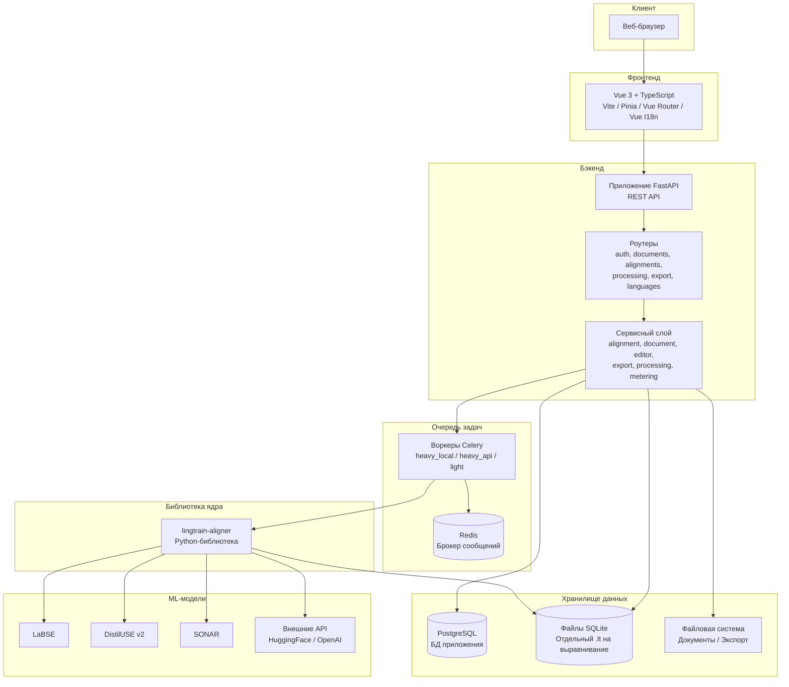

# Обзор архитектуры {#architecture-overview}

На этой странице описана высокоуровневая техническая архитектура Lingtrain Aligner для технически любознательных пользователей, контрибьюторов и администраторов, рассматривающих самостоятельное развёртывание.

## Диаграмма архитектуры {#diagram}



## Обзор компонентов {#components}

### Фронтенд (Vue 3) {#frontend}

Фронтенд — одностраничное приложение (SPA), построенное на:

- **Vue 3** — реактивный UI-фреймворк с Composition API
- **TypeScript** — типизированный JavaScript
- **Vite** — быстрый инструмент сборки и сервер разработки
- **Pinia** — управление состоянием (хранилища для аутентификации, состояния выравнивания, настроек интерфейса)
- **Vue Router** — клиентская маршрутизация между страницами
- **Vue I18n** — интернационализация (английская и русская локали)

**Ключевые каталоги:**

| Каталог | Назначение |
|---------|-----------|
| `fe/src/pages/` | Компоненты страниц (главная, рабочее пространство алайнера) |
| `fe/src/pages/aligner/` | Подстраницы алайнера (документы, выравнивания, создание) |
| `fe/src/components/` | Общие переиспользуемые UI-компоненты |
| `fe/src/api/` | Функции API-клиента (на основе Axios) |
| `fe/src/stores/` | Хранилища состояния Pinia |
| `fe/src/i18n/` | Сообщения локализации |
| `fe/src/assets/` | Глобальные стили, CSS-переменные (дизайн-токены) |

Фронтенд общается с бэкендом исключительно через REST API. WebSocket и server-sent events не используются — обновление прогресса происходит через периодические HTTP-запросы.

### Бэкенд (FastAPI) {#backend}

Бэкенд — Python-приложение, построенное на:

- **FastAPI** — современный асинхронный веб-фреймворк с автоматической OpenAPI-документацией
- **SQLAlchemy** — ORM для PostgreSQL (база данных приложения)
- **Pydantic** — валидация схем запросов/ответов
- **Celery** — распределённая очередь задач для фоновой обработки
- **JWT** — stateless-аутентификация

**Архитектурный паттерн:** Бэкенд следует слоистой архитектуре:

1. **Роутеры** (`be/app/routers/`) — тонкие HTTP-обработчики, валидирующие ввод, вызывающие сервисы и возвращающие ответы
2. **Сервисы** (`be/app/services/`) — слой бизнес-логики (alignment, document, editor, export, metering)
3. **Модели** (`be/app/models/`) — SQLAlchemy ORM-модели для таблиц PostgreSQL
4. **Схемы** (`be/app/schemas/`) — Pydantic-модели для валидации запросов/ответов

**Основные роутеры:**

| Роутер | Префикс | Назначение |
|--------|---------|-----------|
| `auth` | `/api/auth` | Регистрация, вход, подтверждение email, сброс пароля |
| `oauth` | `/api/auth/oauth` | OAuth-потоки (Google, Яндекс, ВК) |
| `documents` | `/api/aligner/documents` | Загрузка документов, листинг, разбиение, метки |
| `alignments` | `/api/aligner/alignments` | CRUD выравниваний, управление, конфликты, прокси |
| `processing` | `/api/aligner/processing` | Операции редактора (страница, редактирование, разделение, кандидаты) |
| `export` | `/api/aligner/export` | Скачивание результатов, предпросмотр книги |
| `languages` | `/api/languages` | Листинг и настройка языков |

### Очередь задач (Celery + Redis) {#task-queue}

Тяжёлые вычислительные задачи (вычисление эмбеддингов, построение матрицы сходства, разрешение конфликтов) выполняются асинхронно через воркеры Celery:

**Архитектура очередей:**

| Очередь | Назначение | Параллельность по умолчанию |
|---------|-----------|---------------------------|
| `heavy_local` | Задачи выравнивания с локальными ML-моделями | 1 (ограничено GPU) |
| `heavy_api` | Задачи выравнивания через внешние API | 1 |
| `light` | Лёгкие задачи (подсчёт строк, очистка) | 4 |

**Жизненный цикл задачи:**

1. Пользователь отправляет задачу (align, align_next, resolve) через API
2. Создаётся `TaskRecord` в PostgreSQL со статусом `QUEUED`
3. Задача отправляется в Celery с предварительно назначенным ID
4. Воркер Celery берёт задачу и меняет статус на `RUNNING`
5. Воркер вызывает функции `lingtrain-aligner` для обработки данных
6. По завершении статус обновляется на `SUCCESS` или `FAILED`
7. Выполняется взаиморасчёт по учёту (фактические строки vs. предоплата)

**Контроль параллельности:** Каждый пользователь имеет лимит параллельных задач (настраивается по тарифу). Система выполняет быструю предварительную проверку (кешированный счётчик) и атомарную перепроверку в транзакции для предотвращения гонок.

### Движок выравнивания (lingtrain-aligner) {#alignment-engine}

Основная логика выравнивания живёт в Python-библиотеке `lingtrain-aligner` (git-подмодуль в `lingtrain-aligner/`). Она обеспечивает:

- **Разбиение на предложения** — языковая сегментация текста
- **Вычисление эмбеддингов** — преобразование предложений в векторы с помощью ML-моделей
- **Матрица сходства** — косинусное сходство с маскированием окна
- **Выбор лучшего соответствия** — оптимальное назначение пар предложений
- **Обнаружение конфликтов** — выявление разрывов в цепочке выравнивания
- **Разрешение конфликтов** — исчерпывающий поиск группировок с агрегацией
- **Персистентность данных** — чтение/запись баз данных SQLite

Библиотека работает с файлами SQLite `.lt`, которые являются форматом хранения всех данных отдельного выравнивания.

### Архитектура баз данных {#database}

Lingtrain использует **двойной** подход к базам данных:

**PostgreSQL (база приложения):**
- Аккаунты пользователей и аутентификация
- Метаданные выравниваний (название, языки, состояние, прогресс)
- Метаданные документов (имя, язык, число строк)
- Записи задач (статус, таймштампы, ошибки)
- Подписки и биллинг
- Конфигурация моделей эмбеддингов
- Конфигурация языков

**SQLite (файлы на каждое выравнивание):**
- Разбитые предложения (исходные и целевые)
- Индекс документа (карта выравнивания)
- Метаданные батчей
- Теги разметки
- Предложения подстрочника
- Кешированные эмбеддинги (опционально)

Такое разделение обеспечивает:
- **Изоляцию** — каждое выравнивание самодостаточно в своём файле
- **Переносимость** — файлы `.lt` можно экспортировать, резервировать и повторно импортировать
- **Масштабируемость** — данные выравниваний масштабируются независимо от базы приложения
- **Безопасность параллельного доступа** — с конкретным файлом `.lt` работает только один воркер одновременно

### Модели эмбеддингов {#embedding-models}

Lingtrain поддерживает несколько моделей с различными характеристиками:

**Локальные модели** (загружаются в GPU/CPU-память воркера):
- LaBSE — 109 языков, 471M параметров
- distiluse-base-multilingual-cased-v2 — 50+ языков, 135M параметров
- XLM-R-100langs — 100 языков
- rubert-tiny2 — ориентирован на русский, быстрый
- SONAR — 200+ языков (Meta)

**API-модели** (внешний инференс):
- Hugging Face Inference API — любая размещённая SentenceTransformers модель
- OpenAI Embeddings API — модели text-embedding

### Хранение файлов {#file-storage}

Организация файлов на сервере:

```
data/
  {user_id}/
    documents/
      {lang}/
        original/           # Исходные загруженные .txt файлы
        splitted/            # Разбитые на предложения файлы
    alignments/
      {lang_from}_{lang_to}/
        {alignment_guid}.db  # SQLite-база выравнивания
    exports/
      {alignment_guid}_*.html  # Сгенерированные экспорты
      {alignment_guid}_*.tmx
      ...
    vis/
      {alignment_guid}_*.png   # Визуализации батчей
```

### Поток аутентификации {#auth-flow}

1. **Email/пароль:** Регистрация, подтверждение email кодом, вход для получения JWT
2. **OAuth:** Перенаправление к провайдеру (Google/Яндекс/ВК), получение кода авторизации, обмен на информацию о пользователе, создание или привязка аккаунта, возврат JWT
3. **API-вызовы:** JWT в заголовке `Authorization: Bearer`, валидация через зависимость `get_current_user`

### Учёт и биллинг {#metering}

Система учёта отслеживает использование и обеспечивает соблюдение квот:

1. **Предоплата:** Перед запуском задачи рассчитывается и резервируется оценочное количество строк из квоты пользователя
2. **Взаиморасчёт:** После завершения задачи (или отмены) фактическое число обработанных строк сравнивается с предоплатой, разница возвращается или доначисляется
3. **Контроль квот:** Задачи отклоняются при недостаточной квоте

## Топология развёртывания {#deployment}

Типичное продакшн-развёртывание включает:

```
[Nginx/Caddy обратный прокси]
    |
    +-- [Бэкенд FastAPI] (порт 8000)
    |       |
    |       +-- [PostgreSQL] (порт 5432)
    |       +-- [Redis] (порт 6379)
    |
    +-- [Воркер Celery: heavy_local] (доступ к GPU)
    +-- [Воркер Celery: heavy_api]
    +-- [Воркер Celery: light]
    |
    +-- [Статические файлы / сборка фронтенда]
```

Все компоненты могут работать на одном сервере или быть распределены по нескольким машинам. Воркеры Celery для локального инференса должны иметь доступ к GPU для оптимальной производительности.

## Сводка технологий {#tech-summary}

| Слой | Технология |
|------|-----------|
| Фреймворк фронтенда | Vue 3, TypeScript |
| Инструмент сборки | Vite |
| Управление состоянием | Pinia |
| Маршрутизация | Vue Router |
| Интернационализация | Vue I18n |
| Фреймворк бэкенда | FastAPI (Python 3.11+) |
| ORM | SQLAlchemy |
| Валидация | Pydantic |
| База данных приложения | PostgreSQL |
| Хранение выравниваний | SQLite |
| Очередь задач | Celery |
| Брокер сообщений | Redis |
| ML-фреймворк | PyTorch, sentence-transformers |
| Обратный прокси | Nginx или Caddy |
| Контейнеризация | Docker, Docker Compose |
