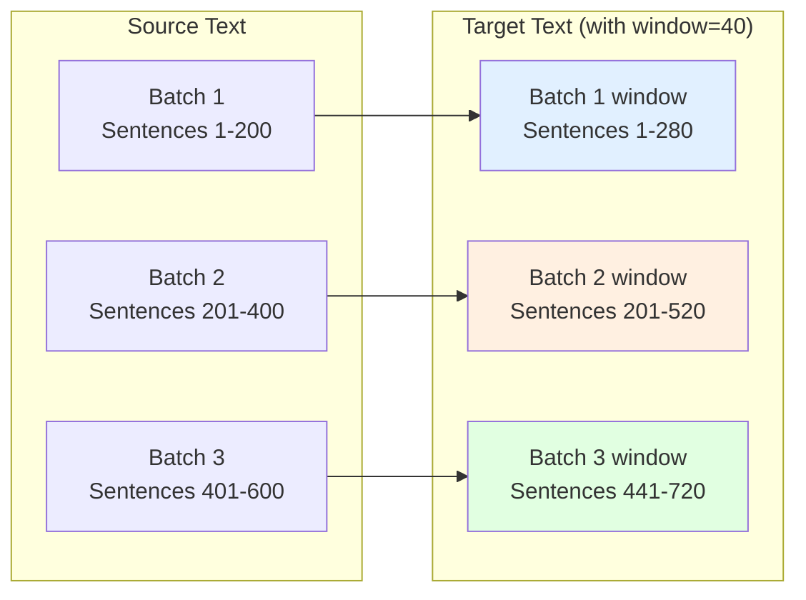
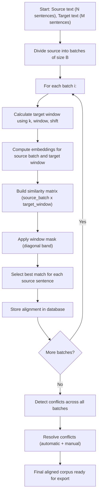

# Batch Processing in Detail {#batch-processing-explained}

Lingtrain Aligner processes texts in batches rather than all at once. This page explains why batching is necessary, how the proportional target window is calculated, how the window and shift parameters affect alignment, and how overlap between batches prevents edge-cutting errors.

## Why batches are needed {#why-batches}

### Memory constraints {#memory}

The alignment algorithm computes a **similarity matrix** between all source and target sentences in a batch. For a matrix with `M` source rows and `N` target columns, the memory requirement is `M * N * 4` bytes (for 32-bit floating-point values).

For a full-length book with 3,000 source sentences and 3,500 target sentences:

```
3,000 * 3,500 * 4 bytes = 42,000,000 bytes ≈ 40 MB
```

This is manageable, but the embedding computation itself (encoding 6,500 sentences through a neural network) takes significant time and memory. With larger texts (10,000+ sentences), the combined memory for embeddings and the similarity matrix can exceed available resources.

Batching keeps each chunk small enough to process efficiently — the default batch size of 200 sentences produces similarity matrices of roughly `200 * 270 * 4 ≈ 216 KB`, well within any system's capacity.

### Incremental progress {#incremental}

Batching allows you to:

- **Check quality early** — inspect the visualization after the first batch before committing to processing the entire text
- **Adjust parameters** — change the shift or window after seeing the results of early batches
- **Pause and resume** — stop processing at any time and continue later
- **Handle errors** — if one batch fails (e.g., due to network issues with API-based embedding models), only that batch needs to be reprocessed

## Proportional target window {#proportional-window}

### The core calculation {#core-calculation}

The key challenge in batching is determining which portion of the target text corresponds to each source batch. If the source and target texts had the same number of sentences, each source batch of 200 sentences would correspond to exactly 200 target sentences. But translations almost never have the same sentence count.

Lingtrain uses a **proportional mapping** to estimate the target window for each source batch:

```
k = len(target) / len(source)    (proportionality ratio)

target_start = source_start * k - window + shift
target_end   = source_end * k   + window + shift
```

This formula ensures that the target window is proportionally sized and positioned, with the **window** parameter adding safety margins on each side.

### Worked example {#worked-example}

Consider a text with:
- **600** source sentences (English)
- **720** target sentences (Russian)
- **Batch size:** 200
- **Window:** 40
- **Shift:** 0

The proportionality ratio: `k = 720 / 600 = 1.2`

This means each source sentence corresponds to approximately 1.2 target sentences (the Russian translation is 20% longer in sentence count).

**Batch 1** (source sentences 1-200):
```
target_start = 1 * 1.2 - 40 + 0 = -38.8 → clamped to 1
target_end   = 200 * 1.2 + 40 + 0 = 280
Target window: sentences 1 to 280
```

**Batch 2** (source sentences 201-400):
```
target_start = 201 * 1.2 - 40 + 0 = 201.2
target_end   = 400 * 1.2 + 40 + 0 = 520
Target window: sentences 201 to 520
```

**Batch 3** (source sentences 401-600):
```
target_start = 401 * 1.2 - 40 + 0 = 441.2
target_end   = 600 * 1.2 + 40 + 0 = 760 → clamped to 720
Target window: sentences 441 to 720
```

Notice: Batch 1 covers target sentences 1-280, and Batch 2 starts at 201. The overlap (sentences 201-280) is intentional — it prevents sentences near batch boundaries from being missed.

## The window parameter {#window-parameter}

### What it does {#window-what}

The **window** parameter (default: 40) adds extra sentences on each side of the proportionally calculated target window. It serves as a safety margin to account for:

- **Accumulated drift** — as sentence splits and merges accumulate through the text, the actual correspondence may drift from the proportional estimate
- **Local variation** — some sections may have more splits/merges than the average
- **Edge effects** — sentences near batch boundaries need overlap to ensure they have candidate matches in both adjacent batches


### Choosing the right window size {#window-size}

| Window | When to use |
|--------|------------|
| **20-30** | Texts with very similar sentence counts (technical documentation, close translations) |
| **40** (default) | Most texts — a good balance of safety and efficiency |
| **50-60** | Texts with significant structural differences or free translations |
| **70-100** | Very free translations, texts with sections added/removed, or low-resource language pairs with noisy embeddings |

**Trade-offs:**

- **Larger window** = more candidate matches, lower risk of missing the correct match, but more computation and higher risk of false matches from distant sentences
- **Smaller window** = faster processing, fewer false positives, but risk of cutting off the correct match at batch edges

### Visual indicator {#visual-indicator}

The batch visualization shows the window setting used for each batch (displayed as "w: 40" on each batch card). If the alignment diagonal extends to the edges of the plot, the window may be too small — the correct match is being cut off.

## The shift parameter {#shift-parameter}

### What it does {#shift-what}

The **shift** parameter (default: 0) manually offsets the target window position. It shifts the entire target window forward (positive shift) or backward (negative shift) by the specified number of sentences.

```
target_start = source_start * k - window + shift
target_end   = source_end * k   + window + shift
```

### When to use shift {#when-shift}

Shift is needed when the proportional mapping drifts away from reality. This happens when:

- **The source text has significantly more sentences than the target** (or vice versa) in a specific region, not just overall
- **One text has content that the other lacks** — a foreword, translator's note, or appendix that exists in only one text
- **The proportional ratio changes throughout the text** — the early chapters may be translated closely (ratio ≈ 1.0) while later chapters are translated more freely (ratio ≈ 1.3)

### How to detect drift {#detect-drift}

Examine the batch visualization:

- **Clean diagonal in center but cut off at edges** — the window may be too small, or the shift needs adjustment
- **Diagonal shifted to one side** — the proportional estimate is off; apply a shift in the opposite direction
- **Diagonal slopes differently than expected** — the ratio for this section differs from the overall ratio; shift can correct for part of this

### Worked example with shift {#shift-example}

Suppose after processing batch 2 you notice the diagonal is shifted upward — the target sentences that match are about 30 sentences higher than where the proportional calculation predicted.

This means the Russian translation has more sentences in the early part of the book than the average ratio suggests. To correct:

- Set **shift = -30** for batch 3
- This moves the target window 30 sentences backward, centering it on the actual correspondence

After applying the shift, check the visualization for batch 3. If the diagonal is now centered, the shift is correct. If it is still off, adjust further.

### Shift accumulation {#shift-accumulation}

Shift is applied cumulatively — if you set shift to -30 for batch 3, it stays at -30 for all subsequent batches until you change it. If the drift continues to grow, you may need to increase the shift for later batches.

## Overlap between batches {#overlap}

### Why overlap matters {#why-overlap}

Without overlap, sentences near batch boundaries would have no candidate matches on one side. Consider a source sentence at position 200 (the last sentence of batch 1) — without overlap, it can only be matched against target sentences in batch 1's window. But its correct match might be a target sentence that falls just outside that window, in the range covered by batch 2.

The window parameter creates overlap between adjacent batches:



The overlap zones (sentences 201-280 between batches 1-2, and sentences 441-520 between batches 2-3) ensure continuity: sentences near the boundary have candidate matches from both batches.

### How the algorithm handles overlap {#handling-overlap}

When consecutive batches produce overlapping alignments, the algorithm resolves conflicts at batch boundaries:

1. **Each batch produces its own alignment** for its portion of the source text
2. **Batch results are concatenated** in source order
3. **Boundary conflicts** — if the last few alignments of batch N and the first few of batch N+1 disagree about target positions, the conflict resolution step handles them as regular conflicts

This seamless stitching is one reason the batch approach works well — the overlap zones provide enough redundancy for the conflict resolver to determine the correct alignment at boundaries.

## Processing flow diagram {#processing-flow}

The complete batch processing flow:



## Parameter summary {#parameter-summary}

| Parameter | Default | Range | Effect |
|-----------|---------|-------|--------|
| **Batch size** | 200 | 50-500 | Number of source sentences per batch. Fixed after alignment creation. |
| **Batch count** | 1 | 1-all | How many batches to process in the next "Align next" action. |
| **Window** | 40 | 10-200 | Extra target sentences added on each side of proportional window. |
| **Shift** | 0 | -200 to +200 | Manual offset to correct proportional drift. |

### Recommended starting configuration {#recommended-config}

For most texts, the default settings work well:

- **Batch size: 200** — provides a good balance of chunk size and batch count
- **Window: 40** — sufficient safety margin for typical translations
- **Shift: 0** — start with no shift; adjust after inspecting the first few batches

For challenging texts (very free translations, large sentence count differences, low-resource languages):

- **Window: 60-80** — larger safety margin
- **Shift:** adjust incrementally based on visualization feedback
- **Batch size:** consider reducing to 100-150 for more granular control

## Further reading {#further-reading}

- [Alignment process](alignment.en.md) — the full alignment workflow including batch processing
- [Alignment algorithm](algorithm.en.md) — how the similarity matrix and conflict resolution work
- [Understanding Cosine Similarity](cosine-similarity.en.md) — the math behind the similarity matrix
- [Sentence Embeddings Explained](sentence-embeddings.en.md) — how embeddings are computed
