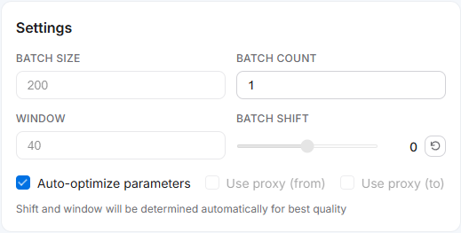
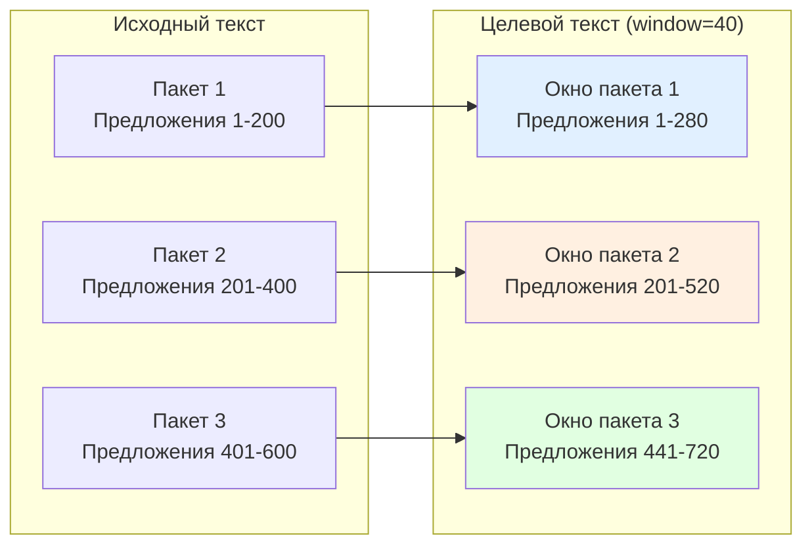
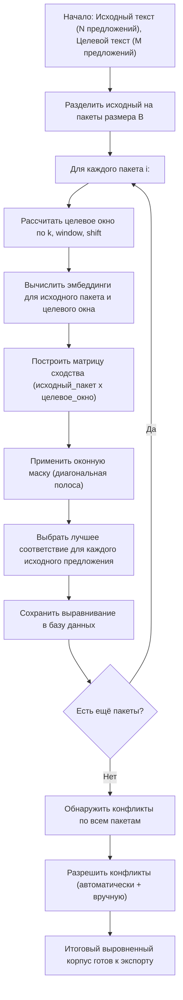

# Пакетная обработка подробно {#batch-processing-explained}

Lingtrain Aligner обрабатывает тексты пакетами, а не целиком за один раз. На этой странице объясняется, почему необходима пакетная обработка, как рассчитывается пропорциональное целевое окно, как параметры window и shift влияют на выравнивание и как перекрытие между пакетами предотвращает ошибки на границах.

## Зачем нужны пакеты {#why-batches}

### Ограничения памяти {#memory}

Алгоритм выравнивания вычисляет **матрицу сходства** между всеми исходными и целевыми предложениями в пакете. Для матрицы с `M` строками исходных и `N` столбцами целевых предложений требуется `M * N * 4` байт (для 32-битных значений с плавающей точкой).

Для полноразмерной книги с 3000 исходных и 3500 целевых предложений:

```
3000 * 3500 * 4 байт = 42 000 000 байт ≈ 40 МБ
```

Это допустимо, но само вычисление эмбеддингов (кодирование 6500 предложений нейросетью) требует значительного времени и памяти. При более крупных текстах (10 000+ предложений) совокупная память для эмбеддингов и матрицы сходства может превысить доступные ресурсы.

Пакетная обработка сохраняет каждый фрагмент достаточно малым для эффективной обработки — размер пакета по умолчанию в 200 предложений создаёт матрицы сходства примерно `200 * 270 * 4 ≈ 216 КБ`, что легко умещается в памяти любой системы.

### Инкрементальный прогресс {#incremental}

Пакетная обработка позволяет:

- **Рано проверять качество** — осмотреть визуализацию после первого пакета, прежде чем обрабатывать весь текст
- **Корректировать параметры** — менять shift или window, увидев результаты первых пакетов
- **Приостанавливать и возобновлять** — остановить обработку в любое время и продолжить позже
- **Обрабатывать ошибки** — если один пакет не удался (например, из-за сетевых проблем с API-моделью), нужно переобработать только этот пакет

## Пропорциональное целевое окно {#proportional-window}

### Основной расчёт {#core-calculation}

Ключевая задача при пакетной обработке — определить, какая часть целевого текста соответствует каждому исходному пакету. Если бы исходный и целевой тексты имели одинаковое число предложений, каждый исходный пакет из 200 предложений соответствовал бы ровно 200 целевым. Но переводы почти никогда не имеют одинакового числа предложений.

Lingtrain использует **пропорциональное отображение** для оценки целевого окна для каждого исходного пакета:

```
k = len(target) / len(source)    (коэффициент пропорциональности)

target_start = source_start * k - window + shift
target_end   = source_end * k   + window + shift
```

Эта формула обеспечивает пропорциональный размер и позиционирование целевого окна, при этом параметр **window** добавляет запас безопасности с каждой стороны.

### Разобранный пример {#worked-example}

Рассмотрим текст с:
- **600** исходных предложений (английский)
- **720** целевых предложений (русский)
- **Размер пакета:** 200
- **Window:** 40
- **Shift:** 0

Коэффициент пропорциональности: `k = 720 / 600 = 1.2`

Это означает, что каждому исходному предложению соответствует примерно 1.2 целевых (русский перевод на 20% длиннее по числу предложений).

**Пакет 1** (исходные предложения 1-200):
```
target_start = 1 * 1.2 - 40 + 0 = -38.8 → ограничено до 1
target_end   = 200 * 1.2 + 40 + 0 = 280
Целевое окно: предложения 1-280
```

**Пакет 2** (исходные предложения 201-400):
```
target_start = 201 * 1.2 - 40 + 0 = 201.2
target_end   = 400 * 1.2 + 40 + 0 = 520
Целевое окно: предложения 201-520
```

**Пакет 3** (исходные предложения 401-600):
```
target_start = 401 * 1.2 - 40 + 0 = 441.2
target_end   = 600 * 1.2 + 40 + 0 = 760 → ограничено до 720
Целевое окно: предложения 441-720
```

Обратите внимание: пакет 1 покрывает целевые предложения 1-280, а пакет 2 начинается с 201. Перекрытие (предложения 201-280) сделано намеренно — оно предотвращает пропуск предложений вблизи границ пакетов.

## Параметр window {#window-parameter}

### Что он делает {#window-what}

Параметр **window** (по умолчанию: 40) добавляет дополнительные предложения с каждой стороны пропорционально рассчитанного целевого окна. Он служит запасом безопасности для учёта:

- **Накопленного дрейфа** — по мере накопления разбиений и слияний предложений по тексту реальное соответствие может отклониться от пропорциональной оценки
- **Локальной вариации** — в некоторых разделах может быть больше разбиений/слияний, чем в среднем
- **Граничных эффектов** — предложения вблизи границ пакетов нуждаются в перекрытии для обеспечения кандидатных соответствий в обоих соседних пакетах



### Выбор правильного размера окна {#window-size}

| Window | Когда использовать |
|--------|-------------------|
| **20-30** | Тексты с очень близким числом предложений (техническая документация, точные переводы) |
| **40** (по умолчанию) | Большинство текстов — хороший баланс безопасности и эффективности |
| **50-60** | Тексты со значительными структурными различиями или свободными переводами |
| **70-100** | Очень свободные переводы, тексты с добавленными/удалёнными разделами, малоресурсные языковые пары с зашумлёнными эмбеддингами |

**Компромиссы:**

- **Большее окно** = больше кандидатных соответствий, меньше риск пропустить правильное, но больше вычислений и выше риск ложных соответствий от далёких предложений
- **Меньшее окно** = быстрее обработка, меньше ложных срабатываний, но риск обрезать правильное соответствие на границах пакетов

### Визуальный индикатор {#visual-indicator}

Визуализация пакетов показывает использованную настройку window для каждого пакета (отображается как «w: 40» на карточке каждого пакета). Если диагональ выравнивания доходит до краёв графика, окно может быть слишком маленьким — правильное соответствие обрезается.

## Параметр shift {#shift-parameter}

### Что он делает {#shift-what}

Параметр **shift** (по умолчанию: 0) вручную смещает позицию целевого окна. Он сдвигает всё целевое окно вперёд (положительный shift) или назад (отрицательный) на указанное число предложений.

```
target_start = source_start * k - window + shift
target_end   = source_end * k   + window + shift
```

### Когда использовать shift {#when-shift}

Shift нужен, когда пропорциональное отображение отклоняется от реальности. Это происходит, когда:

- **В исходном тексте значительно больше предложений, чем в целевом** (или наоборот) в конкретной области, а не только в целом
- **Один текст содержит контент, которого нет в другом** — предисловие, примечание переводчика или приложение, существующее только в одном тексте
- **Пропорциональное соотношение меняется по тексту** — ранние главы могут быть переведены близко (ratio ≈ 1.0), а поздние — более свободно (ratio ≈ 1.3)

### Как обнаружить дрейф {#detect-drift}

Изучите визуализацию пакетов:

- **Чистая диагональ в центре, но обрезана по краям** — окно может быть слишком маленьким, или нужна коррекция shift
- **Диагональ смещена в одну сторону** — пропорциональная оценка неточна; примените shift в противоположном направлении
- **Диагональ наклонена иначе, чем ожидалось** — соотношение для этого раздела отличается от общего; shift может частично скорректировать это

### Разобранный пример с shift {#shift-example}

Допустим, после обработки пакета 2 вы замечаете, что диагональ смещена вверх — целевые предложения, которые соответствуют, расположены примерно на 30 предложений выше, чем предсказал пропорциональный расчёт.

Это означает, что русский перевод содержит больше предложений в начале книги, чем предполагает средний коэффициент. Для коррекции:

- Установите **shift = -30** для пакета 3
- Это сдвинет целевое окно на 30 предложений назад, центрируя его на фактическом соответствии

После применения shift проверьте визуализацию пакета 3. Если диагональ теперь по центру, shift правилен. Если всё ещё смещена, скорректируйте далее.

### Накопление shift {#shift-accumulation}

Shift применяется кумулятивно — если вы установили shift -30 для пакета 3, он остаётся -30 для всех последующих пакетов, пока вы его не измените. Если дрейф продолжает расти, возможно, потребуется увеличить shift для следующих пакетов.

## Перекрытие между пакетами {#overlap}

### Почему перекрытие важно {#why-overlap}

Без перекрытия предложения вблизи границ пакетов не имели бы кандидатных соответствий с одной стороны. Рассмотрим исходное предложение на позиции 200 (последнее предложение пакета 1) — без перекрытия оно может быть сопоставлено только с целевыми предложениями в окне пакета 1. Но его правильное соответствие может оказаться целевым предложением, выходящим за пределы этого окна, в диапазоне, покрываемом пакетом 2.

Параметр window создаёт перекрытие между соседними пакетами:



Зоны перекрытия (предложения 201-280 между пакетами 1-2 и предложения 441-520 между пакетами 2-3) обеспечивают непрерывность: предложения вблизи границ имеют кандидатные соответствия из обоих пакетов.

### Как алгоритм обрабатывает перекрытие {#handling-overlap}

Когда последовательные пакеты создают перекрывающиеся выравнивания, алгоритм разрешает конфликты на границах:

1. **Каждый пакет создаёт своё выравнивание** для своей части исходного текста
2. **Результаты пакетов конкатенируются** в порядке исходного текста
3. **Граничные конфликты** — если последние выравнивания пакета N и первые пакета N+1 расходятся в целевых позициях, этап разрешения конфликтов обрабатывает их как обычные конфликты

Эта бесшовная стыковка — одна из причин, почему пакетный подход работает хорошо: зоны перекрытия обеспечивают достаточную избыточность для определения разрешителем конфликтов правильного выравнивания на границах.

## Диаграмма процесса обработки {#processing-flow}

Полный процесс пакетной обработки:



## Сводка параметров {#parameter-summary}

| Параметр | По умолчанию | Диапазон | Эффект |
|----------|-------------|----------|--------|
| **Размер пакета** | 200 | 50-500 | Число исходных предложений на пакет. Фиксируется после создания выравнивания. |
| **Число пакетов** | 1 | 1-все | Сколько пакетов обработать при следующем нажатии «Выровнять следующий». |
| **Window** | 40 | 10-200 | Дополнительные целевые предложения с каждой стороны пропорционального окна. |
| **Shift** | 0 | -200 до +200 | Ручное смещение для коррекции пропорционального дрейфа. |

### Рекомендуемая начальная конфигурация {#recommended-config}

Для большинства текстов настройки по умолчанию работают хорошо:

- **Размер пакета: 200** — хороший баланс между размером фрагмента и числом пакетов
- **Window: 40** — достаточный запас безопасности для типичных переводов
- **Shift: 0** — начните без смещения; скорректируйте после осмотра первых пакетов

Для сложных текстов (очень свободные переводы, большие различия в числе предложений, малоресурсные языки):

- **Window: 60-80** — больший запас безопасности
- **Shift:** корректируйте инкрементально на основе визуализации
- **Размер пакета:** рассмотрите снижение до 100-150 для более детального контроля

## Дополнительные материалы {#further-reading}

- [Процесс выравнивания](alignment.ru.md) — полный рабочий процесс, включая пакетную обработку
- [Алгоритм выравнивания](algorithm.ru.md) — как работают матрица сходства и разрешение конфликтов
- [Понимание косинусного сходства](cosine-similarity.ru.md) — математика матрицы сходства
- [Векторные представления предложений](sentence-embeddings.ru.md) — как вычисляются эмбеддинги
