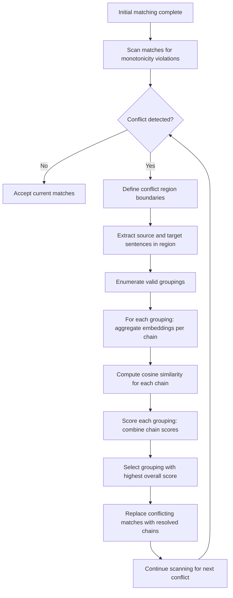

# Conflict Resolution Algorithm in Detail {#conflict-resolution}

When Lingtrain Aligner processes a batch of sentences, the initial matching step produces a sequence of similarity-based matches. In an ideal case, every source sentence maps to exactly one target sentence (1:1 alignment). In practice, translations are rarely this neat — translators split sentences, merge them, omit passages, and reorder content. The conflict resolution algorithm detects these mismatches and resolves them into clean alignment chains.

This page provides a detailed technical description of the conflict resolution process.

## What is a conflict? {#what-is-conflict}

A **conflict** occurs when the initial alignment produces matches that violate the monotonicity constraint — the expectation that sentence order is broadly preserved between source and target texts. Specifically, a conflict is detected when:

- Two or more source sentences map to the same target sentence (convergent match)
- One source sentence maps to multiple target sentences (divergent match)
- Matches cross each other (one source sentence maps to a target sentence that comes *before* the target of a preceding source sentence)

In alignment terminology, a **chain** is a pair `(from_ids, to_ids)` where `from_ids` is a tuple of source sentence indices and `to_ids` is a tuple of target sentence indices. A 1:1 chain like `([5], [5])` means source sentence 5 aligns to target sentence 5. A 2:1 chain like `([5, 6], [5])` means source sentences 5 and 6 together align to target sentence 5. A 1:3 chain like `([5], [5, 6, 7])` means source sentence 5 aligns to target sentences 5, 6, and 7.

## Conflict detection {#detection}

Conflict detection proceeds by scanning the sequence of initial matches (each source sentence mapped to its best-scoring target sentence) and identifying positions where the sequence is non-monotonic.

The detection algorithm works as follows:

1. Iterate through source sentences in order
2. For each source sentence, record which target sentence it was matched to
3. If the target index of the current match is less than or equal to the target index of any previous match, a conflict has begun
4. Continue scanning until the target sequence becomes monotonic again — the conflict region spans from the first out-of-order match to the last

A conflict region is defined by its boundaries: the first and last source sentence indices involved, and the first and last target sentence indices involved. All matches within this region must be re-resolved.

## Conflict types by size {#conflict-types}

Conflicts vary in complexity based on the number of source and target sentences involved:

### Small conflicts (2-3 sentences per side) {#small-conflicts}

The most common case. Typical scenarios:

- **2:1 merge**: The translator merged two source sentences into one target sentence. The initial matcher assigns both source sentences to the same target, creating a convergent conflict.
- **1:2 split**: The translator split one source sentence into two target sentences. One source sentence maps to two adjacent targets, while the next source sentence also maps to one of those targets, creating a crossover.
- **2:2 reorder**: Two source sentences map to two target sentences, but in reversed order.

Small conflicts can be resolved exhaustively by trying all possible groupings.

### Medium conflicts (4-8 sentences per side) {#medium-conflicts}

These arise from longer passages where the translator restructured content more substantially. They may involve a combination of splits, merges, and reorderings. The exhaustive search space is larger but still manageable.

### Large conflicts (9+ sentences per side) {#large-conflicts}

Rare but challenging. These can arise from:
- Significant structural differences between source and target (different paragraph organization)
- Passages where the translator heavily paraphrased or reorganized
- Alignment errors cascading from upstream problems (bad sentence splitting, very different text lengths)

Large conflicts may require heuristic resolution or manual intervention.

## Resolution process {#resolution-process}

The resolution algorithm attempts to find the best grouping of source and target sentences within a conflict region into chains that maximize overall semantic similarity.

### Step 1: Enumerate possible groupings {#step-enumerate}

Given a conflict region with `n` source sentences and `m` target sentences, the algorithm generates all valid groupings. A valid grouping must:

- Assign every source sentence to exactly one chain
- Assign every target sentence to exactly one chain
- Preserve monotonic order (source and target indices within a chain must be contiguous and ordered)
- Respect maximum chain size (typically up to 3:1 or 1:3, sometimes 4:1 or higher for special cases)

For example, given a conflict region with source sentences [3, 4] and target sentences [3, 4, 5], some valid groupings are:

- `([3], [3])` + `([4], [4, 5])` — 1:1 then 1:2
- `([3], [3, 4])` + `([4], [5])` — 1:2 then 1:1
- `([3, 4], [3, 4, 5])` — one big 2:3 chain (if allowed by max size)

### Step 2: Compute chain scores {#step-score}

For each possible grouping, the algorithm computes a similarity score for each chain in the grouping. This requires:

1. **Aggregating source embeddings**: If a chain has multiple source sentences, their embeddings must be combined into a single vector
2. **Aggregating target embeddings**: Similarly for multiple target sentences
3. **Computing similarity**: The cosine similarity between the aggregated source and target vectors

The overall score for a grouping is the product (or sum, depending on configuration) of the individual chain scores.

### Step 3: Select best grouping {#step-select}

The grouping with the highest overall score is selected as the resolution of the conflict. The chains from this grouping replace the original conflicting matches.

### Mermaid diagram of the resolution process {#resolution-diagram}



## Embedding aggregation methods {#aggregation}

When a chain contains multiple sentences on one side (e.g., a 2:1 chain where two source sentences map to one target), the multiple embeddings must be combined into a single vector for comparison. Lingtrain implements several aggregation methods:

### Weighted average {#weighted-average}

The most commonly used method. Each sentence embedding is weighted by a factor (typically based on sentence length or position) and the weighted sum is normalized:

```
v_combined = normalize(w1 * v1 + w2 * v2 + ... + wn * vn)
```

Where `wi` is the weight for sentence `i` and `vi` is its embedding vector.

**Length-based weighting** assigns higher weight to longer sentences, reflecting the assumption that longer sentences carry more semantic content. A sentence of 20 words contributes more to the combined meaning than a sentence of 3 words.

**Equal weighting** simply averages the embeddings. This is the default when sentence lengths are similar.

Weighted average works well in most cases and is computationally efficient.

### Max pooling {#max-pooling}

Instead of averaging, max pooling takes the element-wise maximum across all embedding vectors:

```
v_combined[i] = max(v1[i], v2[i], ..., vn[i])  for each dimension i
```

Max pooling preserves the strongest signal in each dimension. This can be useful when one of the sentences contains a distinctive semantic feature that should dominate the combined representation. However, it can also amplify noise if one embedding has an anomalously high value in a dimension.

### Log scaling {#log-scaling}

Log scaling applies a logarithmic transformation to the weights before averaging:

```
w_scaled = log(1 + length_i) / sum(log(1 + length_j) for all j)
v_combined = normalize(sum(w_scaled_i * v_i))
```

This reduces the dominance of very long sentences in the weighted average. In cases where one sentence is dramatically longer than the others (e.g., one 50-word sentence and one 5-word sentence), plain length-based weighting would almost entirely ignore the short sentence. Log scaling gives it more influence.

### Choosing the right method {#choosing-method}

The choice of aggregation method affects resolution quality:

| Method | Best for | Weakness |
|--------|----------|----------|
| Weighted average | General use, balanced sentence lengths | May under-represent short but semantically important sentences |
| Max pooling | Preserving distinctive features | Can amplify noise; loses averaging effect |
| Log scaling | Very uneven sentence lengths | Slightly more computation; may over-weight trivial short sentences |

In practice, weighted average with length-based weights produces the best results for most text types. Max pooling and log scaling are available as alternatives when the default produces poor results on specific texts.

## Iterative resolution {#iterative-resolution}

Conflict resolution is performed iteratively across multiple passes. After the first pass resolves initial conflicts, the resolved chains may reveal new conflicts (or resolve previously undetected ones). The algorithm repeats until no new conflicts are found or a maximum iteration count is reached.

The iterative process works as follows:

1. **Pass 1**: Detect and resolve all conflicts in the initial match sequence
2. **Pass 2**: Re-scan the resolved sequence for any remaining or newly created conflicts
3. **Pass N**: Continue until convergence (no conflicts remain) or the iteration limit is hit

In practice, most alignments converge within 2-3 passes. Extremely difficult texts (with heavy structural rearrangement) may require more passes.

### Convergence guarantees {#convergence}

The algorithm is designed to converge because each resolution pass either:
- Reduces the total number of conflicts (by resolving them into valid chains)
- Leaves the alignment unchanged (if no new conflicts are found)

It cannot create new conflicts from previously non-conflicting regions, since resolved chains maintain monotonicity within their bounds.

## Configuration parameters {#configuration}

Several parameters control the conflict resolution process:

- **Max chain size**: The maximum number of sentences on either side of a chain (e.g., 3 means up to 3:1, 1:3, or 2:2 chains are allowed). Higher values enable more flexible resolution but increase computation exponentially.
- **Aggregation method**: Which embedding combination method to use (weighted average, max pooling, log scaling).
- **Minimum chain score**: Chains with similarity scores below this threshold are flagged for manual review rather than being accepted automatically.
- **Max iterations**: The maximum number of resolution passes before stopping, regardless of whether conflicts remain.

## Manual conflict resolution {#manual-resolution}

When automatic resolution fails — producing chains with low confidence scores or leaving unresolvable conflicts — Lingtrain provides an interactive interface for manual resolution. Users can:

- View the conflicting source and target sentences side by side
- Manually group sentences into chains
- Split or merge existing chains
- Delete sentences from alignment (marking them as untranslated)

Manual resolution is typically needed for only a small percentage of all chains (1-5% for well-matched texts, up to 10-15% for difficult pairs), but it is essential for achieving high-quality alignment on real-world texts.

## Performance characteristics {#performance}

The computational cost of conflict resolution depends on:

- **Number of conflicts**: More conflicts means more resolution work
- **Conflict size**: The number of valid groupings grows combinatorially with conflict region size. A 2x2 conflict has a handful of groupings; a 5x5 conflict has hundreds
- **Embedding dimension**: Higher-dimensional embeddings increase the cost of similarity computation

For typical literary texts (novels, stories), conflict resolution adds 10-30% to the total alignment time. For well-structured texts (like parliamentary proceedings or subtitles), conflicts are rare and resolution overhead is minimal.

## Diagnostics and quality signals {#diagnostics}

The conflict resolution process produces several diagnostic signals that help assess alignment quality:

- **Conflict count**: The total number of conflicts detected per batch. A high count suggests structural mismatch or parameter issues.
- **Resolution confidence**: The average similarity score of resolved chains. Low confidence suggests that the resolution may be incorrect.
- **Chain type distribution**: The proportion of 1:1, 2:1, 1:2, and larger chains. Most well-aligned texts have 70-90% 1:1 chains.
- **Unresolved conflicts**: Conflicts that exceeded the max chain size or fell below the minimum score threshold. These require manual attention.

These diagnostics are visible in Lingtrain's alignment visualization and batch status indicators, helping users decide whether to accept automatic results or intervene manually.
