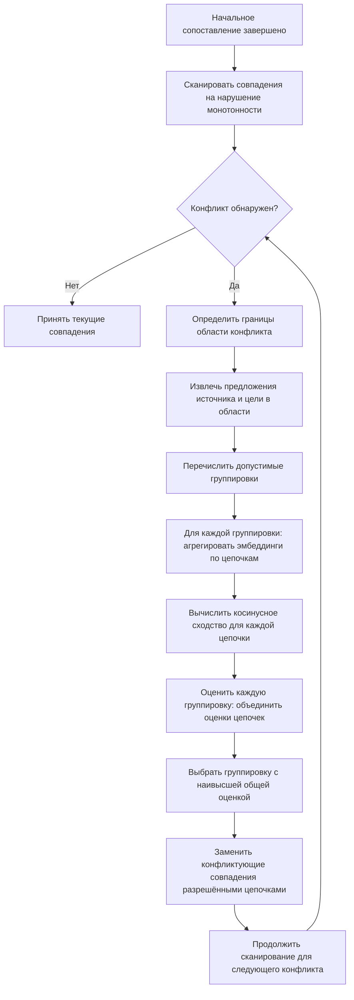

# Алгоритм разрешения конфликтов подробно {#conflict-resolution}

Когда Lingtrain Aligner обрабатывает пакет предложений, этап начального сопоставления порождает последовательность совпадений на основе семантического сходства. В идеальном случае каждое предложение исходного текста сопоставляется ровно с одним предложением целевого текста (выравнивание 1:1). На практике переводы редко бывают столь аккуратными — переводчики разбивают предложения, объединяют их, опускают фрагменты и перестраивают структуру. Алгоритм разрешения конфликтов обнаруживает эти несоответствия и преобразует их в корректные цепочки выравнивания.

На этой странице представлено детальное техническое описание процесса разрешения конфликтов.

## Что такое конфликт? {#what-is-conflict}

**Конфликт** возникает, когда начальное выравнивание порождает совпадения, нарушающие ограничение монотонности — ожидание того, что порядок предложений в целом сохраняется между исходным и целевым текстами. Конкретно, конфликт фиксируется, когда:

- Два или более предложений источника сопоставляются с одним и тем же предложением цели (конвергентное совпадение)
- Одно предложение источника сопоставляется с несколькими предложениями цели (дивергентное совпадение)
- Совпадения пересекаются (предложение источника сопоставляется с предложением цели, расположенным *раньше*, чем цель предыдущего предложения источника)

В терминологии выравнивания **цепочка** — это пара `(from_ids, to_ids)`, где `from_ids` — кортеж индексов предложений источника, а `to_ids` — кортеж индексов предложений цели. Цепочка 1:1 вида `([5], [5])` означает, что предложение 5 источника выравнивается с предложением 5 цели. Цепочка 2:1 вида `([5, 6], [5])` означает, что предложения 5 и 6 источника совместно выравниваются с предложением 5 цели. Цепочка 1:3 вида `([5], [5, 6, 7])` означает, что предложение 5 источника выравнивается с предложениями 5, 6 и 7 цели.

## Обнаружение конфликтов {#detection}

Обнаружение конфликтов происходит путём сканирования последовательности начальных совпадений (каждому предложению источника сопоставлено наилучшее по оценке предложение цели) и выявления позиций, где последовательность немонотонна.

Алгоритм обнаружения работает следующим образом:

1. Перебирать предложения источника по порядку
2. Для каждого предложения источника записать, с каким предложением цели оно сопоставлено
3. Если индекс цели текущего совпадения меньше или равен индексу цели любого предыдущего совпадения — обнаружено начало конфликта
4. Продолжать сканирование, пока последовательность целевых индексов не станет снова монотонной — область конфликта простирается от первого неупорядоченного совпадения до последнего

Область конфликта определяется своими границами: первым и последним индексами предложений источника, а также первым и последним индексами предложений цели. Все совпадения внутри этой области подлежат повторному разрешению.

## Типы конфликтов по размеру {#conflict-types}

Конфликты различаются по сложности в зависимости от числа вовлечённых предложений источника и цели:

### Малые конфликты (2–3 предложения на сторону) {#small-conflicts}

Наиболее распространённый случай. Типичные сценарии:

- **Объединение 2:1**: Переводчик объединил два предложения источника в одно предложение цели. Начальный сопоставитель назначает оба предложения источника одному и тому же предложению цели, создавая конвергентный конфликт.
- **Разбиение 1:2**: Переводчик разбил одно предложение источника на два предложения цели. Одно предложение источника сопоставляется с двумя соседними предложениями цели, а следующее предложение источника тоже сопоставляется с одним из них, создавая пересечение.
- **Перестановка 2:2**: Два предложения источника сопоставляются с двумя предложениями цели, но в обратном порядке.

Малые конфликты разрешаются исчерпывающим перебором всех возможных группировок.

### Средние конфликты (4–8 предложений на сторону) {#medium-conflicts}

Возникают из более длинных фрагментов, где переводчик существенно перестроил содержание. Могут включать комбинацию разбиений, объединений и перестановок. Пространство исчерпывающего поиска больше, но всё ещё управляемо.

### Крупные конфликты (9 и более предложений на сторону) {#large-conflicts}

Редки, но сложны. Могут возникать из-за:
- Значительных структурных различий между источником и целью (разная организация абзацев)
- Фрагментов, где переводчик сильно перефразировал или реорганизовал текст
- Каскадных ошибок выравнивания из-за вышестоящих проблем (неверное разбиение на предложения, сильное различие в объёме текстов)

Крупные конфликты могут потребовать эвристического разрешения или ручного вмешательства.

## Процесс разрешения {#resolution-process}

Алгоритм разрешения стремится найти наилучшую группировку предложений источника и цели внутри области конфликта в цепочки, максимизирующие общее семантическое сходство.

### Шаг 1: Перечисление возможных группировок {#step-enumerate}

Для области конфликта с `n` предложениями источника и `m` предложениями цели алгоритм генерирует все допустимые группировки. Допустимая группировка должна:

- Назначить каждое предложение источника ровно одной цепочке
- Назначить каждое предложение цели ровно одной цепочке
- Сохранять монотонный порядок (индексы источника и цели внутри цепочки должны быть смежными и упорядоченными)
- Соблюдать максимальный размер цепочки (обычно до 3:1 или 1:3, иногда 4:1 или выше для особых случаев)

Например, для области конфликта с предложениями источника [3, 4] и предложениями цели [3, 4, 5] допустимые группировки:

- `([3], [3])` + `([4], [4, 5])` — сначала 1:1, затем 1:2
- `([3], [3, 4])` + `([4], [5])` — сначала 1:2, затем 1:1
- `([3, 4], [3, 4, 5])` — одна большая цепочка 2:3 (если допускается максимальным размером)

### Шаг 2: Вычисление оценок цепочек {#step-score}

Для каждой возможной группировки алгоритм вычисляет оценку сходства для каждой цепочки в группировке. Это требует:

1. **Агрегации эмбеддингов источника**: Если цепочка содержит несколько предложений источника, их эмбеддинги должны быть объединены в единый вектор
2. **Агрегации эмбеддингов цели**: Аналогично для нескольких предложений цели
3. **Вычисления сходства**: Косинусное сходство между агрегированными векторами источника и цели

Общая оценка группировки — произведение (или сумма, в зависимости от конфигурации) индивидуальных оценок цепочек.

### Шаг 3: Выбор лучшей группировки {#step-select}

Группировка с наивысшей общей оценкой выбирается как разрешение конфликта. Цепочки из этой группировки заменяют исходные конфликтующие совпадения.

### Диаграмма процесса разрешения {#resolution-diagram}



## Методы агрегации эмбеддингов {#aggregation}

Когда цепочка содержит несколько предложений на одной стороне (например, цепочка 2:1, где два предложения источника сопоставляются с одним предложением цели), множественные эмбеддинги необходимо объединить в единый вектор для сравнения. Lingtrain реализует несколько методов агрегации:

### Взвешенное среднее {#weighted-average}

Наиболее часто используемый метод. Каждый эмбеддинг предложения взвешивается коэффициентом (обычно на основе длины предложения или позиции), и взвешенная сумма нормализуется:

```
v_combined = normalize(w1 * v1 + w2 * v2 + ... + wn * vn)
```

Где `wi` — вес предложения `i`, а `vi` — его вектор эмбеддинга.

**Взвешивание по длине** назначает больший вес более длинным предложениям, отражая предположение, что длинные предложения несут больше семантического содержания. Предложение из 20 слов вносит больший вклад в объединённый смысл, чем предложение из 3 слов.

**Равное взвешивание** просто усредняет эмбеддинги. Это вариант по умолчанию, когда длины предложений сопоставимы.

Взвешенное среднее хорошо работает в большинстве случаев и вычислительно эффективно.

### Макс-пулинг {#max-pooling}

Вместо усреднения макс-пулинг берёт поэлементный максимум по всем векторам эмбеддингов:

```
v_combined[i] = max(v1[i], v2[i], ..., vn[i])  для каждого измерения i
```

Макс-пулинг сохраняет наиболее сильный сигнал в каждом измерении. Это может быть полезно, когда одно из предложений содержит отличительный семантический признак, который должен доминировать в объединённом представлении. Однако макс-пулинг может также усиливать шум, если один эмбеддинг имеет аномально высокое значение в каком-либо измерении.

### Логарифмическое масштабирование {#log-scaling}

Логарифмическое масштабирование применяет логарифмическое преобразование к весам перед усреднением:

```
w_scaled = log(1 + length_i) / sum(log(1 + length_j) для всех j)
v_combined = normalize(sum(w_scaled_i * v_i))
```

Это снижает доминирование очень длинных предложений во взвешенном среднем. В случаях, когда одно предложение значительно длиннее других (например, одно предложение из 50 слов и одно из 5 слов), простое взвешивание по длине почти полностью проигнорирует короткое предложение. Логарифмическое масштабирование придаёт ему больший вес.

### Выбор подходящего метода {#choosing-method}

Выбор метода агрегации влияет на качество разрешения:

| Метод | Лучше всего для | Слабость |
|-------|----------------|----------|
| Взвешенное среднее | Общее использование, сбалансированные длины предложений | Может недооценивать короткие, но семантически важные предложения |
| Макс-пулинг | Сохранение отличительных признаков | Может усиливать шум; теряется эффект усреднения |
| Логарифмическое масштабирование | Сильно неравные длины предложений | Чуть больше вычислений; может переоценивать тривиальные короткие предложения |

На практике взвешенное среднее с весами по длине даёт лучшие результаты для большинства типов текстов. Макс-пулинг и логарифмическое масштабирование доступны как альтернативы, когда метод по умолчанию даёт плохие результаты на конкретных текстах.

## Итеративное разрешение {#iterative-resolution}

Разрешение конфликтов выполняется итеративно за несколько проходов. После того как первый проход разрешает начальные конфликты, разрешённые цепочки могут выявить новые конфликты (или разрешить ранее незамеченные). Алгоритм повторяется до тех пор, пока новых конфликтов не обнаружено или не достигнуто максимальное число итераций.

Итеративный процесс работает следующим образом:

1. **Проход 1**: Обнаружить и разрешить все конфликты в начальной последовательности совпадений
2. **Проход 2**: Повторно просканировать разрешённую последовательность на наличие оставшихся или вновь возникших конфликтов
3. **Проход N**: Продолжать до сходимости (конфликтов не осталось) или достижения предела итераций

На практике большинство выравниваний сходится за 2–3 прохода. Особо сложные тексты (с существенной структурной перестройкой) могут потребовать большего числа проходов.

### Гарантии сходимости {#convergence}

Алгоритм спроектирован для достижения сходимости, поскольку каждый проход разрешения либо:
- Уменьшает общее число конфликтов (разрешая их в допустимые цепочки)
- Оставляет выравнивание без изменений (если новых конфликтов не найдено)

Он не может создать новые конфликты из ранее бесконфликтных областей, поскольку разрешённые цепочки поддерживают монотонность в своих границах.

## Параметры конфигурации {#configuration}

Несколько параметров управляют процессом разрешения конфликтов:

- **Максимальный размер цепочки**: Максимальное число предложений на каждой стороне цепочки (например, 3 означает допустимость цепочек до 3:1, 1:3 или 2:2). Более высокие значения обеспечивают большую гибкость разрешения, но экспоненциально увеличивают вычисления.
- **Метод агрегации**: Какой метод объединения эмбеддингов использовать (взвешенное среднее, макс-пулинг, логарифмическое масштабирование).
- **Минимальная оценка цепочки**: Цепочки с оценками сходства ниже этого порога отмечаются для ручного просмотра, а не принимаются автоматически.
- **Максимум итераций**: Максимальное число проходов разрешения перед остановкой, вне зависимости от наличия оставшихся конфликтов.

## Ручное разрешение конфликтов {#manual-resolution}

Когда автоматическое разрешение не справляется — порождая цепочки с низкой уверенностью или оставляя неразрешимые конфликты — Lingtrain предоставляет интерактивный интерфейс для ручного разрешения. Пользователи могут:

- Просматривать конфликтующие предложения источника и цели бок о бок
- Вручную группировать предложения в цепочки
- Разбивать или объединять существующие цепочки
- Удалять предложения из выравнивания (помечая их как непереведённые)

Ручное разрешение обычно требуется лишь для небольшого процента всех цепочек (1–5% для хорошо совпадающих текстов, до 10–15% для сложных пар), но оно необходимо для достижения высококачественного выравнивания на реальных текстах.

## Характеристики производительности {#performance}

Вычислительная стоимость разрешения конфликтов зависит от:

- **Числа конфликтов**: Больше конфликтов — больше работы по разрешению
- **Размера конфликта**: Число допустимых группировок растёт комбинаторно с размером области конфликта. Конфликт 2x2 имеет несколько группировок; конфликт 5x5 — сотни
- **Размерности эмбеддингов**: Более высокая размерность увеличивает стоимость вычисления сходства

Для типичных литературных текстов (романов, рассказов) разрешение конфликтов добавляет 10–30% к общему времени выравнивания. Для хорошо структурированных текстов (парламентские протоколы, субтитры) конфликты редки, и накладные расходы на разрешение минимальны.

## Диагностика и сигналы качества {#diagnostics}

Процесс разрешения конфликтов порождает несколько диагностических сигналов, помогающих оценить качество выравнивания:

- **Число конфликтов**: Общее число обнаруженных конфликтов в пакете. Высокое число указывает на структурное несоответствие или проблемы с параметрами.
- **Уверенность разрешения**: Средняя оценка сходства разрешённых цепочек. Низкая уверенность указывает на возможную некорректность разрешения.
- **Распределение типов цепочек**: Доля цепочек 1:1, 2:1, 1:2 и более крупных. В большинстве хорошо выровненных текстов 70–90% цепочек имеют тип 1:1.
- **Неразрешённые конфликты**: Конфликты, превысившие максимальный размер цепочки или опустившиеся ниже порога минимальной оценки. Они требуют ручного вмешательства.

Эта диагностика отображается в визуализации выравнивания и индикаторах статуса пакетов Lingtrain, помогая пользователям решить, принять ли автоматические результаты или вмешаться вручную.
