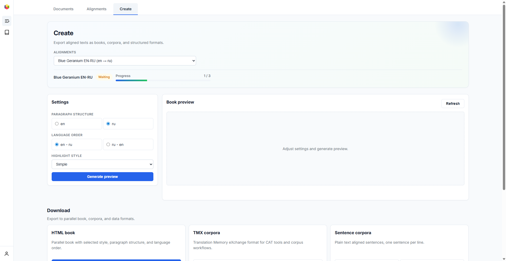

# Export {#export}

The **Create** tab lets you preview and export aligned texts in multiple formats. It is available once you have at least one processed batch in your alignment.

## Export settings {#export-settings}

Configure the output with these options:

- **Paragraph structure** — use paragraph breaks from the source ("from") or target ("to") text. This determines how sentences are grouped into paragraphs in the exported result.
- **Language order** — which language appears on the left side (first) in the parallel view.
- **Highlight style** — visual styling for the parallel book:
  - **Simple** — no background highlighting
  - **Pastel Fill** — solid pastel-colored backgrounds for each language
  - **Pastel Start** — gradient backgrounds that fade out

## Preview {#preview}

Click **"Generate preview"** to see a live preview of the parallel book with your current settings. The preview shows how the final HTML book will look, including paragraph structure, language ordering, and highlight styling.

Adjust settings and regenerate the preview until you're satisfied with the result.

## Download formats {#download}

The following export formats are available:

| Format | Description |
|--------|-------------|
| **HTML book** | Parallel book with side-by-side text, styled and ready to read in any browser. Includes title page and chapter headings from markup tags. |
| **TMX corpora** | Translation Memory eXchange format — standard format for CAT tools (memoQ, SDL Trados, OmegaT). Contains aligned sentence pairs with language metadata. |
| **Sentence corpora** | Plain text files with one aligned sentence per line. Available separately for source and target languages. Useful for NLP research and machine translation training. |
| **Paragraph corpora** | Plain text files grouped by paragraphs based on the selected paragraph structure. Available for both languages. |
| **Structured formats** | XML and JSON representations of the aligned book structure. Suitable for custom processing pipelines and data analysis. |
| **Alignment database** | Lingtrain `.lt` format — the complete alignment database including all metadata, embeddings, and edit history. Use for backup or re-import into Lingtrain. |

Click the download button next to any format to generate and save the file.
