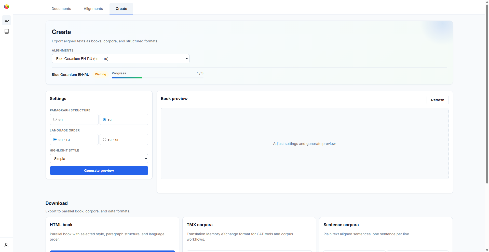
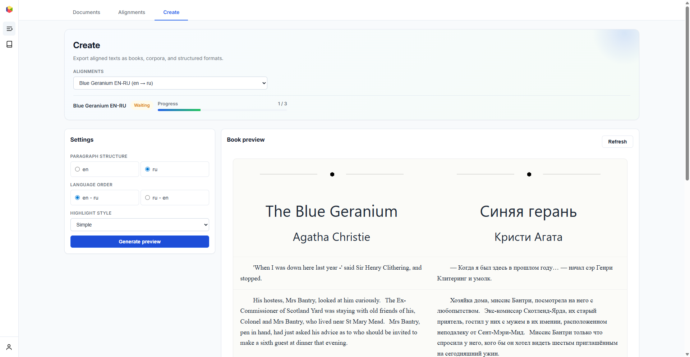
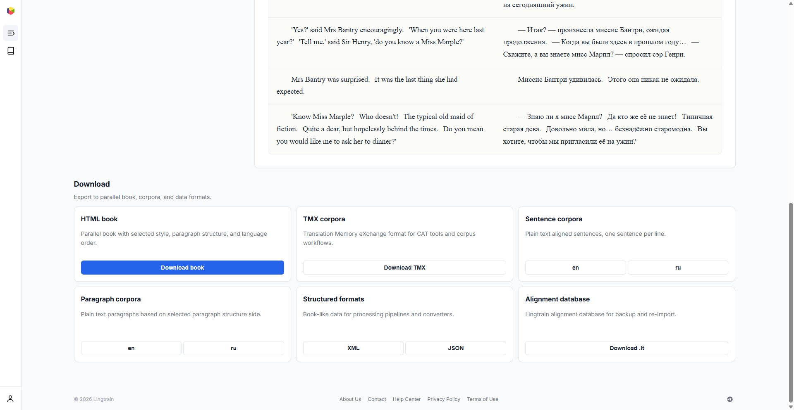

# Export {#export}

The **Create** tab lets you preview and export aligned texts in multiple formats. It is available once you have at least one processed batch in your alignment.

## Export settings {#export-settings}

Configure the output with these options:

- **Paragraph structure** — use paragraph breaks from the source ("from") or target ("to") text. This determines how sentences are grouped into paragraphs in the exported result.
- **Language order** — which language appears on the left side (first) in the parallel view.
- **Highlight style** — visual styling for the parallel book:
  - **Simple** — no background highlighting
  - **Pastel Fill** — solid pastel-colored backgrounds for each language
  - **Pastel Start** — gradient backgrounds that fade out

## Markup {#markup}

The **Markup** section shows the marks stored in the selected `.lt` or `.ltm` alignment. The two active languages are displayed side by side; for multilingual books, they follow the primary and support language selectors. Use the shared page controls to browse long mark lists.

You can add, edit, or delete marks for either visible language. Title and author marks are placed at the beginning automatically and can occur only once per language. For structural marks such as headings, specify the paragraph before which the mark must be rendered. Deleting a mark requires confirmation.

## Preview {#preview}

Click **"Generate preview"** to see a live preview of the parallel book with your current settings. The preview shows how the final HTML book will look, including paragraph structure, language ordering, and highlight styling.

Adjust settings and regenerate the preview until you're satisfied with the result.

## Sharing {#sharing}

Administrators can share their own alignment from the **Share** section. Sharing gives signed-in recipients read-only access to the original book; it does not create a copy. Choose **For everyone** to allow any signed-in Lingtrain user, or find specific active accounts by nickname. The picker does not search or display email addresses. At least one aligned, readable batch is required, so a partially aligned book can be shared and grows automatically as more batches become readable.

While access is active, the section shows one HTTPS invitation link and QR code. The invitation offers **Read on web** and **Open in Theseus**. Each reader keeps independent reading progress, settings, annotations, shelf membership, and offline download against the same live alignment.

Removing direct access keeps the configured recipient list for later reuse. It does not unpublish a book that is separately published in the public Library. Revocation blocks future server reads, downloads, and updates, but cannot remotely erase content already downloaded for offline reading.

## Download formats {#download}

The following export formats are available:

| Format | Description |
|--------|-------------|
| **HTML book** | Parallel book with side-by-side text, styled and ready to read in any browser. Includes title page and chapter headings from markup tags. |
| **TMX corpora** | Translation Memory eXchange format — standard format for CAT tools (memoQ, SDL Trados, OmegaT). Contains aligned sentence pairs with language metadata. |
| **Sentence corpora** | Plain text files with one aligned sentence per line. Available separately for source and target languages. Useful for NLP research and machine translation training. |
| **Paragraph corpora** | Plain text files grouped by paragraphs based on the selected paragraph structure. Available for both languages. |
| **Structured formats** | XML and JSON representations of the aligned book structure. Suitable for custom processing pipelines and data analysis. |
| **Alignment database** | Lingtrain `.lt` format — the complete alignment database including all metadata, embeddings, and edit history. Use for backup or re-import into Lingtrain. |

Click the download button next to any format to generate and save the file.
