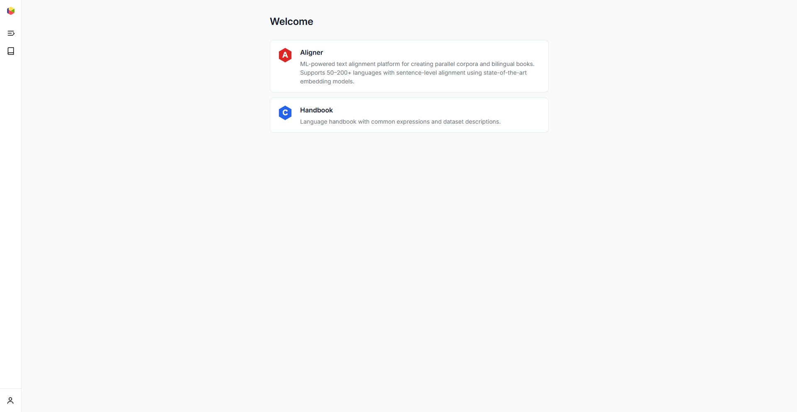
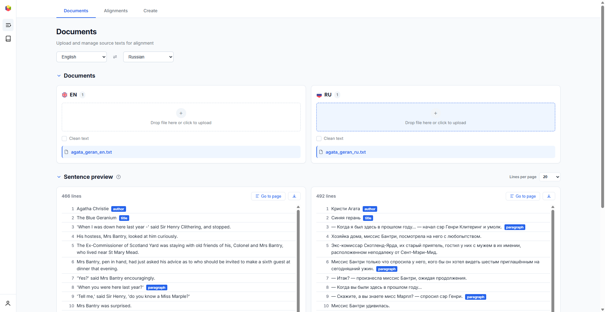
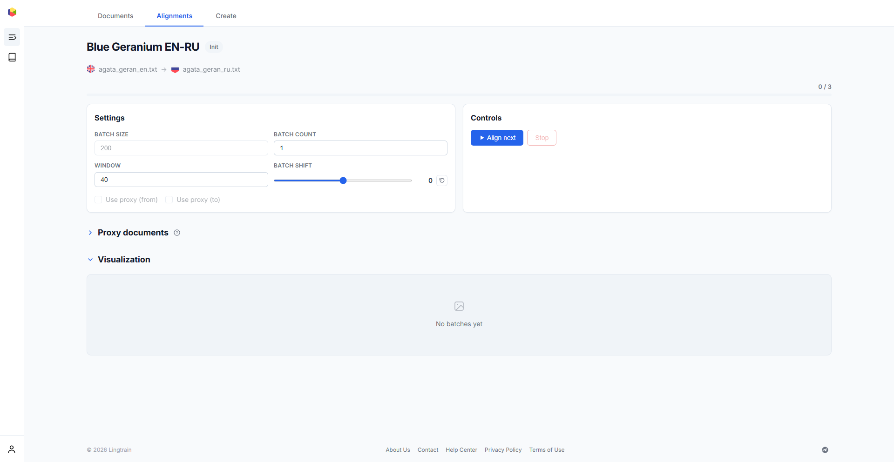
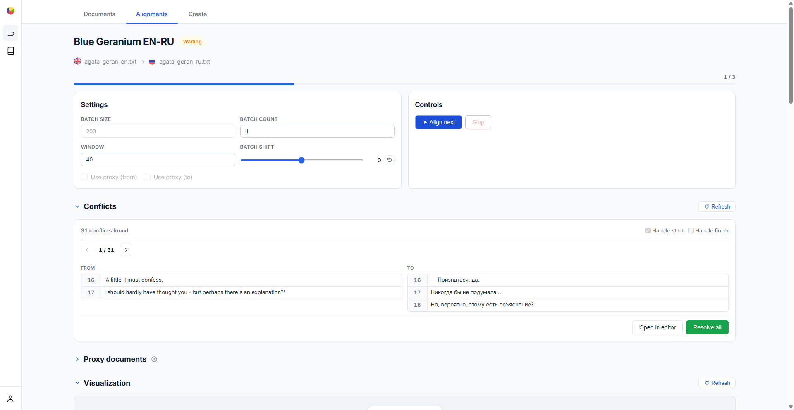
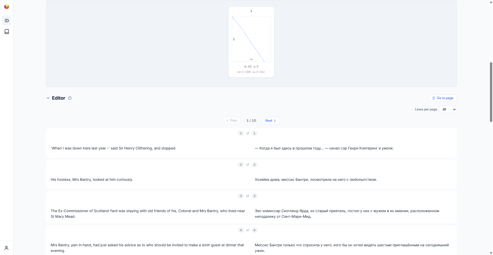
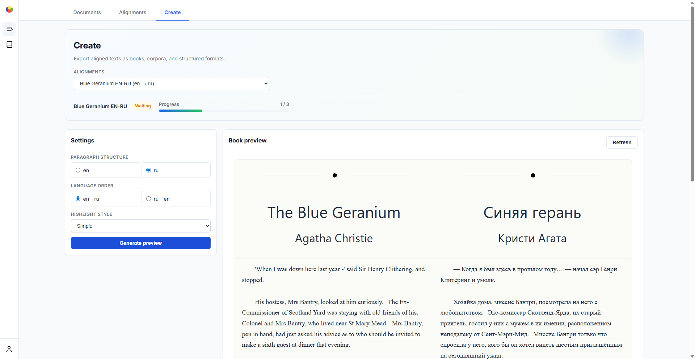
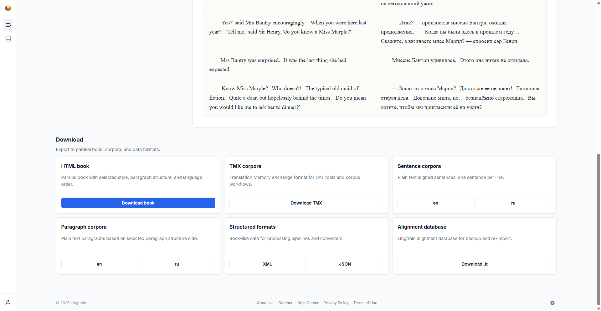

# Lingtrain Aligner {#overview}

Lingtrain Aligner — это веб-приложение на основе ML для создания параллельных корпусов и двуязычных книг из текстов на разных языках. Оно использует современные мультиязычные модели эмбеддингов для автоматического выравнивания предложений между переводами, поддерживая от 50 до 200+ языков.

## Что такое выравнивание текстов? {#what-is-alignment}

Когда у вас есть книга и её перевод, предложения не совпадают один к одному. Переводчик может разбить одно предложение на два, объединить несколько в одно или изменить структуру. **Выравнивание текстов** — это процесс нахождения соответствий между предложениями оригинала и перевода.

Lingtrain Aligner автоматизирует этот процесс с помощью нейронных языковых моделей, которые понимают смысл на разных языках. Приложение преобразует каждое предложение в вектор (эмбеддинг) и находит лучшие семантические совпадения между исходным и целевым текстами.

## Основные возможности {#features}

- **Автоматическое выравнивание на уровне предложений** с использованием мультиязычных моделей эмбеддингов (LaBSE, sentence-transformers)
- **50–200+ языков** — поддержка основных европейских, азиатских и малоресурсных языков
- **Интерактивное разрешение конфликтов** — просмотр и исправление несовпадений, где алгоритм был неуверен
- **Пакетная обработка** с настраиваемыми параметрами (размер пакета, окно, сдвиг)
- **Поддержка прокси-текста** — использование машинного перевода в качестве посредника для малоресурсных языковых пар
- **Множество форматов экспорта** — HTML-книги, TMX-корпусы, корпусы предложений/абзацев, структурированные данные
- **Визуализация** качества выравнивания для каждого пакета
- **Полноценный редактор** для ручной корректировки на уровне предложений

## Обзор рабочего процесса {#workflow}

Процесс выравнивания состоит из трёх основных шагов:

### 1. Загрузка текстов {#step-upload}

Загрузите исходный и целевой тексты во вкладке **Тексты**. Выберите языки, перетащите файлы, затем проверьте предпросмотр предложений и разметку.

[Подробнее о загрузке текстов](uploading.ru.md)

### 2. Выравнивание {#step-align}

Создайте выравнивание во вкладке **Выравнивания**, выбрав исходный и целевой документы. Настройте параметры пакета и нажмите **Начать выравнивание** для запуска обработки.

Система обрабатывает тексты пакетами (по умолчанию: 200 предложений на пакет). После каждого пакета обнаруживаются **конфликты** — места, где алгоритм не смог определить правильное соответствие. Их можно разрешить автоматически или открыть в редакторе для ручной проверки.

Панель **Визуализация** показывает качество выравнивания в виде точечного графика. Чистая диагональная линия означает хорошее выравнивание; разбросанные точки указывают на области, требующие внимания.

**Редактор** отображает выравненные пары предложений рядом друг с другом. Каждая строка показывает исходное предложение слева и его перевод справа. Можно редактировать, разделять, удалять или переназначать предложения.

### 3. Экспорт {#step-export}

Когда выравнивание завершено (или частично завершено), перейдите во вкладку **Экспорт** для предпросмотра и экспорта результатов.

Настройте параметры вывода:

- **Структура абзацев** — использовать разбивку на абзацы из исходного или целевого текста
- **Порядок языков** — какой язык отображается первым
- **Стиль подсветки** — Простой, Пастельная заливка или Пастельный старт

Скачайте в любом из доступных форматов:

| Формат | Описание |
|--------|----------|
| **HTML-книга** | Параллельная книга с текстом бок о бок, со стилями, готовая к чтению |
| **TMX-корпус** | Формат Translation Memory eXchange для CAT-инструментов |
| **Корпус предложений** | Текстовые файлы с одним выравненным предложением на строку |
| **Корпус абзацев** | Текстовые абзацы на основе структуры абзацев |
| **Структурированные форматы** | XML и JSON для пайплайнов обработки |
| **База выравнивания** | Формат Lingtrain `.lt` для резервного копирования и повторной загрузки |

## Поддерживаемые языки {#languages}

Aligner поддерживает следующие языки с выделенной предобработкой:

Русский, английский, немецкий, французский, испанский, итальянский, португальский, турецкий, польский, венгерский, чешский, китайский, японский, корейский, шведский, нидерландский, украинский, белорусский, башкирский, чувашский, армянский.

Для любого другого языка используйте опцию **Другой** — модель эмбеддингов охватывает 100+ языков даже без языко-специфичного разбиения на предложения.

## Сценарии использования {#use-cases}

- **Изучающие языки** — создание параллельных книг из любимых романов для изучения лексики в контексте
- **Переводчики** — создание баз переводов (TMX) из существующих переводов
- **Исследователи** — извлечение параллельных корпусов для NLP и исследований машинного перевода
- **Преподаватели** — подготовка двуязычных учебных материалов
- **Издатели** — выпуск двуязычных изданий с профессиональным оформлением
