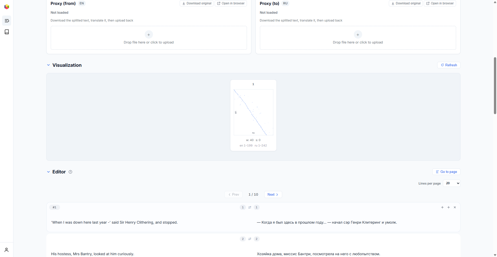
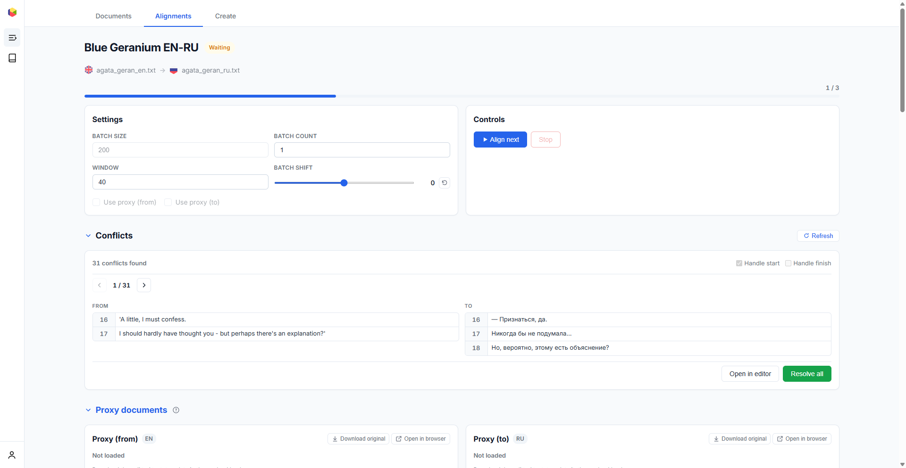
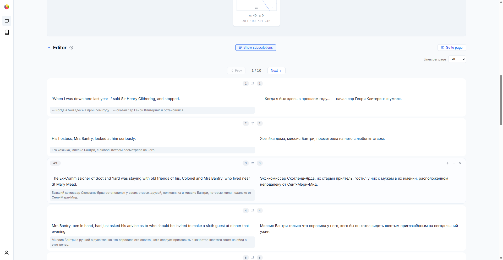

# Подстрочник {#proxy}

Подстрочный перевод улучшает качество выравнивания для языковых пар, где модель эмбеддингов имеет ограниченные обучающие данные.

## Что такое подстрочный перевод? {#what-is-proxy}

Подстрочный перевод — это **машинный перевод** разбитого текста, который служит посредником при выравнивании. Подстрочник полезен, когда модель эмбеддингов имеет ограниченные обучающие данные для данной языковой пары — например, при выравнивании башкирского, чувашского или других малоресурсных языков.

Вместо прямого сравнения оригинальных предложений выравниватель сравнивает подстрочные переводы, которые обычно сделаны на хорошо поддерживаемом языке, таком как английский или русский. Оригинальные тексты сохраняются в финальном результате — подстрочник используется только на этапе сопоставления.

## Когда использовать подстрочник {#when-to-use}

Используйте подстрочный перевод, когда:

- Один или оба языка являются **малоресурсными** (ограниченное представление в модели эмбеддингов)
- Прямое выравнивание даёт **низкое качество** — много конфликтов, сломанная диагональ на визуализации
- Языковая пара **дистантна** (например, японский–финский), и модель плохо справляется с межъязыковым сходством

Подстрочник не нужен для хорошо поддерживаемых языковых пар, таких как английский–русский, английский–немецкий или английский–французский — модели эмбеддингов по умолчанию хорошо справляются с ними.

## Создание подстрочного перевода {#creating-proxy}

1. **Загрузите и разбейте** исходный текст на вкладке [Тексты](uploading.ru.md)
2. **Скачайте разбитый текст** — нажмите кнопку скачивания в панели предпросмотра предложений. Это создаст файл `.txt` с одним предложением на строку
3. **Переведите его** с помощью любого сервиса машинного перевода (Google Translate, DeepL, Яндекс Переводчик и т.д.)
4. **Загрузите перевод** как подстрочник в разделе «Подстрочник» на странице деталей выравнивания

Подстрочник должен содержать **точно такое же количество строк**, как и оригинальный разбитый текст. Каждая строка подстрочника соответствует предложению на той же позиции в оригинале.

## Загрузка подстрочника {#uploading-proxy}

На странице деталей выравнивания раздел **Подстрочник** содержит области загрузки для обоих языков — исходного («из») и целевого («в»).

Для каждого языка:

- **Перетащите** файл `.txt` в область загрузки или нажмите для выбора файла
- После загрузки статус меняется на **«Загружен»** с отображением имени файла
- Используйте кнопку **скачивания** для получения загруженного подстрочника
- Используйте кнопку **удаления** для его удаления
- Используйте кнопку **открытия** для просмотра подстрочника в новой вкладке

## Использование подстрочника при выравнивании {#using-proxy}

После загрузки подстрочных переводов включите их в [настройках выравнивания](alignment.ru.md#settings):

- **Подстрочник (из)** — использовать подстрочник для исходного языка
- **Подстрочник (в)** — использовать подстрочник для целевого языка

Можно включить подстрочник для одной или обеих сторон. При включении выравниватель вычисляет эмбеддинги из подстрочного перевода вместо оригинала, а затем применяет полученное отображение к оригинальным предложениям.

## Подстрочник в редакторе {#proxy-in-editor}

Когда подстрочные переводы загружены, редактор может отображать их в виде **подстрочных аннотаций** под каждым предложением. Это помогает проверять качество выравнивания, даже если вы не владеете одним из языков.

Переключите видимость подстрочника с помощью переключателя **«Показать подстрочник»** в заголовке панели конфликтов.
