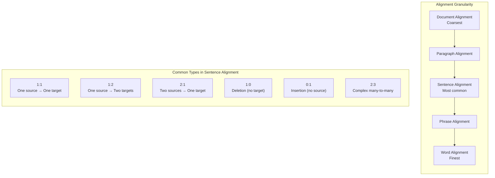

# Text Alignment: Theory and Methods {#text-alignment-theory}

Text alignment is the computational task of establishing correspondences between segments of text in two or more languages. Given a source text and its translation, the goal is to determine which sentences (or phrases, or paragraphs) in the source correspond to which sentences in the translation.

This page surveys the history, methods, challenges, and modern approaches to text alignment — the foundational problem that Lingtrain Aligner solves.

## Why alignment is hard {#why-hard}

At first glance, aligning two texts seems straightforward: sentence 1 maps to sentence 1, sentence 2 to sentence 2, and so on. In practice, this assumption breaks down immediately because of how human translation works.

A skilled translator does not translate sentence by sentence in strict order. They may:

- **Split** a long, complex sentence into two or three shorter ones
- **Merge** several short sentences into a single flowing sentence
- **Reorder** clauses to match the natural syntax of the target language
- **Omit** content that is redundant or culturally irrelevant
- **Add** explanatory material that the target audience needs
- **Restructure** paragraphs to improve readability

These operations mean that the sentence counts in source and target texts almost always differ, and the correspondence between sentences is not one-to-one but a complex many-to-many mapping.

## A brief history {#history}

### Pre-computational era {#pre-computational}

Before computers, parallel texts were aligned manually by scholars — a painstaking process reserved for the most important texts (religious scriptures, legal codes, diplomatic treaties). The Rosetta Stone, interlinear Bible translations, and early comparative grammars all represent manual alignment efforts.

### Statistical revolution (1990s) {#statistical-era}

The modern history of text alignment begins with two landmark publications:

**Brown et al. (1990)** at IBM developed the first statistical models of translation using the Canadian Hansard corpus. Their work showed that translation patterns could be learned from data rather than hand-coded, launching the field of statistical machine translation. The alignment of the Hansard corpus was a prerequisite for training these models.

**Gale and Church (1993)** published "A Program for Aligning Sentences in Bilingual Corpora," which introduced a length-based alignment algorithm. Their key insight was simple but powerful: sentences that are translations of each other tend to have proportional lengths. A long English sentence usually translates to a long French sentence; a short one to a short one. By modeling the relationship between source and target sentence lengths using a statistical distribution, they could align entire documents automatically with high accuracy.

The Gale-Church algorithm uses dynamic programming to find the alignment that maximizes the probability of the observed sentence length pairs, considering possible alignment types: 1-to-1, 1-to-2, 2-to-1, 1-to-0 (deletion), and 0-to-1 (insertion).

**Kay and Roscheisen (1993)** proposed a different approach based on lexical anchoring — using known word correspondences to bootstrap the alignment. Their iterative algorithm alternated between identifying anchor points and refining the alignment.

### Hybrid and lexicon-based methods (2000s) {#hybrid-era}

The 2000s saw increasingly sophisticated approaches:

- **Moore (2002)** combined length-based and word-correspondence methods in a two-pass approach that significantly improved alignment quality.
- **Hunalign** used a combined length-based and dictionary-based scoring scheme, becoming a popular practical tool.
- **Bleualign** (Sennrich and Volk, 2010) used machine translation to create a "rough translation" of the source text, then aligned the rough translation with the actual target text using BLEU score as a similarity metric.

### Neural era (2018-present) {#neural-era}

The transformer revolution transformed text alignment along with every other NLP task:

- **Multilingual sentence embeddings** (mBERT, XLM-R, LaBSE, LASER) made it possible to compute semantic similarity between sentences in any two languages, regardless of whether they share vocabulary or script.
- **Vecalign** (Thompson and Koehn, 2019) used multilingual sentence embeddings with dynamic programming to achieve state-of-the-art alignment quality.
- **Lingtrain Aligner** uses this embedding-based approach with additional innovations in batch processing, conflict resolution, and interactive editing.

## Types of alignment {#alignment-types}

### Sentence-level alignment {#sentence-level}

The most common and practically useful type. Each alignment unit is a sentence (or a small group of sentences that function as a unit). Sentence-level alignment produces the data format needed for machine translation training, translation memories, and bilingual reading tools.

**Challenges at this level:**

- Sentence boundary detection varies by language (Chinese has no spaces; German has long compound sentences; Thai lacks explicit sentence markers)
- 1-to-many and many-to-1 mappings are frequent
- Short, formulaic sentences (greetings, exclamations) can match incorrectly because they all look semantically similar

### Paragraph-level alignment {#paragraph-level}

Aligning entire paragraphs. This is easier than sentence alignment (fewer, larger units) but less useful for most applications. Paragraph alignment is often used as a first step before sentence alignment.

### Word-level alignment {#word-level}

Aligning individual words or short phrases within already sentence-aligned pairs. Word alignment is a subproblem with its own rich literature (IBM Models 1-5, HMM alignment, neural attention-based alignment). It is essential for phrase-based machine translation and bilingual lexicon extraction.

### Phrase-level alignment {#phrase-level}

A middle ground between sentence and word alignment. Phrases (multi-word expressions, clauses) are aligned across languages. This captures translation correspondences at a granularity that is linguistically meaningful but computationally tractable.

The following diagram shows the different alignment types:

## Methods in detail {#methods}

### Length-based methods {#length-based}

The Gale-Church approach exploits a simple observation: the length of a sentence and its translation are correlated. If a source sentence has 20 words, its translation is likely to have around 20 words too (adjusted for the language-specific expansion ratio).

**Algorithm:**
1. Compute sentence lengths (in characters or words)
2. Define alignment types: 1-1, 1-0, 0-1, 1-2, 2-1, 2-2
3. For each possible alignment, compute the probability based on the length ratio
4. Use dynamic programming to find the global alignment that maximizes total probability

**Strengths:** Very fast, language-independent, no bilingual resources needed.
**Weaknesses:** Fails when sentence lengths are not informative (very short sentences, highly divergent languages), cannot handle reordering.

### Lexicon-based methods {#lexicon-based}

These methods use bilingual dictionaries or word translation tables to find anchor points — word pairs that reliably indicate correspondence between segments.

**Algorithm:**
1. Look up each word in a bilingual dictionary
2. Identify "anchor pairs" — sentences that share multiple dictionary translations
3. Use anchors to constrain the alignment space
4. Fill in the gaps between anchors with length-based or statistical methods

**Strengths:** Can handle cases where length information is ambiguous.
**Weaknesses:** Requires a bilingual dictionary, which may not exist for rare language pairs.

### Translation-based methods {#translation-based}

Bleualign and similar methods use machine translation as a bridge:

1. Machine-translate the source text into the target language
2. Compare each machine-translated sentence with each actual target sentence using a similarity metric (BLEU, TER, chrF)
3. Select the best match for each source sentence

**Strengths:** Leverages the full power of MT systems, works for any language with MT support.
**Weaknesses:** Quality depends on MT quality, computationally expensive.

### Embedding-based methods {#embedding-based}

The modern approach used by Lingtrain and other state-of-the-art systems:

1. Encode each sentence into a dense vector (embedding) using a multilingual neural model
2. Compute cosine similarity between all source and target sentence embeddings
3. Use dynamic programming or greedy search to find the optimal alignment

**Strengths:** Language-independent (the embedding model handles cross-lingual mapping), captures semantic similarity rather than surface form, handles languages with different scripts.
**Weaknesses:** Requires a trained multilingual model, computationally heavier than length-based methods, quality depends on the embedding model's coverage of the languages involved.

For details on how sentence embeddings work, see [Sentence Embeddings Explained](sentence-embeddings.en.md).

## Common challenges {#challenges}

### One-to-many alignments {#one-to-many}

A single source sentence translated as two or more target sentences. This is common when translating from languages with long, complex sentences (German, Russian) to languages that prefer shorter constructions (English, Chinese).

**Example:**
> **Source:** "Der alte Mann, der seit vielen Jahren in dem kleinen Haus am Rande des Dorfes lebte, hatte niemals die große Stadt besucht."
>
> **Target 1:** "The old man had lived in the small house at the edge of the village for many years."
> **Target 2:** "He had never visited the big city."

### Many-to-one alignments {#many-to-one}

Multiple source sentences collapsed into a single target sentence. The translator merged content for conciseness or stylistic reasons.

### Null alignments (deletions and insertions) {#null-alignments}

A source sentence with no corresponding target sentence (the translator omitted it), or a target sentence with no source (the translator added content). These are relatively rare in literary translation but common in free/adapted translations.

### Crossing alignments {#crossing}

When the order of content is rearranged between source and target. Sentence 5 in the source might correspond to sentence 3 in the target, creating a "crossing" in the alignment. Most algorithms assume monotonic alignment (preserving order), which is a reasonable approximation for most translation types but breaks down in cases of significant restructuring.

### Short and repetitive sentences {#short-sentences}

Sentences like "Yes.", "Thank you.", "He nodded." appear frequently and all have similar embeddings. The alignment model may confuse them, matching a "Yes" in one part of the text with a "Yes" in a completely different context.

### Domain and register mismatch {#domain-mismatch}

When source and target texts use very different vocabulary or register (e.g., a formal source translated informally), surface-level methods struggle. Embedding-based methods handle this better because they capture semantic meaning rather than exact wording.

## How Lingtrain addresses these challenges {#lingtrain-solutions}

Lingtrain Aligner combines several strategies to handle the difficulties described above:

1. **Batch processing with windowed matching** — instead of aligning entire texts at once, Lingtrain processes batches with overlapping windows, preventing drift and keeping memory manageable. See [Batch Processing in Detail](batch-processing-explained.en.md).

2. **Proportional target window** — the target text window for each batch is calculated proportionally based on sentence count ratios, with configurable padding (window parameter) and manual offset (shift parameter).

3. **Window masking** — similarity scores outside a diagonal band are suppressed, enforcing the monotonicity assumption while allowing local reordering within the window.

4. **Automatic conflict resolution** — after initial alignment, the system detects alignment breaks (conflicts) and resolves them by exhaustively searching for the best grouping of sentences. This handles 1-to-many and many-to-1 cases automatically.

5. **Interactive editor** — for cases that automatic resolution cannot handle, the editor provides tools to manually merge, split, delete, and reassign sentence pairs.

6. **Interlinear translation support** — for language pairs where embedding quality is poor, a machine-translated interlinear translation can be used as an intermediary, improving alignment quality. See [Working with Low-Resource Languages](low-resource-languages.en.md).

7. **Multiple embedding models** — different models excel for different language pairs. Lingtrain supports several models (BGE-M3, LaBSE, Multilingual E5, OpenAI, Qwen3) so you can choose the best one for your languages. See [Comparing Embedding Models](embedding-models-comparison.en.md).

## Evaluation metrics {#evaluation}

Alignment quality is typically measured by:

- **Precision** — what fraction of proposed alignments are correct
- **Recall** — what fraction of true alignments are found
- **F1 score** — harmonic mean of precision and recall
- **Alignment Error Rate (AER)** — the standard metric for word alignment, also adapted for sentence alignment

In practice, Lingtrain uses a **chain score** (1 - breaks/total_lines) as an internal quality metric, where breaks represent discontinuities in the alignment sequence. A perfect score of 1.0 indicates a clean diagonal with no alignment breaks.

## Further reading {#further-reading}

- Gale, W.A. and Church, K.W. (1993). "A Program for Aligning Sentences in Bilingual Corpora." *Computational Linguistics*, 19(1), pp. 75-102.
- Brown, P.F. et al. (1990). "A Statistical Approach to Machine Translation." *Computational Linguistics*, 16(2), pp. 79-85.
- Thompson, B. and Koehn, P. (2019). "Vecalign: Improved Sentence Alignment in Linear Time and Space." *EMNLP 2019*.
- Reimers, N. and Gurevych, I. (2020). "Making Monolingual Sentence Embeddings Multilingual using Knowledge Distillation." *EMNLP 2020*.

For the specific algorithm used by Lingtrain, see [Alignment algorithm](algorithm.en.md). To understand the embedding models used for matching, see [Sentence Embeddings Explained](sentence-embeddings.en.md).
