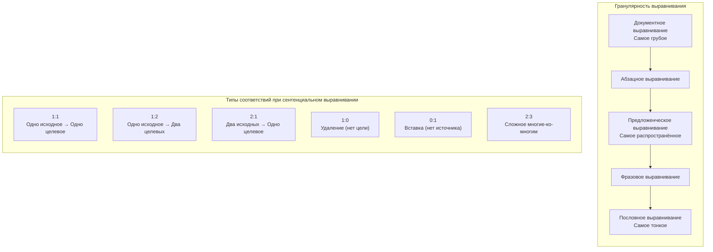

# Выравнивание текстов: теория и методы {#text-alignment-theory}

Выравнивание текстов — это вычислительная задача установления соответствий между сегментами текста на двух или более языках. Имея исходный текст и его перевод, необходимо определить, какие предложения (или фразы, или абзацы) оригинала соответствуют каким предложениям перевода.

На этой странице мы рассмотрим историю, методы, трудности и современные подходы к выравниванию текстов — фундаментальную задачу, которую решает Lingtrain Aligner.

## Почему выравнивание — сложная задача {#why-hard}

На первый взгляд выровнять два текста просто: предложение 1 соответствует предложению 1, предложение 2 — предложению 2, и так далее. На практике это предположение рушится сразу, потому что человеческий перевод работает иначе.

Опытный переводчик не переводит предложение за предложением в строгом порядке. Он может:

- **Разбить** длинное сложное предложение на два-три коротких
- **Объединить** несколько коротких предложений в одно плавное
- **Переставить** части предложения в соответствии с синтаксисом целевого языка
- **Опустить** избыточное или культурно нерелевантное содержание
- **Добавить** пояснительный материал, необходимый целевой аудитории
- **Реструктурировать** абзацы для улучшения читаемости

Эти операции приводят к тому, что количество предложений в исходном и целевом текстах почти всегда различается, а соответствие между предложениями является не взаимно однозначным, а сложным отображением «многие-ко-многим».

## Краткая история {#history}

### Докомпьютерная эра {#pre-computational}

До появления компьютеров параллельные тексты выравнивались учёными вручную — кропотливый процесс, доступный лишь для самых важных текстов (религиозные писания, правовые кодексы, дипломатические договоры). Розеттский камень, подстрочные переводы Библии и ранние сравнительные грамматики — всё это примеры ручного выравнивания.

### Статистическая революция (1990-е) {#statistical-era}

Современная история выравнивания текстов начинается с двух этапных публикаций:

**Браун и др. (1990)** из IBM разработали первые статистические модели перевода на основе канадского Хансарда. Их работа показала, что паттерны перевода можно извлекать из данных, а не кодировать вручную, положив начало области статистического машинного перевода. Выравнивание корпуса Хансарда было предпосылкой для обучения этих моделей.

**Гейл и Чёрч (1993)** опубликовали статью «A Program for Aligning Sentences in Bilingual Corpora», представив алгоритм выравнивания на основе длин предложений. Их ключевое наблюдение было простым, но мощным: предложения, являющиеся переводами друг друга, обычно имеют пропорциональную длину. Длинное английское предложение, как правило, переводится длинным французским, а короткое — коротким. Моделируя соотношение длин исходных и целевых предложений с помощью статистического распределения, они смогли автоматически выравнивать целые документы с высокой точностью.

Алгоритм Гейла-Чёрча использует динамическое программирование для нахождения выравнивания, максимизирующего вероятность наблюдаемых пар длин предложений, с учётом возможных типов выравнивания: 1-к-1, 1-к-2, 2-к-1, 1-к-0 (удаление) и 0-к-1 (вставка).

**Кей и Рошайзен (1993)** предложили иной подход на основе лексических якорей — использование известных пословных соответствий для начальной привязки выравнивания. Их итеративный алгоритм чередовал нахождение опорных точек и уточнение выравнивания.

### Гибридные и лексико-ориентированные методы (2000-е) {#hybrid-era}

В 2000-х появились более изощрённые подходы:

- **Мур (2002)** объединил методы на основе длин и пословных соответствий в двухпроходном подходе, существенно повысившем качество выравнивания.
- **Hunalign** использовал комбинированную оценку на основе длин и словарей, став популярным практическим инструментом.
- **Bleualign** (Зенрих и Фольк, 2010) использовал машинный перевод для создания «чернового перевода» исходного текста, а затем выравнивал его с фактическим целевым текстом, используя метрику BLEU в качестве меры сходства.

### Нейросетевая эра (2018 — настоящее время) {#neural-era}

Революция трансформеров преобразила выравнивание текстов наряду со всеми остальными задачами NLP:

- **Мультиязычные эмбеддинги предложений** (mBERT, XLM-R, LaBSE, LASER) позволили вычислять семантическое сходство между предложениями на любых двух языках вне зависимости от общего словаря или письменности.
- **Vecalign** (Томпсон и Кёен, 2019) применил мультиязычные эмбеддинги предложений с динамическим программированием и достиг передового качества выравнивания.
- **Lingtrain Aligner** использует этот подход на основе эмбеддингов с дополнительными инновациями в пакетной обработке, разрешении конфликтов и интерактивном редактировании.

## Типы выравнивания {#alignment-types}

### Выравнивание на уровне предложений {#sentence-level}

Самый распространённый и практически полезный тип. Каждая единица выравнивания — предложение (или небольшая группа предложений, функционирующих как единое целое). Выравнивание на уровне предложений создаёт формат данных, необходимый для обучения машинного перевода, памятей переводов и инструментов двуязычного чтения.

**Трудности на этом уровне:**

- Определение границ предложений зависит от языка (в китайском нет пробелов; в немецком — длинные составные предложения; в тайском отсутствуют явные маркеры предложений)
- Соответствия 1-ко-многим и многие-к-1 встречаются часто
- Короткие шаблонные предложения (приветствия, восклицания) могут быть сопоставлены неверно из-за семантического сходства

### Выравнивание на уровне абзацев {#paragraph-level}

Выравнивание целых абзацев. Это проще, чем сентенциальное выравнивание (меньше единиц, и они крупнее), но менее полезно для большинства приложений. Абзацное выравнивание часто используется как первый шаг перед выравниванием на уровне предложений.

### Выравнивание на уровне слов {#word-level}

Выравнивание отдельных слов или коротких фраз внутри уже выровненных пар предложений. Пословное выравнивание — это подзадача с собственной обширной литературой (IBM-модели 1-5, HMM-выравнивание, нейросетевое выравнивание на основе внимания). Оно необходимо для фразового машинного перевода и извлечения двуязычных словарей.

### Выравнивание на уровне фраз {#phrase-level}

Промежуточный уровень между предложенческим и пословным выравниванием. Фразы (многословные выражения, клаузы) выравниваются между языками. Это отражает переводческие соответствия на уровне, лингвистически осмысленном и вычислительно решаемом.

Следующая диаграмма показывает различные типы выравнивания:

## Методы подробно {#methods}

### Методы на основе длин {#length-based}

Подход Гейла-Чёрча использует простое наблюдение: длина предложения и его перевода коррелированы. Если исходное предложение содержит 20 слов, его перевод, скорее всего, тоже содержит около 20 слов (с поправкой на коэффициент расширения для конкретной пары языков).

**Алгоритм:**
1. Вычислить длины предложений (в символах или словах)
2. Определить типы выравнивания: 1-1, 1-0, 0-1, 1-2, 2-1, 2-2
3. Для каждого возможного выравнивания вычислить вероятность на основе соотношения длин
4. Методом динамического программирования найти глобальное выравнивание, максимизирующее суммарную вероятность

**Достоинства:** Очень быстро, независимо от языка, не требует двуязычных ресурсов.
**Недостатки:** Даёт сбои, когда длины не информативны (очень короткие предложения, сильно различающиеся языки), не обрабатывает перестановки.

### Лексико-ориентированные методы {#lexicon-based}

Эти методы используют двуязычные словари или таблицы переводов слов для нахождения опорных точек (якорей) — пар слов, надёжно указывающих на соответствие между сегментами.

**Алгоритм:**
1. Найти каждое слово в двуязычном словаре
2. Определить «якорные пары» — предложения с несколькими совпадающими переводами из словаря
3. Использовать якоря для ограничения пространства выравнивания
4. Заполнить промежутки между якорями методами на основе длин или статистическими методами

**Достоинства:** Справляется с ситуациями, где информация о длине неоднозначна.
**Недостатки:** Требует двуязычного словаря, который может не существовать для редких языковых пар.

### Методы на основе перевода {#translation-based}

Bleualign и аналогичные методы используют машинный перевод как мост:

1. Машинно перевести исходный текст на целевой язык
2. Сравнить каждое машинно-переведённое предложение с каждым фактическим целевым предложением с помощью метрики сходства (BLEU, TER, chrF)
3. Выбрать наилучшее соответствие для каждого исходного предложения

**Достоинства:** Использует всю мощь систем МТ, работает для любого языка с поддержкой МТ.
**Недостатки:** Качество зависит от качества МТ, вычислительно затратно.

### Методы на основе эмбеддингов {#embedding-based}

Современный подход, используемый Lingtrain и другими передовыми системами:

1. Закодировать каждое предложение в плотный вектор (эмбеддинг) с помощью мультиязычной нейронной модели
2. Вычислить косинусное сходство между всеми эмбеддингами исходных и целевых предложений
3. Найти оптимальное выравнивание методом динамического программирования или жадного поиска

**Достоинства:** Независимость от языка (модель эмбеддингов обеспечивает кросс-языковое отображение), учитывает семантическое сходство, а не поверхностную форму, работает с языками с различными письменностями.
**Недостатки:** Требует обученной мультиязычной модели, вычислительно тяжелее методов на основе длин, качество зависит от покрытия языков моделью.

Подробнее о том, как работают эмбеддинги предложений, см. [Векторные представления предложений](sentence-embeddings.ru.md).

## Типичные трудности {#challenges}

### Выравнивание «один ко многим» {#one-to-many}

Одно исходное предложение переведено двумя или более целевыми. Это часто происходит при переводе с языков с длинными сложными предложениями (немецкий, русский) на языки, предпочитающие короткие конструкции (английский, китайский).

**Пример:**
> **Оригинал:** «Старик, который много лет жил в маленьком домике на окраине деревни, никогда не бывал в большом городе.»
>
> **Перевод 1:** "The old man had lived in the small house at the edge of the village for many years."
> **Перевод 2:** "He had never visited the big city."

### Выравнивание «многие к одному» {#many-to-one}

Несколько исходных предложений объединены в одно целевое. Переводчик объединил содержание для краткости или стилистических целей.

### Нулевые выравнивания (удаления и вставки) {#null-alignments}

Исходное предложение без соответствующего целевого (переводчик его опустил) или целевое без исходного (переводчик добавил содержание). Это относительно редко в литературном переводе, но распространено в свободных/адаптированных переводах.

### Перекрёстные выравнивания {#crossing}

Когда порядок содержания перестраивается между исходным и целевым текстом. Предложение 5 в оригинале может соответствовать предложению 3 в переводе, создавая «перекрёстье» в выравнивании. Большинство алгоритмов предполагают монотонное выравнивание (с сохранением порядка), что является разумным приближением для большинства видов перевода, но нарушается при значительной перестройке текста.

### Короткие и повторяющиеся предложения {#short-sentences}

Предложения вроде «Да.», «Спасибо.», «Он кивнул.» встречаются часто и имеют схожие эмбеддинги. Модель выравнивания может их перепутать, сопоставив «Да» в одной части текста с «Да» в совершенно другом контексте.

### Несовпадение домена и регистра {#domain-mismatch}

Когда исходный и целевой тексты используют очень разную лексику или регистр (например, формальный оригинал переведён неформально), методы поверхностного уровня испытывают трудности. Методы на основе эмбеддингов справляются лучше, поскольку фиксируют семантическое значение, а не точные формулировки.

## Как Lingtrain справляется с этими трудностями {#lingtrain-solutions}

Lingtrain Aligner сочетает несколько стратегий для решения описанных выше проблем:

1. **Пакетная обработка с оконным сопоставлением** — вместо выравнивания всего текста сразу Lingtrain обрабатывает пакеты с перекрывающимися окнами, предотвращая дрейф и контролируя расход памяти. См. [Пакетная обработка подробно](batch-processing-explained.ru.md).

2. **Пропорциональное целевое окно** — целевое окно для каждого пакета рассчитывается пропорционально на основе соотношения числа предложений, с настраиваемым запасом (параметр window) и ручным смещением (параметр shift).

3. **Оконная маска** — оценки сходства за пределами диагональной полосы подавляются, обеспечивая допущение монотонности при сохранении возможности локальных перестановок в пределах окна.

4. **Автоматическое разрешение конфликтов** — после начального выравнивания система обнаруживает разрывы (конфликты) и разрешает их путём полного перебора возможных группировок предложений. Это автоматически обрабатывает случаи «один ко многим» и «многие к одному».

5. **Интерактивный редактор** — для случаев, с которыми автоматическое разрешение не справляется, редактор предоставляет инструменты для ручного объединения, разбиения, удаления и переназначения пар предложений.

6. **Поддержка подстрочника** — для языковых пар с низким качеством эмбеддингов можно использовать машинный перевод в качестве посредника, повышая качество выравнивания. См. [Работа с малоресурсными языками](low-resource-languages.ru.md).

7. **Несколько моделей эмбеддингов** — разные модели лучше подходят для разных языковых пар. Lingtrain поддерживает несколько моделей (BGE-M3, LaBSE, Multilingual E5, OpenAI, Qwen3), чтобы вы могли выбрать оптимальную. См. [Сравнение моделей эмбеддингов](embedding-models-comparison.ru.md).

## Метрики оценки {#evaluation}

Качество выравнивания обычно измеряется с помощью:

- **Точность (Precision)** — какая доля предложенных выравниваний корректна
- **Полнота (Recall)** — какая доля истинных выравниваний найдена
- **F1-мера** — гармоническое среднее точности и полноты
- **Alignment Error Rate (AER)** — стандартная метрика для пословного выравнивания, адаптированная также для сентенциального

На практике Lingtrain использует **оценку цепей** (1 - разрывы/общее_число_строк) как внутреннюю метрику качества, где разрывы — это нарушения непрерывности последовательности выравнивания. Идеальная оценка 1.0 означает чистую диагональ без разрывов.

## Дополнительная литература {#further-reading}

- Gale, W.A. and Church, K.W. (1993). "A Program for Aligning Sentences in Bilingual Corpora." *Computational Linguistics*, 19(1), pp. 75-102.
- Brown, P.F. et al. (1990). "A Statistical Approach to Machine Translation." *Computational Linguistics*, 16(2), pp. 79-85.
- Thompson, B. and Koehn, P. (2019). "Vecalign: Improved Sentence Alignment in Linear Time and Space." *EMNLP 2019*.
- Reimers, N. and Gurevych, I. (2020). "Making Monolingual Sentence Embeddings Multilingual using Knowledge Distillation." *EMNLP 2020*.

Об алгоритме, используемом Lingtrain, см. [Алгоритм выравнивания](algorithm.ru.md). О моделях эмбеддингов см. [Векторные представления предложений](sentence-embeddings.ru.md).
