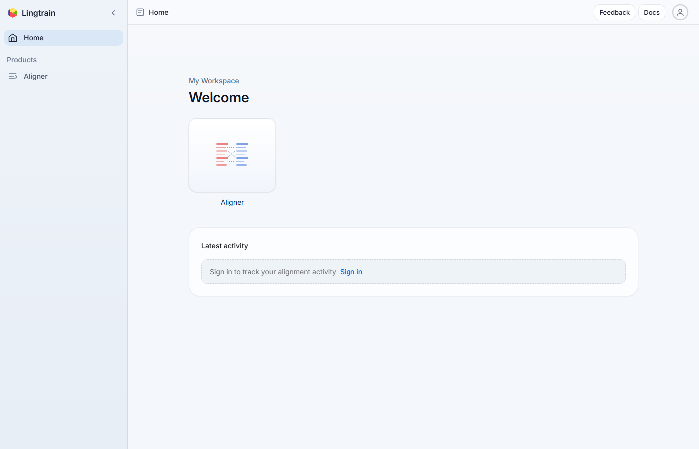
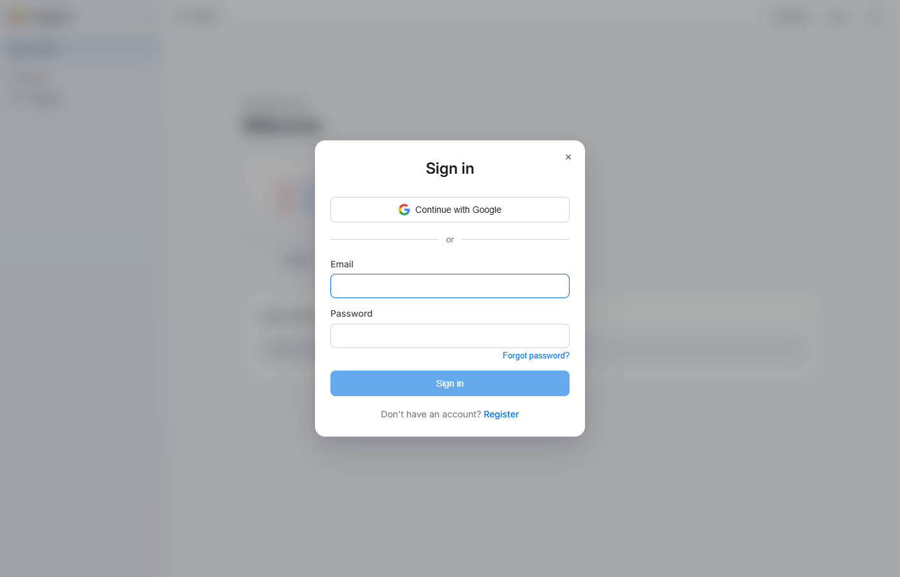
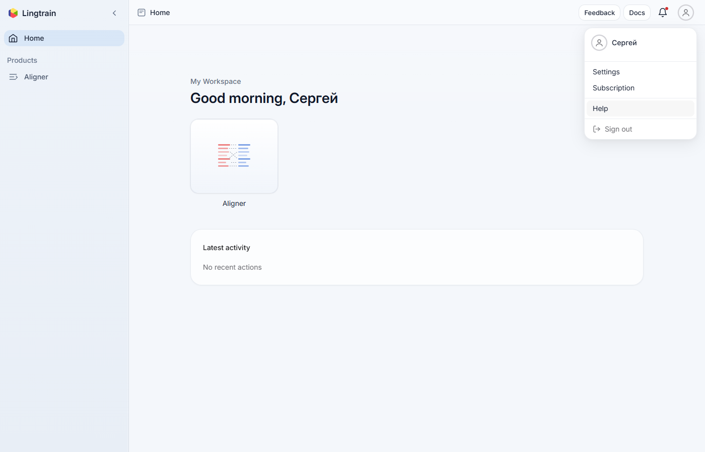

# Tutorial: Account and Settings {#account-settings}

This tutorial covers account management in Lingtrain: creating an account, signing in, configuring your workspace, and adjusting application settings.

## Creating an Account {#registration}

To use Lingtrain Aligner, you need an account. Open the application and click **"Sign in"** in the top-right corner.

### Email Registration {#email-registration}

1. In the sign-in dialog, click **"Create account"**.
2. Enter your **email address**.
3. Choose a **password** (minimum 6 characters).
4. Enter the password again to confirm.
5. Read and accept the **terms of use** and **personal data processing policy** by checking the consent checkbox.
6. Click **"Register"**.

### Email Verification {#email-verification}

After registration, the system sends a six-digit verification code to your email address.

1. Check your inbox (and spam folder, just in case).
2. Enter the code on the verification screen.
3. Click **"Verify"**.

If the code does not arrive, use **"Send a new code"** to request another one. There is a short cooldown between resend attempts.

### Setting Your Name {#setting-name}

After verification, you are prompted to enter your display name. This name appears on the home page greeting (e.g., "Good morning, Maria") and in the account settings.

Enter your name and click **"Continue"**.

## Signing In {#signing-in}

If you already have an account:

1. Click **"Sign in"** on the landing page.
2. Enter your email and password.
3. Click **"Sign in"**.

### OAuth Providers {#oauth}

You can also sign in using third-party providers:

- **Google** — click "Continue with Google" and follow the Google authentication flow.
- **Yandex** — click "Continue with Yandex" for Yandex ID authentication.
- **VK** — click "Continue with VK" for VK ID authentication.

The available providers depend on your region and the application configuration. OAuth sign-in creates an account automatically if one does not exist for that email.

### Password Reset {#password-reset}

If you forgot your password:

1. Click **"Forgot password?"** on the sign-in screen.
2. Enter the email address associated with your account.
3. Click **"Send reset code"**.
4. Check your email for a six-digit reset code.
5. Enter the code and your new password.
6. Click **"Update password"**.

After resetting, you can sign in with the new password.

## The Home Page {#home-page}

After signing in, you land on the home page. The home page shows:

- **Greeting** — a time-appropriate greeting with your name (Good morning/afternoon/evening).
- **My Workspace** — cards for available applications:
  - **Aligner** — the text alignment tool (the main application).
  - **Handbook** — language handbook with common expressions and dataset descriptions.
- **Latest activity** — your recent alignment actions (created, processed, exported alignments).

Click on any application card to open it.

## Application Settings {#settings}

Access settings by clicking the gear icon or navigating to the Settings page. Settings are organized into sections.

### General Settings {#general-settings}

#### Appearance {#appearance}

Choose the visual theme for the application:

- **System** — follows your operating system's preference (light or dark).
- **Light** — always light theme.
- **Dark** — always dark theme.

The theme affects the entire application interface.

#### Language {#language}

Select the interface language:

- **English** — all UI labels, buttons, and messages in English.
- **Russian** — all UI labels, buttons, and messages in Russian.

This setting only affects the application interface — it does not affect the languages of your alignment texts.

### Account Settings {#account-section}

#### Name {#name-setting}

Your display name, shown in the home page greeting and in your profile. Click the name field to edit it, then click **"Save"** to apply changes.

#### Email {#email-setting}

Your registered email address. This is used for authentication and notifications. The email is displayed but cannot be changed from the settings page.

### Notifications {#notifications}

Notification preferences are managed in the Notifications section. When enabled, you receive notifications about:

- Alignment processing completion.
- Queue position updates.
- System announcements.

Notifications appear in the application's notification center, accessible via the bell icon in the top navigation bar.

## Navigation {#navigation}

The application has a consistent navigation structure:

### Top Navigation Bar {#top-bar}

- **Logo** — click to return to the home page.
- **Application title** — shows the current application name.
- **Notification bell** — access notifications.
- **User menu** — access settings, account information, and sign out.

### Aligner Tabs {#aligner-tabs}

Within the Aligner, three tabs organize the workflow:

- **Documents** — upload and manage texts.
- **Alignments** — create and run alignment projects.
- **Create** — preview and export results.

These tabs are persistent — you can switch between them without losing your work.

### Footer {#footer}

The footer provides links to:

- **Home** — return to the landing page.
- **Contacts** — contact information.
- **Documentation** — link to these docs.
- **Privacy Policy** — data privacy information.
- **Terms of Use** — service terms.
- **Personal Data Agreement** — data processing consent details.

## Signing Out {#signing-out}

To sign out, click **"Logout"** in the user menu (top-right corner). You will be returned to the landing page.

Your alignment data is stored on the server and persists between sessions. You can sign back in at any time to continue your work.

## Data and Privacy {#data-privacy}

- Your uploaded texts and alignment data are stored on the server and associated with your account.
- Only you can access your alignment projects — they are not shared with other users.
- You can delete individual alignments and documents from your workspace at any time.
- For details on data handling, review the Privacy Policy and Personal Data Agreement linked in the application footer.

## Tips {#tips}

1. **Use a strong, unique password** for your account. The minimum is 6 characters, but longer passwords with mixed characters are more secure.
2. **Verify your email promptly.** Unverified accounts may have limited functionality.
3. **Choose your preferred language** in settings. The interface is fully localized in English and Russian.
4. **Try dark mode** for extended alignment sessions — it reduces eye strain in low-light environments.
5. **Check notifications** after queueing alignment tasks. The system notifies you when processing completes.

## Next Steps {#next-steps}

- [Tutorial: Your First Alignment](tutorial-first-alignment.en.md) — get started with the Aligner.
- [Tutorial: Preparing Texts](tutorial-prepare-texts.en.md) — prepare texts for your first alignment project.
