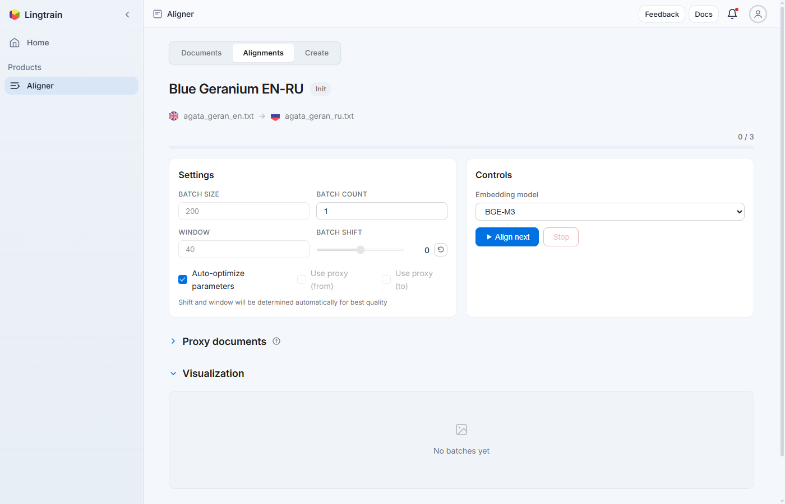
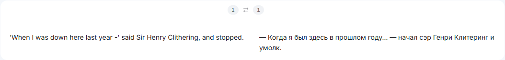

# Руководство: использование редактора выравнивания {#editor-guide}

Редактор выравнивания — мощный инструмент для проверки и тонкой настройки выровненных пар предложений. Это руководство охватывает все доступные функции редактора: навигацию, пагинацию, редактирование ячеек, работу с кандидатами и управление строками.

## Доступ к редактору {#accessing}

Редактор находится в разделе **Editor** на странице деталей выравнивания. Он становится доступен после обработки хотя бы одного пакета. Также можно перейти к конкретному месту напрямую из раздела Conflicts или из карточки визуализации, нажав **«Open in editor»**.

## Компоновка редактора {#layout}

Редактор отображает выровненные пары предложений в двухколоночной таблице:

Каждая строка представляет одну выровненную пару и содержит:

- **Номер строки** — последовательная нумерация (#1, #2, #3, ...).
- **Идентификаторы исходных строк** — оригинальные номера строк из обоих текстов, показаны мелким шрифтом. Эти идентификаторы сохраняются через все операции редактирования, поддерживая связь с исходными документами.
- **Исходный текст** (левая колонка) — предложение из исходного языка («from»).
- **Целевой текст** (правая колонка) — соответствующее предложение из целевого языка («to»).

Пустые ячейки могут появляться там, где в выравнивании есть пробелы — например, когда предложение на одном языке не имеет аналога на другом.

## Навигация и пагинация {#navigation}

### Элементы управления страницами {#page-controls}

Редактор использует постраничную навигацию для работы с большими выравниваниями. Элементы управления расположены в верхней и нижней частях раздела:

- **Per page** — выбор количества строк на странице: 10, 20 или 50. Меньше строк — удобнее детальная проверка; больше строк — лучший контекст.
- **Индикатор страницы** — показывает текущую страницу и общее количество (например, «Page 3 of 15»).
- **Prev / Next** — переход между страницами.
- **Go to page** — введите номер страницы и нажмите **«Go»** для прямого перехода.

### Советы по навигации {#navigation-tips}

- При обзоре всего выравнивания начинайте с 20 или 50 строк на странице для быстрого сканирования очевидных проблем.
- Переключайтесь на 10 строк при детальном редактировании.
- Используйте «Go to page» для перехода к конкретным местам, обнаруженным просмотрщиком конфликтов или визуализацией.
- Редактор запоминает настройки пагинации для каждого выравнивания.

## Действия с ячейками {#cell-actions}

Наведите курсор на любую ячейку (исходную или целевую), чтобы увидеть кнопки действий. Это инструменты для редактирования выравнивания.

### Редактирование {#action-edit}

Нажмите кнопку **Edit** (значок карандаша), чтобы войти в режим редактирования ячейки. Ячейка превращается в текстовое поле ввода, где можно изменить содержимое.

Случаи использования:

- **Исправление опечаток или ошибок OCR** в исходном тексте.
- **Объединение текста** из соседних ячеек путём копирования содержимого из одной ячейки и вставки в другую.
- **Очистка** нежелательных символов или артефактов форматирования.

После редактирования сохраните изменения. Оригинальные идентификаторы строк сохраняются — меняется только текстовое содержимое.

### Кандидаты {#action-candidates}

Нажмите **Candidates**, чтобы просмотреть альтернативные варианты сопоставления для ячейки. Система извлекает предложения из того же текста, которые потенциально могут быть помещены в эту ячейку, ранжированные по семантическому сходству с предложением в противоположной колонке.

Используйте кнопки **Previous** и **Next** для перебора кандидатов. Когда найдёте правильное совпадение, подтвердите выбор.

Эта функция особенно полезна для:

- **Исправления несоответствий** — когда неправильное предложение оказалось в ячейке.
- **Разрешения конфликтов** — поиска правильного партнёра для предложения среди нескольких кандидатов.
- **Проверки выравнивания** — подтверждения, что текущее совпадение действительно лучшее.

### Удаление {#action-delete}

Нажмите **Delete**, чтобы удалить предложение из ячейки. Ячейка становится пустой, но сама строка остаётся.

Случаи использования:

- **Удаление несопоставленного контента** — примечаний переводчика, сносок или лишних предложений без аналога.
- **Очистка неверно размещённого предложения** — когда предложение попало не на своё место и должно быть перемещено.

Удаление не убирает предложение из исходного документа — оно удаляется только из результата выравнивания.

### Добавление пустой строки {#action-add-row}

Две кнопки позволяют вставить пустую строку:

- **Add empty row above** — вставка пустой строки перед текущей.
- **Add empty row below** — вставка пустой строки после текущей.

Пустые строки полезны для:

- **Создания пространства** для ручных корректировок, когда нужно сдвинуть предложения вверх или вниз.
- **Разделения ошибочно объединённого контента** — добавьте пустую строку, затем переместите в неё предложения.
- **Обработки структурных различий** — когда в одном тексте есть дополнительный контент, которому нужен заполнитель в другом.

### Разделение предложения {#action-split}

Действие **Split sentence** позволяет разделить содержимое ячейки в указанной позиции. При активации вы указываете позицию разделения, и текст делится на две части: первая остаётся в текущей ячейке, вторая перемещается в новую строку ниже.

Это полезно, когда два предложения ошибочно объединились в одну ячейку — вы можете разделить их и выровнять каждую часть отдельно.

## Работа с подстрочными аннотациями {#proxy-annotations}

Когда для выравнивания загружены подстрочные переводы, редактор может отображать их в виде подстрочных аннотаций под каждым предложением.

Переключите видимость подстрочника с помощью переключателя **«Show subscriptions»** в заголовке панели Conflicts.

Подстрочные аннотации полезны для:

- **Проверки выравнивания незнакомых языков** — если вы не читаете на одном из языков, подстрочный перевод (на знакомом вам языке) помогает подтвердить правильность пар.
- **Проверки качества подстрочника** — сравнения подстрочного перевода с оригиналом для выявления проблем.

## Рекомендации по рабочему процессу {#workflow}

### Быстрый обзор {#quick-review}

1. Установите 50 строк на странице.
2. Просканируйте страницы, ища явно несовпадающие пары.
3. При обнаружении проблемы переключитесь в режим детального редактирования.

### Детальное редактирование {#detailed-editing}

1. Установите 10 или 20 строк на странице.
2. Внимательно прочитайте каждую пару.
3. Используйте Candidates для проверки сомнительных совпадений.
4. Используйте Edit и Delete для исправления проблем.

### Разрешение конфликтов {#conflict-workflow}

1. Перейдите к конфликту через «Open in editor» из раздела Conflicts.
2. Изучите окружающий контекст — посмотрите 5-10 строк до и после конфликта.
3. Определите паттерн (разбиение, объединение, отсутствующий контент или перестановка).
4. Примените подходящее исправление с помощью инструментов редактора.
5. Перейдите к следующему конфликту.

### Проверка краёв {#edge-review}

Система предупреждает: «Pay attention to the beginning and the end of alignment. Some undetected conflicts can still be there.»

Всегда проверяйте:

- **Первые 10-20 строк** — разбиение на предложения в начале текста может иногда давать неожиданные результаты.
- **Последние 10-20 строк** — конец текста — место, где артефакты границ пакетов наиболее вероятны.
- **Границы пакетов** — если вы выровняли несколько пакетов, проверьте строки вокруг переходов между пакетами.

## Сохранение настроек пагинации {#persistence}

Редактор сохраняет настройку количества строк на странице и текущую позицию для каждого выравнивания. Когда вы покидаете и возвращаетесь в редактор, ваша позиция восстанавливается. Данные хранятся в локальном хранилище браузера.

## Типичные сценарии {#scenarios}

### Сценарий 1: Неправильное предложение в ячейке {#scenario-wrong}

Вы замечаете, что предложение исходника сопоставлено с неправильным предложением перевода.

1. Нажмите **Candidates** на ячейке перевода.
2. Пролистайте кандидатов кнопками Previous/Next.
3. Найдите правильное предложение и подтвердите выбор.

### Сценарий 2: Два предложения в одной ячейке {#scenario-combined}

Ячейка содержит два предложения, которые должны быть раздельными.

1. Нажмите **Split sentence** на ячейке.
2. Укажите позицию разделения (индекс символа, где начинается второе предложение).
3. Нажмите **Split** — текст делится на две строки.

### Сценарий 3: Лишнее предложение без аналога {#scenario-extra}

На одной стороне есть предложение (например, сноска переводчика), которого нет в другом тексте.

1. Нажмите **Delete** на несопоставленной ячейке.
2. Ячейка становится пустой. Окружающее выравнивание подстраивается естественным образом.

### Сценарий 4: Отсутствующая строка {#scenario-missing}

Предложение существует в одном тексте, но не имеет строки в выравнивании.

1. Нажмите **Add empty row above** или **below** в ближайшей позиции.
2. Используйте **Candidates** на новой пустой ячейке для нахождения и вставки недостающего предложения.

## Следующие шаги {#next-steps}

- [Разрешение конфликтов выравнивания](tutorial-conflict-resolution.ru.md) — стратегии разрешения конфликтов.
- [Проверка качества выравнивания](tutorial-quality-check.ru.md) — проверка результатов редактирования.
- [Экспорт результатов](tutorial-export-formats.ru.md) — экспорт завершённого выравнивания.
