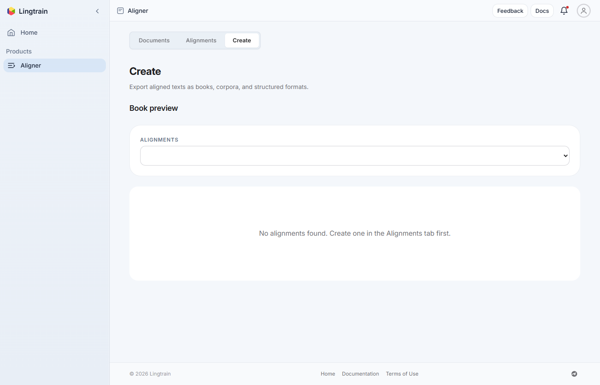

# Tutorial: Exporting Your Results {#export-formats}

Once your alignment is complete (or partially complete), the **Create** tab lets you preview and export the results in multiple formats. This tutorial explains each export format, its use cases, and how to configure the output for your needs.

## Accessing the Create Tab {#accessing}

Navigate to the **Create** tab in the Aligner. You will see the export interface.

The Create tab has three sections:

1. **Alignment selector** — choose which alignment to export.
2. **Settings and preview** — configure output parameters and generate a live preview.
3. **Download** — export in any of the available formats.

Select your alignment from the dropdown list. If the alignment has at least one processed batch, the export controls become available. If the alignment is still in progress, a message indicates that exports become available after at least one batch is aligned.

## Export Settings {#settings}

Before exporting, configure these settings to control how the output looks and behaves.

### Paragraph Structure {#paragraph-structure}

Choose which text's paragraph breaks to use in the exported result:

- **From** — use paragraph breaks from the source (left) text.
- **To** — use paragraph breaks from the target (right) text.

This determines how sentences are grouped into paragraphs. In the original texts, paragraph boundaries are marked on the last sentence of each paragraph. The export uses these marks from whichever side you select.

Typically, if you are creating a book for readers of the source language, use the "from" paragraph structure. If the target audience reads the target language, use "to".

### Language Order {#language-order}

Choose which language appears first (on the left) in the parallel view:

- **From** — source language on the left, target on the right.
- **To** — target language on the left, source on the right.

### Highlight Style {#highlight-style}

Visual styling for the parallel book. This affects only the HTML book export:

- **Without highlight** — no background colors. Clean, minimal look suitable for printing or professional use.
- **Pastel** — solid pastel-colored backgrounds for each language. Makes it easy to distinguish which language you are reading.
- **Gradient** — gradient backgrounds that fade out from the left edge. A more subtle visual differentiation.

### Reading Density {#reading-density}

Controls the spacing between sentence pairs in the preview and HTML book:

- **Comfortable** — more whitespace between pairs. Easier to read for extended sessions.
- **Compact** — less whitespace. Fits more content on screen and reduces scrolling.

### Paragraph Count (Preview) {#paragraph-count}

Controls how many paragraphs are shown in the preview. Adjust this to see more or less of the book before downloading.

## Generating a Preview {#preview}

Click **"Generate preview"** to see a live rendering of the parallel book with your current settings. The preview shows exactly how the final HTML book will look.

The preview includes:

- **Title page** — generated from `%%%%%author.` and `%%%%%title.` markup tags.
- **Chapter headings** — from `%%%%%h1.` through `%%%%%h5.` tags.
- **Sentence pairs** — side-by-side text with the configured highlighting and language order.
- **Section dividers** — from `%%%%%divider.` tags.
- **Quotations** — from `%%%%%qtext.` and `%%%%%qname.` tags.

A status indicator shows whether the preview is up to date or needs regeneration after changing settings:

- **"Preview up to date"** — the preview matches the current settings.
- **"Controls changed"** — settings were modified since the last preview generation. Click "Apply changes" to update.

Adjust settings and regenerate until you are satisfied with the result.

## Export Formats {#formats}

### HTML Book {#html-book}

**Format:** A self-contained HTML file with inline CSS styling.

**Use cases:**
- Reading parallel texts in a browser on desktop, tablet, or phone.
- Sharing with students or language partners.
- Printing on paper (use the "Without highlight" style for best print results).

**What it includes:**
- Title page with author and title.
- Chapter headings and structural elements.
- Side-by-side sentence pairs with the selected highlight style.
- Responsive layout that works on screens of all sizes.

**How to use:** Click the download button next to "HTML book". Open the downloaded `.html` file in any web browser. No internet connection required — the file is fully self-contained.

### TMX Corpora {#tmx}

**Format:** Translation Memory eXchange (`.tmx`) — an XML-based standard format for storing translation memories.

**Use cases:**
- Importing into CAT tools (memoQ, SDL Trados, OmegaT, Memsource, SmartCAT).
- Building translation memories from existing translations.
- Sharing translation data with other translators or agencies.

**What it includes:**
- Aligned sentence pairs with language metadata.
- Each pair is wrapped in a `<tu>` (translation unit) element with `<tuv>` (translation unit variant) children.

**How to use:** Click "Download TMX". Import the downloaded file into your CAT tool as a translation memory. The tool will use these pairs for fuzzy matching and leverage during translation.

### Sentence Corpora {#sentence-corpora}

**Format:** Two plain text files (`.txt`), one for each language. Each line contains one sentence, aligned by line number — line 1 in the source file corresponds to line 1 in the target file.

**Use cases:**
- NLP research — training machine translation models, evaluating alignment quality.
- Building parallel corpora for academic research.
- Data analysis and statistics on sentence lengths, vocabulary, etc.
- Input for other text processing tools that expect parallel plain text.

**What it includes:**
- Clean text without formatting, markup, or metadata.
- One sentence per line, strictly aligned by position.

**How to use:** Click the download buttons for the source and target sentence corpora separately. Each downloads as a `.txt` file.

### Paragraph Corpora {#paragraph-corpora}

**Format:** Two plain text files (`.txt`), one for each language. Sentences are grouped into paragraphs based on the selected paragraph structure.

**Use cases:**
- Research requiring paragraph-level alignment rather than sentence-level.
- Building corpora where paragraph context is important.
- Comparing paragraph structures between translations.

**What it includes:**
- Text grouped by paragraphs, with blank lines separating paragraphs.
- Paragraph boundaries come from the side selected in "Paragraph structure" setting.

**How to use:** Click the download buttons for source and target paragraph corpora.

### Structured Formats (XML and JSON) {#structured}

**Format:** XML and JSON representations of the complete book structure.

**Use cases:**
- Custom processing pipelines — when you need programmatic access to the alignment data.
- Converting to other formats (EPUB, PDF, custom HTML) using your own scripts.
- Data analysis requiring structured metadata (headings, page structure, alignment IDs).
- Integration with other software systems.

**What it includes:**
- Full book structure with metadata (title, author, headings, dividers).
- Aligned sentence pairs with their original line IDs.
- Paragraph groupings and structural elements.

**How to use:** Click the download button for XML or JSON. Parse the file in your preferred programming language.

### Alignment Database (.lt) {#alignment-db}

**Format:** Lingtrain's proprietary SQLite-based format (`.lt`).

**Use cases:**
- **Backup** — save a complete snapshot of your alignment including all metadata, embeddings, and edit history.
- **Re-import** — upload the `.lt` file back into Lingtrain to continue work or share with collaborators.
- **Migration** — move alignment projects between Lingtrain instances.
- **Archival** — long-term storage of alignment work.

**What it includes:**
- Complete alignment database with all batches, conflicts, and resolution history.
- Sentence embeddings for both texts.
- All editor edits and modifications.
- Proxy document data (if any).
- Configuration parameters (batch size, window, shift, model).

**How to use:** Click "Download .lt". To re-import, go to the Alignments tab and use the "Upload alignment" section at the bottom of the page. Drag and drop the `.lt` file to import it.

### Similarity Corpora {#similarity-corpora}

**Format:** Plain text file with similarity scores.

**Use cases:**
- Research on alignment quality metrics.
- Filtering aligned pairs by confidence level.
- Training and evaluating alignment models.

**What it includes:**
- Similarity scores for aligned sentence pairs.

## Choosing the Right Format {#choosing}

| Your goal | Recommended format |
|---|---|
| Read a parallel book | HTML book |
| Feed a CAT tool | TMX corpora |
| Train an MT model | Sentence corpora |
| Academic research | Sentence or paragraph corpora |
| Build a custom app | Structured formats (JSON/XML) |
| Back up your work | Alignment database (.lt) |
| Share with a colleague who uses Lingtrain | Alignment database (.lt) |
| Print a bilingual book | HTML book (Without highlight style) |
| Analyze alignment quality | Similarity corpora |

## Tips {#tips}

1. **Generate a preview before downloading.** The preview gives you a quick visual check of the output quality and formatting.
2. **Try different highlight styles.** Each style works better for different reading contexts — screen vs. print, casual vs. academic.
3. **Use paragraph structure from the language you read.** The paragraph breaks from your primary reading language will feel more natural.
4. **Download the .lt backup** before making major edits. If something goes wrong, you can re-import and start over.
5. **For research, export both sentence and paragraph corpora.** They serve different analysis needs and are quick to generate.
6. **TMX files can be large.** For long texts, the TMX file may be several megabytes. This is normal and CAT tools handle it well.

## Next Steps {#next-steps}

- [Tutorial: Your First Alignment](tutorial-first-alignment.en.md) — complete walkthrough from upload to export.
- [User Story: Creating a Parallel Book](tutorial-creating-parallel-book.en.md) — end-to-end story focused on HTML book output.
- [User Story: Building a Parallel Corpus](tutorial-building-corpus.en.md) — research-focused export workflow.
- [User Story: Building Translation Memory](tutorial-translation-memory.en.md) — TMX-focused workflow.
