# Руководство: ваше первое выравнивание {#first-alignment}

Это пошаговое руководство проведёт вас через весь процесс создания первого текстового выравнивания в Lingtrain Aligner — от регистрации аккаунта до экспорта готовой параллельной книги. К концу руководства у вас будет двуязычная HTML-книга, которую можно читать в любом браузере.

## Что понадобится {#prerequisites}

Для начала работы вам нужны:

- Два текстовых файла на разных языках — например, рассказ на английском и его перевод на русский.
- Тексты должны быть в формате `.txt`, сохранённые в кодировке UTF-8.
- Длина текстов — несколько страниц (рассказ или одна глава подойдут для первого раза).

Если у вас ещё нет готовых текстов, обратитесь к руководству [Подготовка текстов для выравнивания](tutorial-prepare-texts.ru.md).

## Шаг 1: Создание аккаунта {#step-create-account}

Откройте веб-сайт Lingtrain Aligner. Вы увидите главную страницу с обзором возможностей платформы.

Нажмите **«Sign in»** в правом верхнем углу страницы. Появится диалог входа.

Если у вас уже есть аккаунт, введите email и пароль, затем нажмите **«Sign in»**. Если нет — нажмите **«Create account»** для регистрации:

1. Введите **адрес электронной почты**.
2. Придумайте **пароль** (не менее 6 символов).
3. Подтвердите пароль.
4. Примите условия использования и политику обработки персональных данных.
5. Нажмите **«Register»**.

На указанный email придёт шестизначный код подтверждения. Введите его на экране верификации. После подтверждения вас попросят указать имя — так приложение будет приветствовать вас на главной странице.

Также можно войти через **Google**, **Яндекс** или **VK**, если эти способы доступны в вашем регионе.

## Шаг 2: Переход к Aligner {#step-navigate}

После входа вы попадаете на главную страницу рабочего пространства с доступными приложениями и последней активностью.

Нажмите на карточку **«Aligner»**, чтобы открыть инструмент выравнивания текстов. В Aligner есть три основные вкладки:

- **Documents** — загрузка и управление исходными текстами.
- **Alignments** — создание и запуск проектов выравнивания.
- **Create** — предпросмотр и экспорт результатов.

## Шаг 3: Загрузка текстов {#step-upload}

Вы начинаете на вкладке **Documents**. Здесь вы загружаете тексты, которые хотите выровнять.

### Выбор языков {#select-languages}

В верхней части страницы расположены два селектора языков — **«From»** (исходный) и **«To»** (целевой). Выберите язык исходного текста слева и язык перевода справа. В этом руководстве мы используем **English** (английский) как исходный и **Russian** (русский) как целевой.

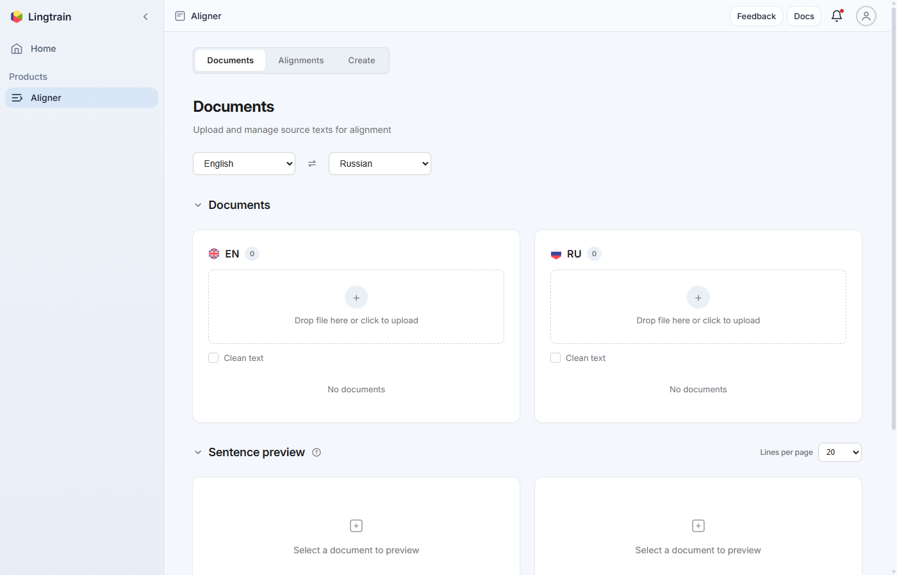

Выбор языка определяет, какие правила сегментации на предложения будут применены при обработке текста.

### Загрузка исходного текста {#upload-source}

В левой панели (язык «From») находится область загрузки. Перетащите файл с английским текстом на неё или нажмите, чтобы открыть диалог выбора файла.

Флажок **«Clean text»** включает базовую нормализацию текста при загрузке — удаление лишних пробелов и исправление проблем с кодировкой. Включите его, если ваш текст содержит артефакты форматирования после копирования.

После загрузки документ появляется в списке под областью загрузки.

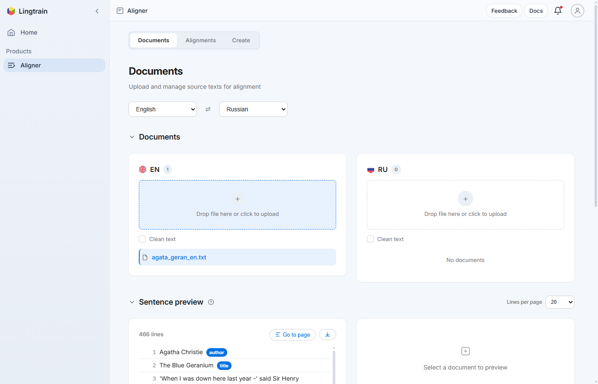

### Загрузка целевого текста {#upload-target}

Повторите то же самое в правой панели (язык «To») с файлом русского текста.

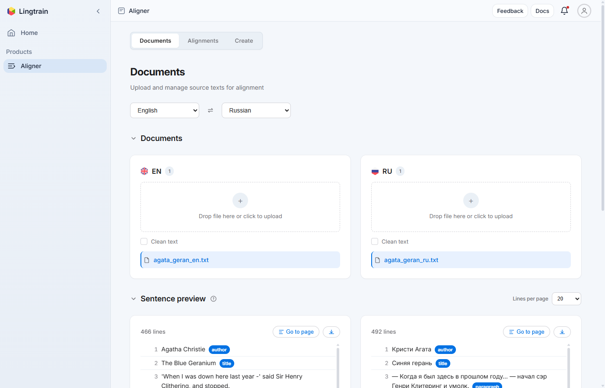

### Предпросмотр разбиения {#preview-split}

Нажмите на документ в списке, чтобы увидеть, как текст был разбит на предложения. Панель **«Sentence preview»** показывает пронумерованные строки — каждая представляет одно предложение, с которым будет работать алгоритм выравнивания.

Строки с тегами разметки (автор, заголовок, название) отображаются с цветными бейджами. Бейдж `paragraph` отмечает последнее предложение в каждом абзаце — эта информация используется при экспорте для восстановления абзацной структуры книги.

Можно настроить количество строк на странице (10, 20 или 50), перемещаться между страницами и скачать разбитый текст как файл.

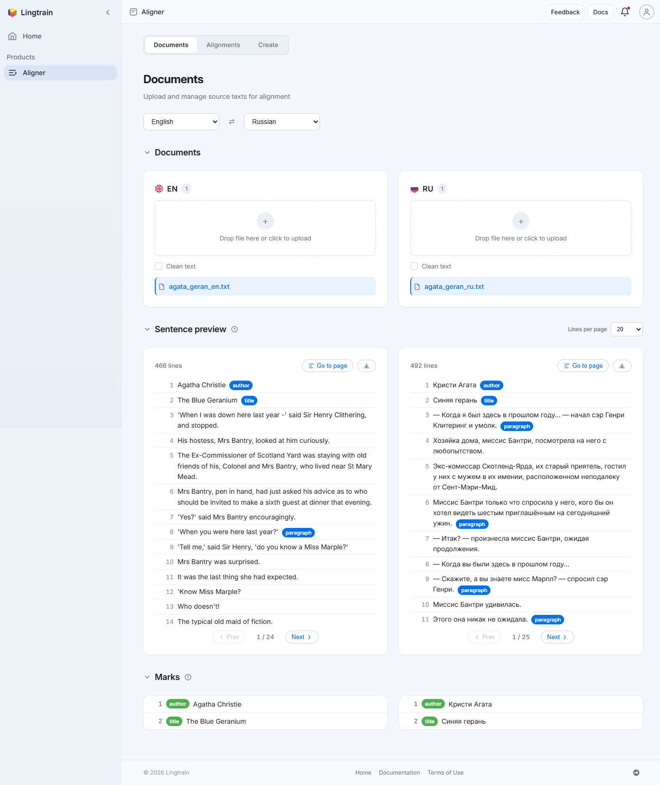

Просмотрите предложения и убедитесь, что разбиение выглядит разумно. Если предложения разрезаны не в тех местах, возможно, исходный текст нуждается в корректировке форматирования (см. [Подготовка текстов](tutorial-prepare-texts.ru.md)).

## Шаг 4: Создание выравнивания {#step-create-alignment}

Перейдите на вкладку **Alignments**. Если это ваше первое выравнивание, вы увидите пустое состояние.

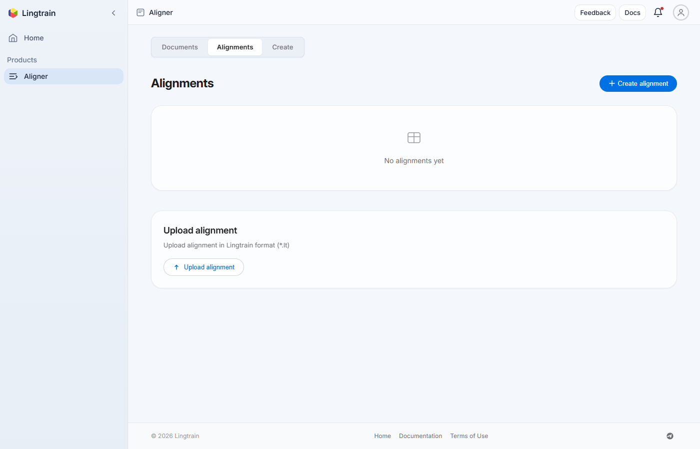

Нажмите **«+ Create alignment»** в правом верхнем углу. Появится диалог:

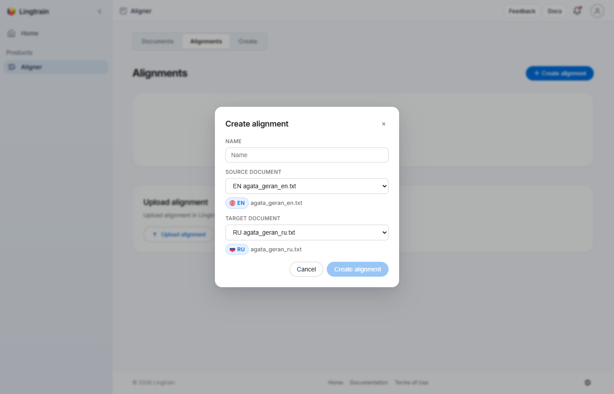

1. **Name** — дайте выравниванию описательное имя, например «Синяя герань EN-RU».
2. **Source document** — выберите загруженный английский документ.
3. **Target document** — выберите русский документ.

Нажмите **«Create alignment»**, чтобы инициализировать проект. Система разобьёт тексты на пакеты (батчи) и подготовит базу данных выравнивания.

Новое выравнивание появится в списке со статусом **«Init»** и прогрессом **«0/N»** (где N — общее количество пакетов).

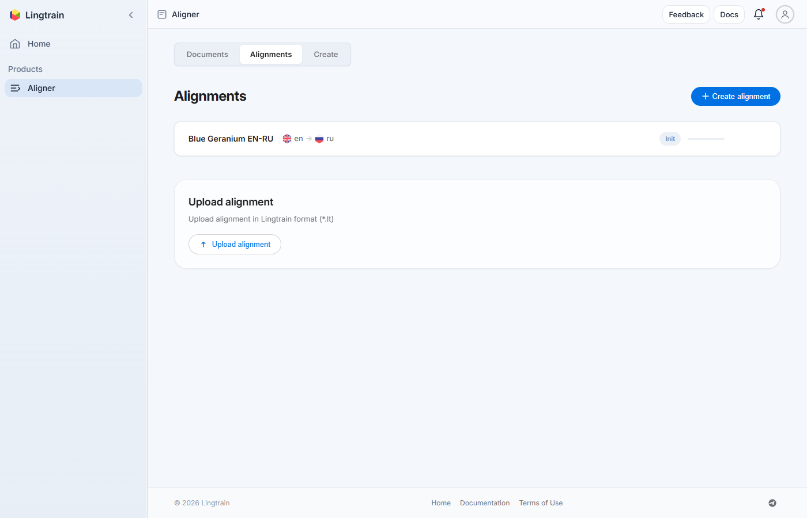

Нажмите на выравнивание, чтобы открыть страницу деталей.

## Шаг 5: Настройка параметров {#step-settings}

На странице деталей выравнивания вы увидите несколько панелей: **Settings**, **Controls**, **Visualization**, **Conflicts** и **Editor**.

Панель **Settings** управляет параметрами выравнивания:

- **Batch size** — количество предложений исходного текста на пакет (по умолчанию: 200). Значение фиксируется при создании.
- **Batch count** — сколько пакетов обработать за один запуск. Для первого выравнивания оставьте 1, чтобы проверять результаты пакет за пакетом.
- **Window** — дополнительные предложения по бокам целевого окна (по умолчанию: 40). Больше окно — больше шансов найти правильные совпадения, но дольше обработка.
- **Batch shift** — ручное смещение целевого окна. Пока оставьте 0.
- **Embedding model** — нейронная модель для вычисления эмбеддингов предложений. Модель по умолчанию хорошо работает для большинства европейских языковых пар.

Для первого выравнивания настройки по умолчанию подходят. Вы всегда сможете изменить их позже.

## Шаг 6: Запуск выравнивания {#step-run}

На панели **Controls** нажмите **«Align next»**, чтобы начать обработку первого пакета.

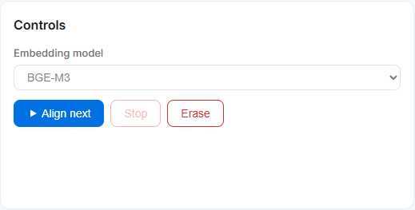

Статус выравнивания изменится на **«Queued»** (ожидание в очереди), затем на **«In progress»** (обработка).

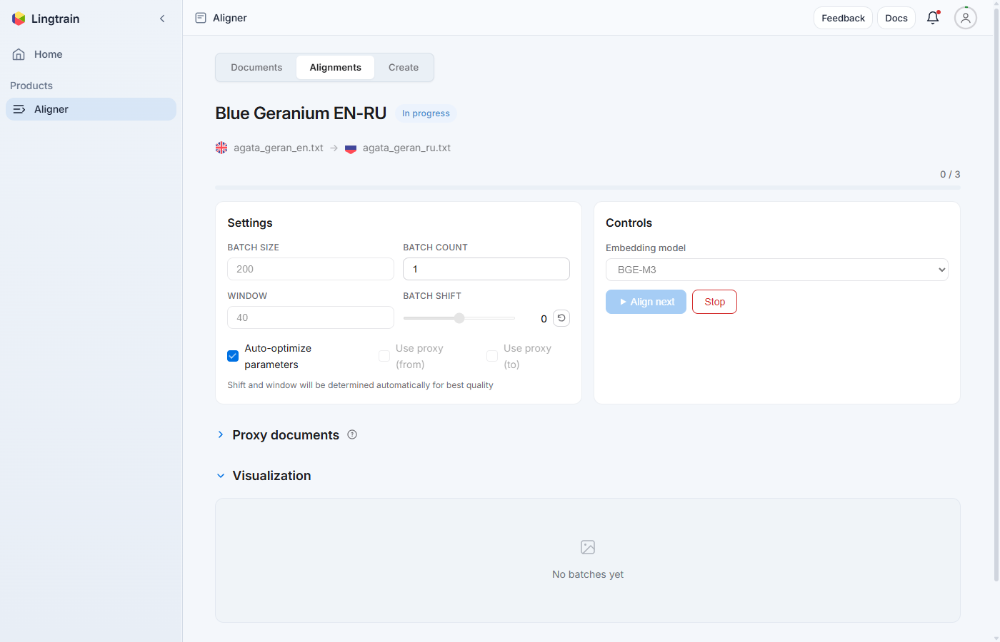

Во время обработки система:

1. Вычисляет эмбеддинги предложений с помощью настроенной ML-модели.
2. Строит матрицу косинусного сходства между предложениями исходного и целевого текстов.
3. Выбирает лучшее соответствие для каждого предложения.
4. Сохраняет результаты и генерирует визуализацию.

После завершения первого пакета статус меняется на **«Waiting»**. Индикатор прогресса обновляется (например, «1/3» означает, что обработан 1 из 3 пакетов).

### Проверка визуализации {#check-visualization}

Раздел **Visualization** показывает точечную диаграмму для обработанного пакета. Каждая точка — это выровненная пара предложений.

Хорошее выравнивание показывает точки, выстроенные по **диагонали** от нижнего левого угла к верхнему правому. Если диагональ чёткая — выравнивание работает хорошо. Если точки разбросаны или диагональ разорвана, возможно, нужно скорректировать параметр **shift** или подготовить тексты тщательнее.

Каждая карточка визуализации показывает номер пакета, использованные параметры окна и сдвига, а также диапазоны строк исходного и целевого текстов.

### Продолжение обработки {#continue-processing}

Если первый пакет выглядит хорошо, нажмите **«Align next»** снова для обработки следующего пакета. Повторяйте, пока все пакеты не будут обработаны.

Можно также нажать **«Align all»**, чтобы обработать все оставшиеся пакеты за один раз. Это удобно, когда вы уверены в правильности настроек.

## Шаг 7: Разрешение конфликтов {#step-conflicts}

После обработки всех пакетов раздел **Conflicts** покажет найденные несоответствия.

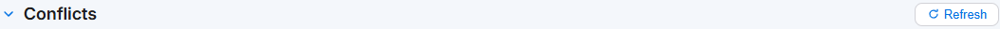

Конфликт возникает, когда алгоритм не может установить однозначное соответствие между предложениями исходного и целевого текстов. Это нормально: переводчики регулярно разбивают, объединяют или переставляют предложения.

Просмотрщик конфликтов показывает:

- Общее количество найденных конфликтов.
- Кнопки навигации для просмотра конфликтов по одному.
- Панели **«From»** и **«To»** с конфликтующими группами предложений и их номерами строк.

### Автоматическое разрешение {#auto-resolve}

Нажмите **«Resolve all»**, чтобы запустить автоматический алгоритм разрешения конфликтов. Система итеративно разрешает конфликты от меньших к большим, выбирая лучшую группировку на основе оценок семантического сходства.

После автоматического разрешения количество конфликтов должно значительно сократиться — часто до нуля. Оставшиеся конфликты, если они есть, требуют ручной работы в редакторе.

### Ручное разрешение {#manual-resolve}

Подробное руководство по ручному разрешению конфликтов: [Разрешение конфликтов выравнивания](tutorial-conflict-resolution.ru.md).

## Шаг 8: Проверка в редакторе {#step-editor}

Раздел **Editor** показывает выровненные пары предложений в формате бок о бок.

Каждая строка отображает:

- Номер строки.
- Исходный текст (слева) и целевой текст (справа).
- Идентификаторы исходных строк — оригинальные номера строк из обоих текстов.

Пролистайте выровненные пары и убедитесь, что предложения совпадают. Обратите особое внимание на **начало и конец** выравнивания, где иногда скрываются необнаруженные конфликты.

Если вы нашли несоответствия, наведите курсор на ячейку — появятся кнопки действий:

- **Edit** — редактирование содержимого текста.
- **Candidates** — просмотр альтернативных вариантов сопоставления.
- **Delete** — удаление предложения из ячейки.
- **Add empty row** — вставка пустой строки выше или ниже для ручной корректировки.

Полное руководство по редактору: [Использование редактора выравнивания](tutorial-editor-guide.ru.md).

## Шаг 9: Экспорт результатов {#step-export}

Когда вы удовлетворены качеством выравнивания, перейдите на вкладку **Create**.

### Настройка экспорта {#export-settings}

Выберите выравнивание из выпадающего списка. Затем настройте параметры:

- **Paragraph structure** — использовать разбиение на абзацы из исходного («from») или целевого («to») текста.
- **Language order** — какой язык отображать на левой стороне (первым) в параллельном виде.
- **Highlight style** — визуальный стиль параллельной книги:
  - **Without highlight** — без фоновых цветов.
  - **Pastel** — сплошные пастельные фоны для каждого языка.
  - **Gradient** — градиентные фоны с затуханием.

### Генерация предпросмотра {#generate-preview}

Нажмите **«Generate preview»**, чтобы увидеть живой предпросмотр параллельной книги. Предпросмотр показывает, как будет выглядеть финальная HTML-книга с текущими настройками.

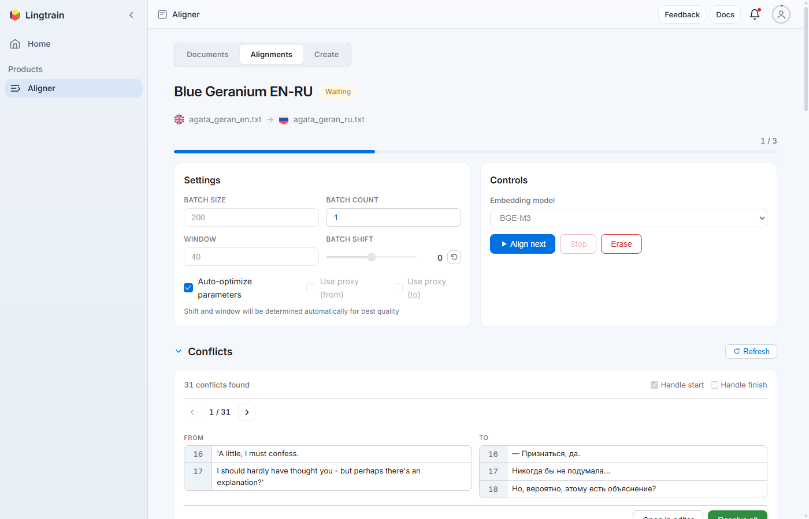

Корректируйте настройки и пересоздавайте предпросмотр, пока результат вас не устроит.

### Скачивание книги {#download-book}

Под предпросмотром расположены кнопки скачивания для всех доступных форматов:

- **HTML book** — стилизованная параллельная книга для чтения в браузере или на планшете.
- **TMX corpora** — формат Translation Memory eXchange для CAT-инструментов.
- **Sentence corpora** — текстовые файлы с одним выровненным предложением на строку.
- **Paragraph corpora** — текстовые файлы, сгруппированные по абзацам.
- **Structured formats** — XML и JSON для пользовательской обработки.
- **Alignment database** — формат `.lt` Lingtrain для резервного копирования или повторного импорта.

Нажмите кнопку скачивания рядом с **«HTML book»**, чтобы сохранить параллельную книгу.

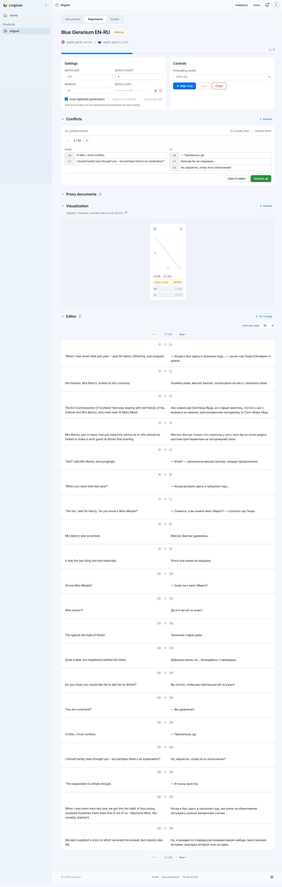

## Поздравляем! {#congratulations}

Вы создали своё первое текстовое выравнивание и экспортировали его как параллельную книгу. Откройте скачанный HTML-файл в браузере, чтобы читать двуязычный текст с параллельными предложениями.

## Что дальше? {#what-next}

Теперь, когда вы прошли весь процесс, можно изучить более продвинутые возможности:

- [Подготовка текстов для выравнивания](tutorial-prepare-texts.ru.md) — как форматировать тексты с тегами разметки для лучших результатов.
- [Разрешение конфликтов выравнивания](tutorial-conflict-resolution.ru.md) — освоение работы с конфликтами.
- [Использование редактора выравнивания](tutorial-editor-guide.ru.md) — все инструменты редактора.
- [Работа с несколькими пакетами](tutorial-multiple-batches.ru.md) — управление выравниванием длинных текстов.
- [Выравнивание с подстрочником](tutorial-proxy-alignment.ru.md) — использование подстрочных переводов для малоресурсных языков.
- [Экспорт результатов](tutorial-export-formats.ru.md) — все форматы экспорта и сценарии использования.

## Советы для лучших результатов {#tips}

1. **Тщательно готовьте тексты** — удалите номера страниц, сноски и посторонний контент перед загрузкой.
2. **Используйте теги разметки** — добавьте `%%%%%author.`, `%%%%%title.` и `%%%%%h1.` в тексты для корректного форматирования экспортированной книги.
3. **Начинайте с настроек по умолчанию** — batch size 200 и window 40 хорошо работают для большинства текстов.
4. **Проверяйте визуализацию на раннем этапе** — после первого пакета убедитесь, что диагональ ровная. Если она разорвана, скорректируйте параметры перед продолжением.
5. **Сначала разрешайте конфликты автоматически** — автоматический резольвер справляется с большинством случаев. Редактор нужен для оставшихся немногих.
6. **Сохраняйте свою работу** — скачайте базу данных выравнивания `.lt` как резервную копию, чтобы можно было импортировать её позже.
