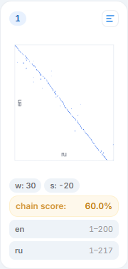

# Руководство: работа с несколькими пакетами {#multiple-batches}

При выравнивании длинного текста система разбивает его на пакеты (батчи) для обработки. Понимание работы пакетов, настройки параметров между ними и обработки дрейфа необходимо для получения хороших результатов на длинных текстах (романы, руководства, сборники рассказов). Это руководство подробно описывает рабочий процесс с пакетами.

## Как работают пакеты {#how-batches-work}

Система выравнивания делит исходный текст на сегменты фиксированного размера — пакеты. Каждый пакет обрабатывает часть исходного текста в сопоставлении с соответствующим окном целевого текста.

Для исходного текста из `N` предложений и настроенного размера пакета `B`:

- **Пакет 1** обрабатывает предложения исходника с 1 по B.
- **Пакет 2** обрабатывает предложения с B+1 по 2B.
- И так далее, пока все предложения исходника не будут покрыты.

Для каждого пакета исходника целевое окно рассчитывается пропорционально:

- Коэффициент пропорциональности `k = len(target) / len(source)` определяет приблизительную позицию.
- Параметр **window** добавляет дополнительные предложения по обе стороны пропорционального диапазона.
- Параметр **shift** применяет ручное смещение к целевому окну.

Общее количество пакетов показано в индикаторе прогресса (например, «0/5» означает 5 пакетов, ни один не обработан).

## Индикатор прогресса {#batch-progress}

Индикатор прогресса на странице деталей выравнивания показывает текущее состояние:

- **0/3** — всего 3 пакета, ни один не обработан. Статус: «Init».
- **1/3** — первый пакет обработан. Статус: «Waiting» (ожидание действий пользователя).
- **2/3** — два пакета обработаны.
- **3/3** — все пакеты обработаны. Статус: «Done» (если конфликты разрешены) или «Waiting» (если остались конфликты).

## Пакет за пакетом vs. «Align all» {#batch-vs-all}

Есть два варианта обработки:

### Пакет за пакетом (рекомендуется для начала) {#batch-by-batch}

1. Установите **Batch count** в 1 в настройках.
2. Нажмите **«Align next»** для обработки одного пакета.
3. Проверьте визуализацию.
4. Если диагональ хорошая — нажмите «Align next» снова.
5. Если диагональ смещена — скорректируйте **shift** и перезапустите.

Этот подход даёт контроль и позволяет выявлять проблемы на ранней стадии, до их накопления.

### Обработка всех {#align-all}

1. Установите **Batch count** на большое число или нажмите **«Align all»**.
2. Все оставшиеся пакеты обрабатываются последовательно.
3. Просмотрите визуализацию для всех пакетов по завершении.

Это быстрее и хорошо работает, когда вы уверены в качестве текстов и поддержке языковой пары.

## Карточки визуализации {#visualization-cards}

После обработки каждый пакет получает карточку визуализации в разделе **Visualization**.



Каждая карточка показывает:

- **Номер пакета** (например, «Batch 1», «Batch 2»).
- **Параметры window (w) и shift (s)**, использованные для этого пакета.
- **Диапазоны строк** исходного и целевого текстов (например, «en 1-199, ru 1-242»).
- **Точечную диаграмму** с позициями выровненных предложений.
- **Кнопку «Open in editor»** для перехода к предложениям этого пакета в редакторе.

### Чтение точечной диаграммы {#scatter-plot}

Каждая точка представляет одну выровненную пару. Ось X — позиция предложения исходника, ось Y — позиция сопоставленного предложения перевода.

- **Чистая диагональная линия** — отличное выравнивание. Модель нашла правильные соответствия повсюду.
- **Диагональ с небольшими колебаниями** — хорошее выравнивание. Мелкие отклонения нормальны (разбиения/объединения предложений).
- **Разорванная диагональ** — выравнивание дрейфует. Некоторые предложения сопоставлены далеко от ожидаемой позиции. Скорректируйте shift и перезапустите.
- **Разбросанные точки** — плохое выравнивание. Модель не смогла найти надёжных соответствий. Рассмотрите использование подстрочника, увеличение окна или улучшение подготовки текстов.

### Общий показатель цепочки {#chain-score}

Сводка визуализации показывает общий показатель цепочки (chain score) по всем обработанным пакетам (например, «Aligned 3 batches, overall chain score: 0.97»).

Chain score измеряет непрерывность выравнивания:

```
score = 1 - (breaks / total_lines)
```

- **1.0** — идеальное выравнивание, без разрывов в последовательности.
- **0.95-0.99** — хорошее выравнивание с незначительными проблемами.
- **0.90-0.95** — приемлемо, но рекомендуется проверка.
- **Ниже 0.90** — значительные проблемы, нужна ручная проверка или перевыравнивание.

## Корректировка сдвига между пакетами {#adjusting-shift}

Параметр **shift** — самая важная настройка при работе с несколькими пакетами. Он компенсирует разницу в количестве предложений между исходным и целевым текстами.

### Когда корректировать сдвиг {#when-to-adjust}

- Визуализация показывает **дрейф** диагонали — начинается ровно, но постепенно смещается.
- Точки **группируются** у одного края графика, а не следуют диагонали.
- Конфликты концентрируются **на границах пакетов**.
- Исходный и целевой тексты имеют **существенно разное количество предложений** (например, 800 в исходнике vs. 1 100 в переводе).

### Как корректировать {#how-to-adjust}

1. Посмотрите на визуализацию последнего пакета.
2. Если точки **выше** диагонали (сопоставления перевода на более высоких позициях, чем ожидалось), перевод «забегает вперёд» — используйте **отрицательный** сдвиг.
3. Если точки **ниже** диагонали, перевод «отстаёт» — используйте **положительный** сдвиг.
4. Начинайте с небольших корректировок (shift = 5 или -5) и увеличивайте при необходимости.

### Настройка для каждого пакета {#per-batch}

Каждый пакет может быть перевыровнен индивидуально с другими параметрами. Для перевыравнивания конкретного пакета:

1. Нажмите на карточку пакета в визуализации.
2. В диалоге пакета скорректируйте значения **shift** и **window**.
3. Нажмите **«Recalculate»** для перевыравнивания с новыми параметрами.

Это не затрагивает другие пакеты — перерабатывается только выбранный.

## Обработка дрейфа {#handling-drift}

Дрейф возникает, когда накопительная разница в количестве предложений между исходником и переводом приводит к постепенной потере синхронизации. Это самая распространённая проблема с длинными текстами.

### Обнаружение дрейфа {#detecting-drift}

- Визуализация **пакета 1**: чистая диагональ.
- Визуализация **пакета 2**: диагональ чуть смещена.
- Визуализация **пакета 3**: диагональ заметно смещена или разорвана.

Такая закономерность указывает на дрейф — пропорциональный расчёт окна больше не точно предсказывает, где должны быть предложения перевода.

### Исправление дрейфа {#fixing-drift}

1. **Проверьте визуализацию текущего пакета** — отметьте, насколько сместилась диагональ.
2. **Скорректируйте shift** для следующего пакета. Хорошая отправная точка: если диагональ сместилась примерно на 20 предложений перевода, установите shift в -20 (или +20, в зависимости от направления).
3. **Перевыровняйте затронутый пакет**, если он уже был обработан.
4. **Рассмотрите увеличение window** — большее окно (например, 60 вместо 40) даёт алгоритму больше пространства для нахождения правильных соответствий, даже когда пропорциональная оценка немного неточна.

### Автоматическая оптимизация параметров {#auto-optimize}

Функция **«Auto-optimize parameters»** может автоматически определить лучшие значения shift и window для каждого пакета. При включении система анализирует паттерн выравнивания и корректирует параметры для оптимального качества. Это особенно полезно, когда вы не хотите вручную настраивать параметры для каждого пакета.

## Когда стирать и перезапускать пакет {#erase-restart}

Иногда пакет даёт настолько плохие результаты, что ручная коррекция не стоит усилий. В этих случаях:

1. Откройте диалог пакета (нажмите на карточку).
2. Скорректируйте параметры shift и window.
3. Нажмите **«Recalculate»** для перевыравнивания с новыми настройками.

Если всё выравнивание нужно начать заново (например, вы хотите попробовать другую модель эмбеддингов):

1. Нажмите **«Erase»** на панели Controls.
2. Подтвердите действие — это удалит все данные пакетов, но сохранит конфигурацию выравнивания и документы.
3. Выберите новую модель эмбеддингов, если нужно.
4. Нажмите «Align next» для начала заново.


## Выравнивание произвольного диапазона {#custom-range}

Для продвинутых сценариев функция **Custom range** позволяет выбрать конкретный диапазон пакетов и перевыровнять их с пользовательскими параметрами. Это полезно для:

- **Сбора образцов** с разными значениями shift и window для нахождения оптимальных настроек.
- **Перевыравнивания проблемного участка** без влияния на остальные.
- **A/B-тестирования** разных комбинаций параметров.

## Управление длинными текстами {#managing-long-texts}

Для очень длинных текстов (1 000+ предложений) помните о следующих практиках:

1. **Сначала обрабатывайте пакет за пакетом.** Даже если планируете «Align all» позже, обработайте первые 2-3 пакета вручную, чтобы проверить настройки.
2. **Проверяйте визуализацию после каждого пакета.** Раннее обнаружение дрейфа предотвращает его накопление.
3. **Разрешайте конфликты инкрементально.** После каждого пакета (или каждых 2-3) разрешайте конфликты. Это поддерживает управляемый список.
4. **Используйте последовательную стратегию сдвига.** Если пакет 2 требовал shift +5, а пакет 3 — shift +8, пакет 4, скорее всего, потребует shift +10 или +12. Дрейф обычно кумулятивный.
5. **Сохраняйте резервные копии .lt на вехах.** После успешной обработки половины текста скачайте .lt файл. Если с последующими пакетами что-то пойдёт не так, можно восстановить из копии.

## Советы {#tips}

1. **Настройки по умолчанию работают для большинства текстов.** Batch size 200 и window 40 справляются с подавляющим большинством случаев. Корректируйте только когда визуализация показывает проблемы.
2. **Shift — ваш главный инструмент настройки.** Если диагональ дрейфует — корректируйте shift. Если чистая — оставляйте как есть.
3. **Больше window = больше допуска, больше вычислений.** Увеличение окна с 40 до 60 или 80 помогает с дрейфом, но замедляет обработку и может вводить больше ложных совпадений.
4. **Erase не затрагивает документы.** Стирание данных выравнивания не влияет на загруженные документы. Вы всегда можете перевыровнять.
5. **Используйте автооптимизацию для автоматической обработки.** Если не хотите вручную проверять каждый пакет, функция автооптимизации — хорошая золотая середина.

## Следующие шаги {#next-steps}

- [Разрешение конфликтов выравнивания](tutorial-conflict-resolution.ru.md) — работа с конфликтами в многопакетных выравниваниях.
- [Проверка качества выравнивания](tutorial-quality-check.ru.md) — верификация качества по пакетам.
- [Ваше первое выравнивание](tutorial-first-alignment.ru.md) — обзор базового процесса.
