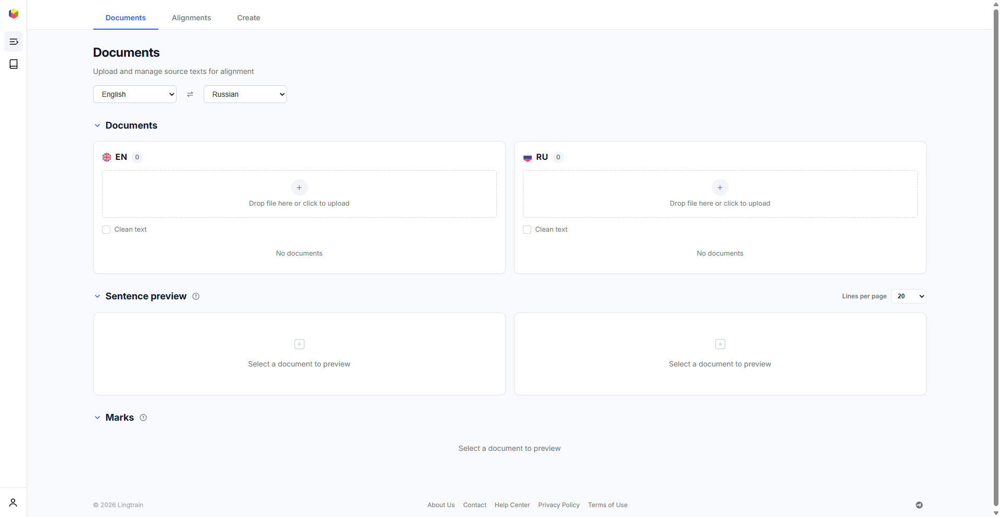
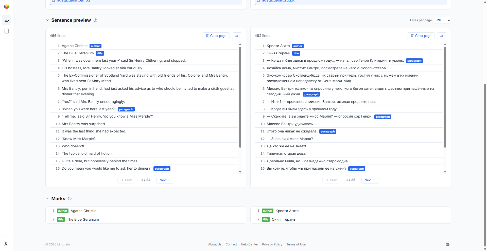

# Uploading texts {#uploading}

The **Documents** tab is where you upload, preview, and manage source texts before alignment.

## Preparing your texts {#preparation}

Before uploading, prepare your text files:

1. **Use plain text format** (`.txt`). The system processes raw text, not PDF, DOCX, or other rich formats.
2. **Remove extraneous content** — page numbers, footnotes, edition-specific notes, table of contents, translator's prefaces (unless you want them aligned).
3. **Keep paragraphs separated by blank lines**. The splitter uses paragraph breaks to improve sentence detection.
4. **Add markup tags** (see below) for titles, author names, headings, and other metadata.

## Selecting languages {#languages}

At the top of the Documents page, select the **source** ("From") and **target** ("To") languages using the dropdown menus. This selection determines:

- Which language-specific sentence splitting rules are applied
- How the uploaded documents are categorized
- Which flag icons are displayed



## Uploading files {#upload}

Each language panel has a drag-and-drop upload area. You can either:

- **Drag and drop** a `.txt` file onto the upload area
- **Click** the upload area to open a file picker

The **Clean text** checkbox applies basic text normalization (removing extra whitespace, fixing encoding issues) during upload. Enable it if your text has formatting artifacts.

After uploading, the document appears in the list below the upload area, and the **Sentence preview** panel updates to show the split result.


## Markup tags {#markup}

Lingtrain uses special markup tags to separate metadata (titles, headings, quotes) from the body text. Tags are placed **at the end of a line** using the `%%%%%` prefix.

### Supported tags {#tags}

| Tag | Purpose | Example |
|-----|---------|---------|
| `%%%%%author.` | Author name | `Agatha Christie%%%%%author.` |
| `%%%%%title.` | Book or work title | `The Blue Geranium%%%%%title.` |
| `%%%%%h1.` | Heading level 1 | `Chapter One%%%%%h1.` |
| `%%%%%h2.` | Heading level 2 | `Part I%%%%%h2.` |
| `%%%%%h3.` | Heading level 3 | `Section 1.1%%%%%h3.` |
| `%%%%%h4.` | Heading level 4 | `Subsection%%%%%h4.` |
| `%%%%%h5.` | Heading level 5 | `Minor heading%%%%%h5.` |
| `%%%%%qtext.` | Quotation text | `To be or not to be%%%%%qtext.` |
| `%%%%%qname.` | Quote attribution | `William Shakespeare%%%%%qname.` |
| `%%%%%image.` | Image reference | `illustration.jpg%%%%%image.` |
| `%%%%%translator.` | Translator credit | `Translated by John Doe%%%%%translator.` |
| `%%%%%divider.` | Section divider | `* * *%%%%%divider.` |

### How tags work {#how-tags-work}

- Tagged lines are **excluded from the alignment algorithm** — they won't be matched against sentences in the other language.
- Tags are **preserved as metadata** in the alignment database and used for formatting in the exported book (title pages, chapter headings, quotation styling).
- The `author` and `title` tags are the most important — they produce the title page in the exported HTML book.
- **Both texts should have matching markup**. For example, if the English text has `%%%%%author.` and `%%%%%title.` tags, the Russian text should have them too.

### Example {#markup-example}

**English text file (`agata_geran_en.txt`):**

```
Agatha Christie%%%%%author.
The Blue Geranium%%%%%title.


'When I was down here last year -' said Sir Henry Clithering, and stopped.

His hostess, Mrs Bantry, looked at him curiously. The Ex-Commissioner
of Scotland Yard was staying with old friends of his, Colonel and Mrs Bantry,
who lived near St Mary Mead.
```

**Russian text file (`agata_geran_ru.txt`):**

```
Кристи Агата%%%%%author.
Синяя герань%%%%%title.


— Когда я был здесь в прошлом году… — начал сэр Генри Клитеринг и умолк.

Хозяйка дома, миссис Бантри, посмотрела на него с любопытством.
Экс-комиссар Скотленд-Ярда, их старый приятель, гостил у них с мужем
в их имении, расположенном неподалеку от Сент-Мэри-Мид.
```

## Sentence preview {#preview}

After uploading, the **Sentence preview** panel shows how each document was split into individual sentences. Each line is numbered and represents one sentence that the alignment algorithm will work with.

Lines that contain markup tags display the tag type as a colored badge (e.g., `author`, `title`, `paragraph`).

The `paragraph` badge marks the last sentence in a paragraph — this information is used later to reconstruct paragraph structure in the exported book.



You can adjust the number of lines per page (10, 20, or 50) and navigate between pages. Use **Go to page** to jump to a specific page or the **download** button to save the split text as a file.

## Marks panel {#marks}

The **Marks** panel at the bottom shows all markup tags found in both documents side by side. This is your verification step — check that:

- Both documents have the **same number of marks** for each tag type
- The mark content matches (e.g., the author name appears in both languages)

Mismatched mark counts can cause alignment issues, since marks define structural boundaries that the algorithm relies on.

## Interlinear documents {#proxy}

For language pairs where the embedding model has limited training data (e.g., Bashkir, Chuvash, or other low-resource languages), you can use **interlinear documents** to improve alignment quality.

An interlinear document is a **machine-translated version** of the split text that serves as an intermediary. The workflow is:

1. Upload and split your source text normally
2. **Download the split text** using the download button in the sentence preview
3. **Translate it** using any machine translation service (Google Translate, DeepL, etc.)
4. **Upload the translation back** as an interlinear document in the Interlinear documents section on the Alignment detail page

The interlinear document must contain **exactly the same number of lines** as the original split text. The alignment algorithm then uses the interlinear translation for matching while the original text is preserved in the final output.

Interlinear text is displayed as subscript annotations in the editor, helping you verify alignment quality even when you don't read one of the languages.
