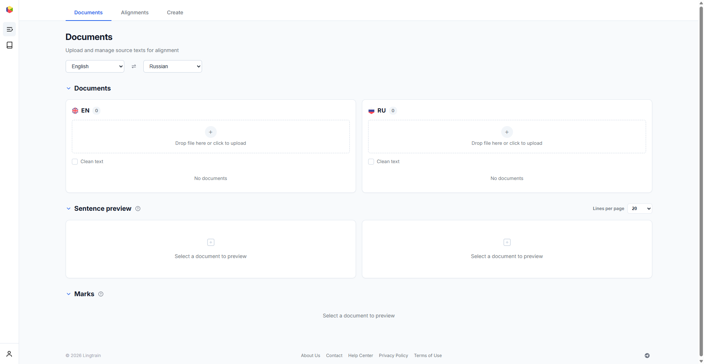
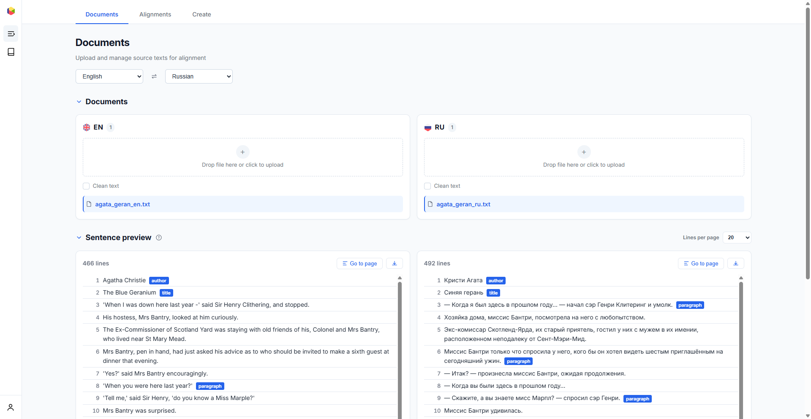
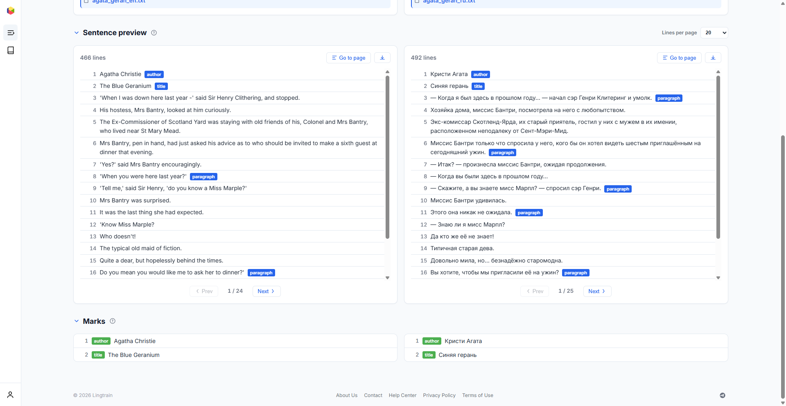

# Uploading texts {#uploading}

The **Documents** tab is where you upload, preview, and manage source texts before alignment.

## Preparing your texts {#preparation}

Before uploading, prepare your document files:

1. Use **plain text** (`.txt`) or **FictionBook 2** (`.fb2`). PDF, DOCX, EPUB, and HTML are not accepted directly.
2. For TXT, remove extraneous content such as page numbers, footnotes, edition-specific notes, and unwanted prefaces.
3. For TXT, keep paragraphs separated by blank lines. The splitter uses paragraph breaks to improve sentence detection.
4. For TXT, add markup tags (see below) for titles, author names, headings, and other metadata. FB2 structure is marked automatically.

## Selecting languages {#languages}

At the top of the Documents page, select the **source** ("From") and **target** ("To") languages using the dropdown menus. This selection determines:

- Which language-specific sentence splitting rules are applied
- How the uploaded documents are categorized
- Which flag icons are displayed



## Uploading files {#upload}

Each language panel has a drag-and-drop upload area. You can either:

- **Drag and drop** a `.txt` or `.fb2` file onto the upload area
- **Click** the upload area to open a file picker

The default limit is **10 MB per file**. TXT files are normalized to UTF-8; if an unusual source encoding cannot be detected confidently, save the file as UTF-8 and retry.

After uploading, the document appears in the list below the upload area, and the **Sentence preview** panel updates to show the split result.



## FB2 conversion {#fb2-conversion}

FB2 files are converted on the server before sentence splitting. The conversion is deterministic: the same file, selected language, and converter rules produce the same UTF-8 marked text.

| FB2 structure | Generated Lingtrain text |
|---|---|
| Book title, authors, translators | `title`, `author`, and optional `translator` marks |
| Flat top-level sections | `h2` headings |
| Parts with titled subsections | Part as `h1`; nested headings descend through `h2`–`h5` |
| Subtitles | One heading level below the containing section |
| Epigraphs and citations | `qtext`; attribution as `qname` |
| Poems | One atomic `verse` line per `<v>`, with stanza breaks preserved |
| Decorative glyph-only paragraphs | `divider` |
| Ordinary paragraphs and inline emphasis | Plain, single-line text |

The title metadata is authoritative, so a duplicate printed title page in the body is omitted. Cover images, embedded binary data, named notes/comments bodies, and explicit note-link labels are also omitted. The original FB2 is not stored.

An uploaded `novel.fb2` is listed and stored as `novel.txt`. That generated TXT is the document used by sentence preview, alignment, and downloads. The language selected in the upload dialog controls both sentence splitting and conservative English/Russian front-matter cleanup; the FB2 `<lang>` field is informational.

## Markup tags {#markup}

Lingtrain uses special markup tags to separate metadata (titles, headings, quotes) from the body text. Tags are placed **at the end of a line** using the `%%%%%` prefix.

### Supported tags {#tags}

| Tag | Purpose | Example |
|-----|---------|---------|
| `%%%%%author.` | Author name | `Agatha Christie%%%%%author.` |
| `%%%%%title.` | Book or work title | `The Blue Geranium%%%%%title.` |
| `%%%%%h1.` | Heading level 1 | `Chapter One%%%%%h1.` |
| `%%%%%h2.` | Heading level 2 | `Part I%%%%%h2.` |
| `%%%%%h3.` | Heading level 3 | `Section 1.1%%%%%h3.` |
| `%%%%%h4.` | Heading level 4 | `Subsection%%%%%h4.` |
| `%%%%%h5.` | Heading level 5 | `Minor heading%%%%%h5.` |
| `%%%%%qtext.` | Quotation text | `To be or not to be%%%%%qtext.` |
| `%%%%%qname.` | Quote attribution | `William Shakespeare%%%%%qname.` |
| `%%%%%image.` | Image reference | `illustration.jpg%%%%%image.` |
| `%%%%%translator.` | Translator credit | `Translated by John Doe%%%%%translator.` |
| `%%%%%divider.` | Section divider | `* * *%%%%%divider.` |
| `%%%%%verse.` | Atomic poetry line | `The moon rises%%%%%verse.` |

### How tags work {#how-tags-work}

- Most tagged lines are **excluded from the alignment algorithm** and retained as structure. A `verse` line is content-bearing and is aligned atomically without sentence splitting.
- Tags are **preserved as metadata** in the alignment database and used for formatting in the exported book (title pages, chapter headings, quotation styling).
- The `author` and `title` tags are the most important — they produce the title page in the exported HTML book.
- **Both texts should have matching markup**. For example, if the English text has `%%%%%author.` and `%%%%%title.` tags, the Russian text should have them too.

### Example {#markup-example}

**English text file (`agata_geran_en.txt`):**

```
Agatha Christie%%%%%author.
The Blue Geranium%%%%%title.


'When I was down here last year -' said Sir Henry Clithering, and stopped.

His hostess, Mrs Bantry, looked at him curiously. The Ex-Commissioner
of Scotland Yard was staying with old friends of his, Colonel and Mrs Bantry,
who lived near St Mary Mead.
```

**Russian text file (`agata_geran_ru.txt`):**

```
Кристи Агата%%%%%author.
Синяя герань%%%%%title.


— Когда я был здесь в прошлом году… — начал сэр Генри Клитеринг и умолк.

Хозяйка дома, миссис Бантри, посмотрела на него с любопытством.
Экс-комиссар Скотленд-Ярда, их старый приятель, гостил у них с мужем
в их имении, расположенном неподалеку от Сент-Мэри-Мид.
```

## Sentence preview {#preview}

After uploading, the **Sentence preview** panel shows how each document was split into individual sentences. Each line is numbered and represents one sentence that the alignment algorithm will work with.

To permanently remove an unwanted split line, hover over its row and select the cross on the right. On touch devices the cross remains visible. Confirm with **Yes**; there is no undo for this action. The preview, line numbers, and Marks panel refresh after deletion.

Lines that contain markup tags display the tag type as a colored badge (e.g., `author`, `title`, `paragraph`).

The `paragraph` badge marks the last sentence in a paragraph — this information is used later to reconstruct paragraph structure in the exported book.



You can adjust the number of lines per page (10, 20, or 50) and navigate between pages. Use **Go to page** to jump to a specific page or the **download** button to save the split text as a file.

## Marks panel {#marks}

The **Marks** panel at the bottom shows all markup tags found in both documents side by side. This is your verification step — check that:

- Both documents have the **same number of marks** for each tag type
- The mark content matches (e.g., the author name appears in both languages)

Mismatched mark counts can cause alignment issues, since marks define structural boundaries that the algorithm relies on.

## Interlinear documents {#proxy}

For language pairs where the embedding model has limited training data (e.g., Bashkir, Chuvash, or other low-resource languages), you can use **interlinear documents** to improve alignment quality.

An interlinear document is a **machine-translated version** of the split text that serves as an intermediary. The workflow is:

1. Upload and split your source text normally
2. **Download the split text** using the download button in the sentence preview
3. **Translate it** using any machine translation service (Google Translate, DeepL, etc.)
4. **Upload the translation back** as an interlinear document in the Interlinear documents section on the Alignment detail page

The interlinear document must contain **exactly the same number of lines** as the original split text. The alignment algorithm then uses the interlinear translation for matching while the original text is preserved in the final output.

Interlinear text is displayed as subscript annotations in the editor, helping you verify alignment quality even when you don't read one of the languages.
