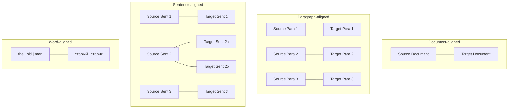
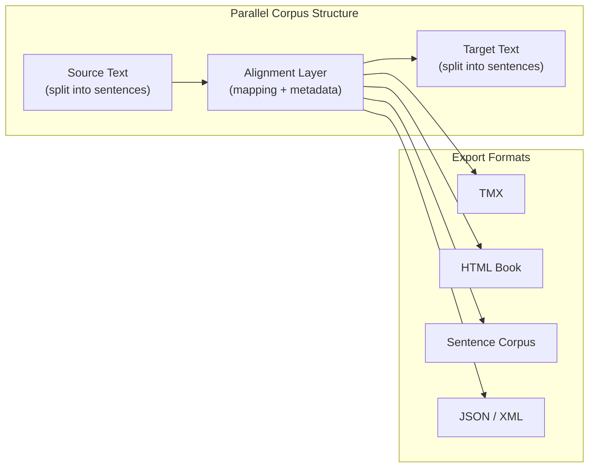

# What is a Parallel Corpus? {#parallel-corpus}

A **parallel corpus** (plural: *parallel corpora*) is a collection of texts in two or more languages that are translations of each other, aligned at some level of granularity — sentences, paragraphs, or documents. Parallel corpora are one of the most valuable resources in computational linguistics, translation studies, and language learning.

This page explains what parallel corpora are, why they matter, how they are constructed, and how Lingtrain Aligner helps you create them from any pair of texts.

## Definition and core idea {#definition}

At its simplest, a parallel corpus is a structured dataset where every unit of text in language A is paired with its corresponding translation in language B. Consider a sentence from a novel:

> **English:** "The old man sat by the window and watched the rain."
>
> **Russian:** "Старик сидел у окна и смотрел на дождь."

When you collect thousands of such pairs — maintaining the link between original and translation — you have a parallel corpus. The "parallel" part refers to the fact that the two texts run side by side, aligned unit by unit.

Unlike a **comparable corpus** (texts on the same topic in different languages, but not direct translations), a parallel corpus guarantees that each segment in one language has a known, specific counterpart in the other.

## A brief history {#history}

### The Rosetta Stone: the original parallel text {#rosetta-stone}

The idea of parallel texts is ancient. The Rosetta Stone, carved in 196 BC, contains the same decree written in three scripts: Egyptian hieroglyphs, Demotic script, and Ancient Greek. It was this parallelism that allowed Jean-Francois Champollion to decipher Egyptian hieroglyphs in 1822. The stone served as a natural "parallel corpus" — researchers could compare known Greek text with unknown hieroglyphic text, aligning passages to unlock meaning.

This is exactly the principle behind modern parallel corpora: if you know the meaning in one language, you can learn the meaning in another.

### Early computational efforts {#early-efforts}

In the computational era, interest in parallel corpora surged in the late 1980s and early 1990s. Key milestones include:

- **1990** — Brown et al. at IBM published foundational work on statistical machine translation using the Canadian Hansard (parliamentary proceedings in English and French), one of the first large-scale parallel corpora used for NLP.
- **1993** — Gale and Church published their sentence alignment algorithm based on sentence length ratios, enabling automatic construction of sentence-aligned parallel corpora from raw bilingual text.
- **2000s** — The Europarl corpus (European Parliament proceedings) and United Nations parallel corpus became standard benchmarks, containing millions of aligned sentences across multiple language pairs.
- **2010s** — Projects like OPUS aggregated dozens of parallel corpora into a single searchable resource, and neural machine translation (NMT) drove demand for even larger, higher-quality parallel datasets.

## Types of parallel corpora {#types}

Parallel corpora differ in their **level of alignment** — how finely the texts are linked.

### Document-aligned corpora {#document-aligned}

The coarsest level. You know that document A in English corresponds to document B in French, but you do not know which sentences match which. Many web-crawled corpora start at this level (e.g., pages from multilingual websites).

**Use case:** Bootstrapping alignment pipelines, training document-level translation models.

### Paragraph-aligned corpora {#paragraph-aligned}

Each paragraph in the source text is linked to its corresponding paragraph in the target text. This preserves more context than sentence-level alignment and is useful for studying translation at the discourse level.

**Use case:** Discourse analysis, paragraph-level translation training, bilingual book creation.

### Sentence-aligned corpora {#sentence-aligned}

The most common and most useful type. Each sentence in the source is linked to one or more sentences in the translation. This is the standard format for machine translation training, translation memory systems, and bilingual reading tools.

**Use case:** Machine translation, translation memories (TMX), language learning, linguistic research.

### Sub-sentence alignment {#sub-sentence}

Word-level or phrase-level alignment, where individual words or phrases in the source are linked to their counterparts in the translation. This requires more sophisticated methods and is typically derived from sentence-aligned corpora as a secondary step.

**Use case:** Bilingual lexicon extraction, word-level translation models, linguistic analysis.

The following diagram illustrates these alignment levels:

## Famous parallel corpora {#famous-corpora}

Several parallel corpora have become foundational resources in NLP and translation studies:

### Europarl Corpus {#europarl}

The **European Parliament Proceedings Parallel Corpus** contains the proceedings of the European Parliament from 1996 to 2011, aligned at the sentence level across up to 21 European languages. It was created by Philipp Koehn and has been one of the most widely used resources for statistical and neural machine translation research. The corpus contains approximately 60 million words per language.

### United Nations Parallel Corpus {#un-corpus}

The **UN Parallel Corpus** contains official United Nations documents in all six official UN languages: Arabic, Chinese, English, French, Russian, and Spanish. With over 800 million words, it is one of the largest publicly available parallel corpora. Its consistent, formal style makes it valuable for training translation systems in the legal and diplomatic domain.

### OPUS {#opus}

**OPUS** (Open Parallel Corpus) is not a single corpus but a collection of freely available parallel corpora aggregated from many sources: movie subtitles (OpenSubtitles), software localization files (GNOME, KDE, Ubuntu), religious texts (Bible, Quran), EU legislation (JRC-Acquis, DGT), Wikipedia articles, and more. OPUS covers hundreds of language pairs and is the go-to resource for researchers working with less common language combinations.

### Canadian Hansard {#hansard}

The **Canadian Hansard** contains the proceedings of the Canadian Parliament in English and French. It was the corpus used in the seminal IBM statistical machine translation papers (Brown et al., 1990) and remains historically significant as the dataset that launched the statistical MT revolution.

### ParaCrawl and CCAligned {#paracrawl}

Modern web-crawled corpora like **ParaCrawl** and **CCAligned** have pushed the scale of parallel data into the billions of sentence pairs. They use automatic alignment of multilingual web pages and are noisier than curated corpora, but their sheer scale makes them useful for training large neural translation models.

## Why parallel corpora matter {#importance}

### Machine translation {#mt}

Parallel corpora are the primary training data for machine translation systems. Both statistical MT (phrase tables) and neural MT (sequence-to-sequence models) learn translation patterns from millions of aligned sentence pairs. The quality and domain coverage of the parallel corpus directly determines the quality of the resulting translation system.

### Cross-lingual NLP {#cross-lingual}

Beyond translation, parallel corpora enable **cross-lingual transfer learning** — training an NLP model on data in one language and applying it to another. This is critical for low-resource languages where labeled data is scarce. Parallel corpora allow researchers to project annotations (named entities, sentiment labels, syntactic structures) from a resource-rich language to a resource-poor one.

### Translation studies {#translation-studies}

Linguists and translation scholars use parallel corpora to study how translators work: what they change, what they preserve, how they handle cultural references, idioms, and ambiguity. Large parallel corpora enable quantitative analysis of translation strategies that was previously impossible.

### Language learning {#language-learning}

Parallel texts are a proven tool for language acquisition. Reading a text in a foreign language with a parallel translation available provides **comprehensible input** — the learner encounters new vocabulary and grammar in context, with the safety net of being able to check the native-language version. Lingtrain Aligner enables learners to create personalized parallel books from any text they find engaging.

### Bilingual lexicography {#lexicography}

Parallel corpora are used to extract bilingual dictionaries and terminological databases automatically. By analyzing which words and phrases consistently co-occur across aligned sentences, researchers can build comprehensive bilingual lexicons — especially valuable for specialized domains (medicine, law, technology) where standard dictionaries fall short.

## The alignment problem {#alignment-problem}

Creating a parallel corpus from raw texts is not trivial. You might have an English novel and its Russian translation, but the sentences do not line up one-to-one. A translator may:

- **Split** one long sentence into two shorter ones
- **Merge** two short sentences into one
- **Reorder** clauses or sentences for natural flow in the target language
- **Add** explanatory text that has no counterpart in the source
- **Omit** content that is redundant or culturally irrelevant

These transformations mean that a naive "line N in English = line N in Russian" approach will fail almost immediately. Automatic alignment algorithms are needed to determine the correct mapping, and that is exactly what Lingtrain Aligner does.

For a deep dive into alignment methods, see [Text alignment: theory and methods](text-alignment-theory.en.md).

## How Lingtrain creates parallel corpora {#lingtrain-approach}

Lingtrain Aligner uses a modern, embedding-based approach to parallel corpus construction:

1. **Upload** your source and target texts (any two languages from 50-200+ supported)
2. **Sentence splitting** — language-aware tokenization breaks each text into sentences
3. **Embedding** — each sentence is converted to a vector using a multilingual neural model
4. **Batch alignment** — cosine similarity matching finds the best sentence correspondences
5. **Conflict resolution** — automatic and manual tools handle complex cases (1-to-many, many-to-1)
6. **Export** — download the aligned corpus in formats including TMX, HTML parallel books, sentence corpora, XML, and JSON

The result is a high-quality, sentence-aligned parallel corpus that you can use for research, translation, language learning, or publishing.

For step-by-step instructions, see the [alignment process guide](alignment.en.md).

## Structure of a parallel corpus {#structure}

A parallel corpus is typically stored as a table or database where each row represents an aligned unit:

| # | Source (English) | Target (Russian) |
|---|------------------|-------------------|
| 1 | The old man sat by the window. | Старик сидел у окна. |
| 2 | He watched the rain fall on the garden. | Он смотрел, как дождь падает на сад. |
| 3 | His tea grew cold. | Его чай остыл. |

In practice, the structure includes metadata: alignment IDs, source line numbers, confidence scores, and paragraph markers. Lingtrain uses an SQLite database internally, and exports to standard interchange formats like TMX (Translation Memory eXchange) for compatibility with translation tools.

## Quality considerations {#quality}

Not all parallel corpora are created equal. Key quality factors include:

- **Alignment accuracy** — are the sentence pairs actually translations of each other? Misaligned pairs introduce noise into any downstream application.
- **Translation quality** — is the translation itself accurate? Parallel corpora inherit the quality of the underlying translation.
- **Domain coverage** — does the corpus cover the vocabulary and style needed for your application? A corpus of parliamentary debates will not help you translate medical records.
- **Size** — larger corpora generally yield better results, but quality matters more than quantity. A small, clean corpus often outperforms a large, noisy one.
- **Language diversity** — some language pairs are heavily resourced (English-French, English-Chinese), while others have almost no parallel data available.

Lingtrain Aligner addresses alignment accuracy through its combination of neural matching, automatic conflict resolution, and interactive editing. The visualization tools help you spot quality issues early, and the editor lets you fix them at the sentence level.

## Getting started {#getting-started}

Ready to create your own parallel corpus? Start with the [overview](index.en.md) to learn the full workflow, or jump directly to [uploading texts](uploading.en.md) to begin.

If you want to understand the alignment algorithm in depth, see [alignment algorithm](algorithm.en.md). For information about the embedding models that power the matching, see [sentence embeddings explained](sentence-embeddings.en.md).
