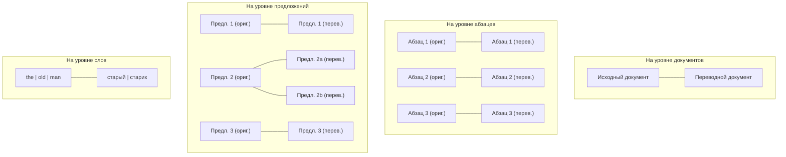
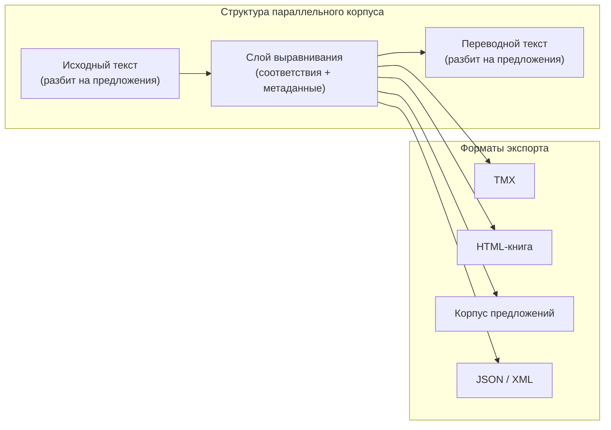

# Что такое параллельный корпус? {#parallel-corpus}

**Параллельный корпус** (мн. ч.: *параллельные корпуса*) — это собрание текстов на двух или более языках, являющихся переводами друг друга и выровненных на определённом уровне: предложений, абзацев или документов. Параллельные корпуса — один из самых ценных ресурсов в компьютерной лингвистике, переводоведении и изучении языков.

На этой странице мы объясним, что представляют собой параллельные корпуса, почему они важны, как создаются и как Lingtrain Aligner помогает создавать их из любой пары текстов.

## Определение и базовая идея {#definition}

В самом простом понимании параллельный корпус — это структурированный набор данных, в котором каждая единица текста на языке А соединена с её переводом на языке Б. Рассмотрим предложение из романа:

> **Русский:** "Старик сидел у окна и смотрел на дождь."
>
> **Английский:** "The old man sat by the window and watched the rain."

Когда вы собираете тысячи таких пар, сохраняя связь между оригиналом и переводом, вы получаете параллельный корпус. Слово «параллельный» указывает на то, что два текста идут бок о бок, выровненные единица за единицей.

В отличие от **сопоставимого корпуса** (тексты на одну тему на разных языках, но не прямые переводы), параллельный корпус гарантирует, что каждый сегмент на одном языке имеет известное, конкретное соответствие на другом.

## Краткая история {#history}

### Розеттский камень: первый параллельный текст {#rosetta-stone}

Идея параллельных текстов уходит в глубокую древность. Розеттский камень, высеченный в 196 году до н.э., содержит один и тот же указ, записанный тремя письменностями: египетскими иероглифами, демотическим письмом и на древнегреческом. Именно эта параллельность позволила Жану-Франсуа Шампольону расшифровать египетские иероглифы в 1822 году. Камень выступил в роли естественного «параллельного корпуса» — исследователи могли сопоставлять известный греческий текст с неизвестным иероглифическим, выравнивая фрагменты для раскрытия значений.

Именно этот принцип лежит в основе современных параллельных корпусов: зная значение на одном языке, мы можем узнать значение на другом.

### Ранние вычислительные работы {#early-efforts}

В вычислительную эпоху интерес к параллельным корпусам резко вырос в конце 1980-х и начале 1990-х годов. Ключевые вехи:

- **1990** — Браун и коллеги из IBM опубликовали основополагающие работы по статистическому машинному переводу, используя канадский Хансард (парламентские протоколы на английском и французском) — один из первых крупномасштабных параллельных корпусов для задач NLP.
- **1993** — Гейл и Чёрч опубликовали алгоритм выравнивания предложений на основе соотношения длин, позволяющий автоматически создавать параллельные корпуса на уровне предложений из необработанных двуязычных текстов.
- **2000-е** — Корпус Europarl (протоколы Европейского парламента) и параллельный корпус ООН стали стандартными бенчмарками, содержащими миллионы выровненных предложений для множества языковых пар.
- **2010-е** — Проекты вроде OPUS объединили десятки параллельных корпусов в единый ресурс с возможностью поиска, а нейронный машинный перевод (NMT) потребовал ещё больших и качественных параллельных датасетов.

## Типы параллельных корпусов {#types}

Параллельные корпуса различаются **уровнем выравнивания** — насколько мелко связаны тексты.

### Корпуса с выравниванием на уровне документов {#document-aligned}

Самый грубый уровень. Известно, что документ A на английском соответствует документу B на французском, но неизвестно, какие предложения соответствуют каким. Многие корпуса, собранные из веба, начинаются с этого уровня (например, страницы многоязычных сайтов).

**Применение:** начальный этап конвейеров выравнивания, обучение моделей перевода на уровне документов.

### Корпуса с выравниванием на уровне абзацев {#paragraph-aligned}

Каждый абзац исходного текста связан с соответствующим абзацем переводного текста. Это сохраняет больше контекста, чем выравнивание на уровне предложений, и полезно для исследования перевода на уровне дискурса.

**Применение:** анализ дискурса, обучение переводу на уровне абзацев, создание двуязычных книг.

### Корпуса с выравниванием на уровне предложений {#sentence-aligned}

Самый распространённый и полезный тип. Каждое предложение исходного текста связано с одним или несколькими предложениями перевода. Это стандартный формат для обучения машинного перевода, систем памяти переводов и инструментов двуязычного чтения.

**Применение:** машинный перевод, памяти переводов (TMX), изучение языков, лингвистические исследования.

### Субсентенциальное выравнивание {#sub-sentence}

Выравнивание на уровне слов или словосочетаний, при котором отдельные слова или фразы исходного текста связываются с их соответствиями в переводе. Это требует более сложных методов и обычно выполняется как вторичный шаг на основе корпуса, выровненного на уровне предложений.

**Применение:** извлечение двуязычных словарей, модели пословного перевода, лингвистический анализ.

Следующая диаграмма иллюстрирует эти уровни выравнивания:

## Знаменитые параллельные корпуса {#famous-corpora}

Ряд параллельных корпусов стал фундаментальными ресурсами в NLP и переводоведении:

### Europarl {#europarl}

**Параллельный корпус протоколов Европейского парламента** содержит стенограммы заседаний с 1996 по 2011 год, выровненные на уровне предложений для 21 европейского языка. Он был создан Филиппом Кёном и является одним из самых широко используемых ресурсов для исследований в области статистического и нейронного машинного перевода. Корпус содержит около 60 миллионов слов на каждом языке.

### Параллельный корпус ООН {#un-corpus}

**Параллельный корпус ООН** содержит официальные документы Организации Объединённых Наций на всех шести официальных языках ООН: арабском, китайском, английском, французском, русском и испанском. С объёмом более 800 миллионов слов это один из крупнейших общедоступных параллельных корпусов. Его выдержанный официальный стиль делает его ценным для обучения систем перевода в юридической и дипломатической сфере.

### OPUS {#opus}

**OPUS** (Open Parallel Corpus) — это не отдельный корпус, а коллекция свободно доступных параллельных корпусов, собранных из множества источников: субтитры к фильмам (OpenSubtitles), файлы локализации программ (GNOME, KDE, Ubuntu), религиозные тексты (Библия, Коран), законодательство ЕС (JRC-Acquis, DGT), статьи Википедии и другие. OPUS охватывает сотни языковых пар и является основным ресурсом для исследователей, работающих с менее распространёнными языковыми комбинациями.

### Канадский Хансард {#hansard}

**Канадский Хансард** содержит протоколы канадского парламента на английском и французском языках. Именно этот корпус использовался в основополагающих работах IBM по статистическому машинному переводу (Браун и др., 1990) и остаётся исторически значимым как датасет, положивший начало революции статистического МТ.

### ParaCrawl и CCAligned {#paracrawl}

Современные корпуса, собранные из веба, — **ParaCrawl** и **CCAligned** — довели масштаб параллельных данных до миллиардов пар предложений. Они используют автоматическое выравнивание многоязычных веб-страниц и содержат больше шума, чем курируемые корпуса, но их колоссальный объём делает их полезными для обучения больших нейронных моделей перевода.

## Почему параллельные корпуса важны {#importance}

### Машинный перевод {#mt}

Параллельные корпуса — это основные обучающие данные для систем машинного перевода. И статистический МТ (таблицы фраз), и нейронный МТ (модели sequence-to-sequence) учатся паттернам перевода на миллионах выровненных пар предложений. Качество и тематический охват параллельного корпуса напрямую определяют качество результирующей системы перевода.

### Кросс-языковое NLP {#cross-lingual}

Помимо перевода, параллельные корпуса обеспечивают **кросс-языковой перенос обучения** — обучение модели NLP на данных одного языка с последующим применением к другому. Это критически важно для малоресурсных языков, где размеченных данных мало. Параллельные корпуса позволяют проецировать разметку (именованные сущности, метки тональности, синтаксические структуры) с ресурсно богатого языка на бедный.

### Переводоведение {#translation-studies}

Лингвисты и исследователи перевода используют параллельные корпуса для изучения работы переводчиков: что они меняют, что сохраняют, как обрабатывают культурные реалии, идиомы и многозначность. Крупные параллельные корпуса делают возможным количественный анализ стратегий перевода, который раньше был невозможен.

### Изучение языков {#language-learning}

Параллельные тексты — проверенный инструмент освоения языка. Чтение текста на иностранном языке с доступным параллельным переводом обеспечивает **понятный ввод** (comprehensible input) — ученик встречает новую лексику и грамматику в контексте, имея возможность свериться с версией на родном языке. Lingtrain Aligner позволяет учащимся создавать персональные параллельные книги из любого интересного им текста.

### Двуязычная лексикография {#lexicography}

Параллельные корпуса используются для автоматического извлечения двуязычных словарей и терминологических баз. Анализируя, какие слова и фразы регулярно соседствуют в выровненных предложениях, исследователи могут строить полноценные двуязычные словники — это особенно ценно для специализированных областей (медицина, юриспруденция, технологии), где стандартные словари недостаточны.

## Проблема выравнивания {#alignment-problem}

Создание параллельного корпуса из необработанных текстов — нетривиальная задача. У вас может быть английский роман и его русский перевод, но предложения не совпадают один к одному. Переводчик может:

- **Разделить** одно длинное предложение на два коротких
- **Объединить** два коротких предложения в одно
- **Переставить** части предложения или целые предложения для естественности на целевом языке
- **Добавить** пояснительный текст, которого нет в оригинале
- **Опустить** содержание, избыточное или культурно нерелевантное

Эти трансформации означают, что наивный подход «строка N на английском = строка N на русском» сломается почти сразу. Необходимы автоматические алгоритмы выравнивания для определения правильного соответствия, и именно это делает Lingtrain Aligner.

Для глубокого погружения в методы выравнивания см. [Выравнивание текстов: теория и методы](text-alignment-theory.ru.md).

## Как Lingtrain создаёт параллельные корпуса {#lingtrain-approach}

Lingtrain Aligner использует современный подход на основе эмбеддингов для создания параллельных корпусов:

1. **Загрузка** исходного и целевого текстов (любые два языка из 50-200+ поддерживаемых)
2. **Разбиение на предложения** — языко-зависимая токенизация разбивает каждый текст на предложения
3. **Эмбеддинг** — каждое предложение преобразуется в вектор с помощью мультиязычной нейронной модели
4. **Пакетное выравнивание** — сопоставление по косинусному сходству находит лучшие соответствия предложений
5. **Разрешение конфликтов** — автоматические и ручные инструменты обрабатывают сложные случаи (1-ко-многим, многие-к-1)
6. **Экспорт** — скачивание выровненного корпуса в форматах TMX, HTML-книга, корпус предложений, XML и JSON

Результат — качественный параллельный корпус на уровне предложений, который можно использовать для исследований, перевода, изучения языков или публикации.

Пошаговые инструкции см. в [руководстве по процессу выравнивания](alignment.ru.md).

## Структура параллельного корпуса {#structure}

Параллельный корпус обычно хранится в виде таблицы или базы данных, где каждая строка представляет выровненную единицу:

| # | Оригинал (русский) | Перевод (английский) |
|---|-------------------|----------------------|
| 1 | Старик сидел у окна. | The old man sat by the window. |
| 2 | Он смотрел, как дождь падает на сад. | He watched the rain fall on the garden. |
| 3 | Его чай остыл. | His tea grew cold. |

На практике структура включает метаданные: идентификаторы выравнивания, номера строк в исходном тексте, оценки уверенности и маркеры абзацев. Lingtrain использует базу данных SQLite для внутреннего хранения и экспортирует в стандартные форматы обмена, такие как TMX (Translation Memory eXchange), для совместимости с инструментами перевода.

## Критерии качества {#quality}

Не все параллельные корпуса одинаково хороши. Ключевые факторы качества:

- **Точность выравнивания** — действительно ли пары предложений являются переводами друг друга? Ошибочно выровненные пары вносят шум в любое последующее применение.
- **Качество перевода** — насколько точен сам перевод? Параллельные корпуса наследуют качество лежащего в их основе перевода.
- **Тематический охват** — покрывает ли корпус лексику и стиль, необходимые для вашего приложения? Корпус парламентских дебатов не поможет переводить медицинские записи.
- **Объём** — большие корпуса, как правило, дают лучшие результаты, но качество важнее количества. Небольшой чистый корпус часто превосходит большой зашумлённый.
- **Языковое разнообразие** — одни языковые пары хорошо обеспечены ресурсами (английский-французский, английский-китайский), а для других параллельных данных почти не существует.

Lingtrain Aligner решает проблему точности выравнивания за счёт комбинации нейронного сопоставления, автоматического разрешения конфликтов и интерактивного редактирования. Инструменты визуализации помогают рано обнаружить проблемы качества, а редактор позволяет исправить их на уровне предложений.

## С чего начать {#getting-started}

Готовы создать собственный параллельный корпус? Начните с [обзора](index.ru.md), чтобы узнать полный рабочий процесс, или сразу перейдите к [загрузке текстов](uploading.ru.md).

Если вы хотите глубже понять алгоритм выравнивания, см. [алгоритм выравнивания](algorithm.ru.md). Информацию о моделях эмбеддингов, обеспечивающих сопоставление, см. в [объяснение эмбеддингов предложений](sentence-embeddings.ru.md).
